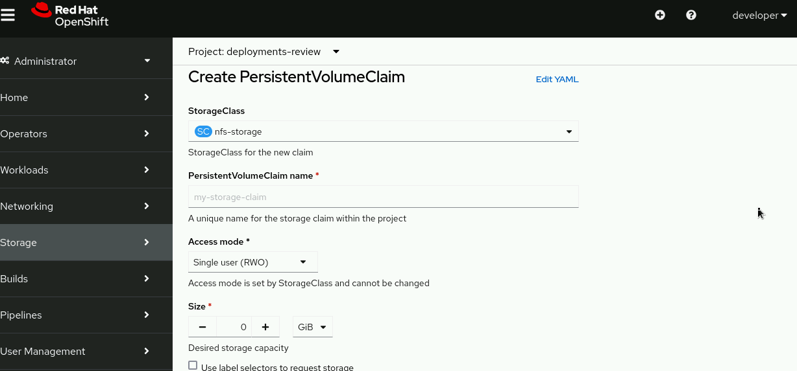

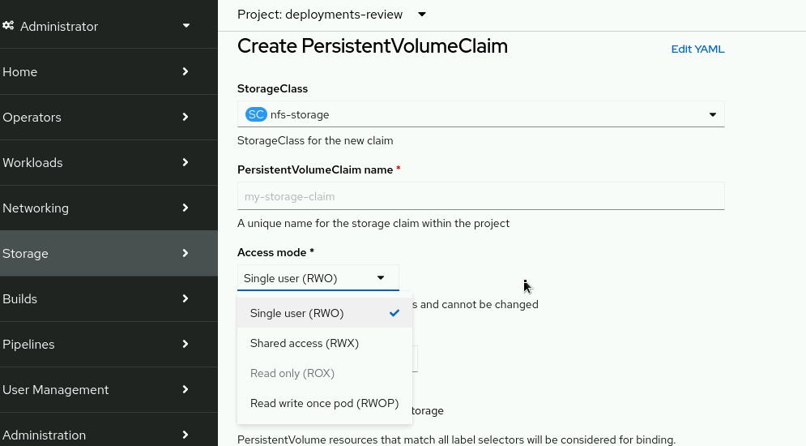

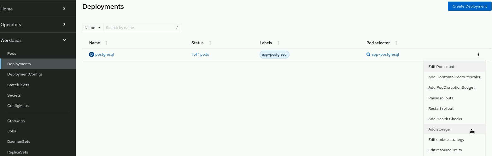

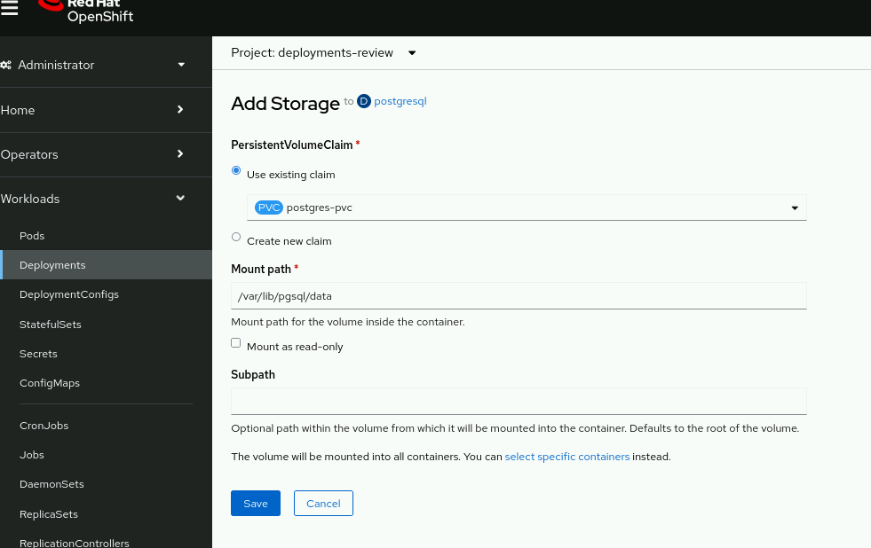

Gắn thêm PVC vào Deployment
```
oc set volume deploy/postgresql \
--add --name=postgresql-data -t pvc \
--claim-name=postgres-pvc \
--mount-path /var/lib/pgsql/data
```
Giải thích chi tiết từng phần:

| Tham số                            | Ý nghĩa                                                            |
| ---------------------------------- | ------------------------------------------------------------------ |
| `oc set volume deploy/postgresql`  | Chỉnh sửa volumes của deployment `postgresql`                      |
| `--add`                            | Thêm (không thay thế) volume mới                                   |
| `--name=postgresql-data`           | Đặt tên cho volume mới là `postgresql-data`                        |
| `-t pvc` hoặc `--type=pvc`         | Kiểu volume là **PersistentVolumeClaim**                           |
| `--claim-name=postgres-pvc`        | Dùng PVC tên là `postgres-pvc`                                     |
| `--mount-path /var/lib/pgsql/data` | Mount volume này vào container tại đường dẫn `/var/lib/pgsql/data` |


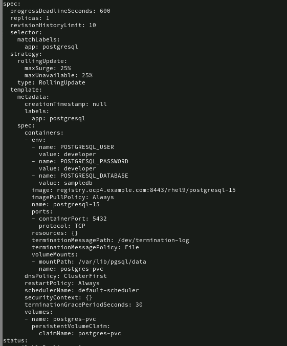

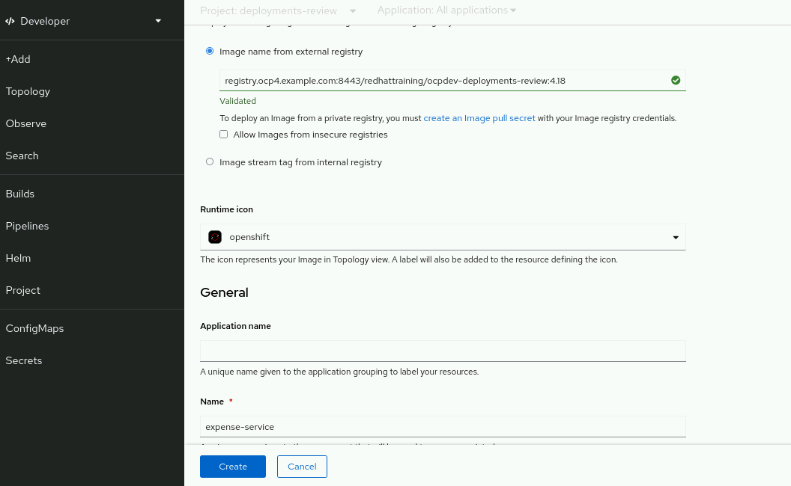

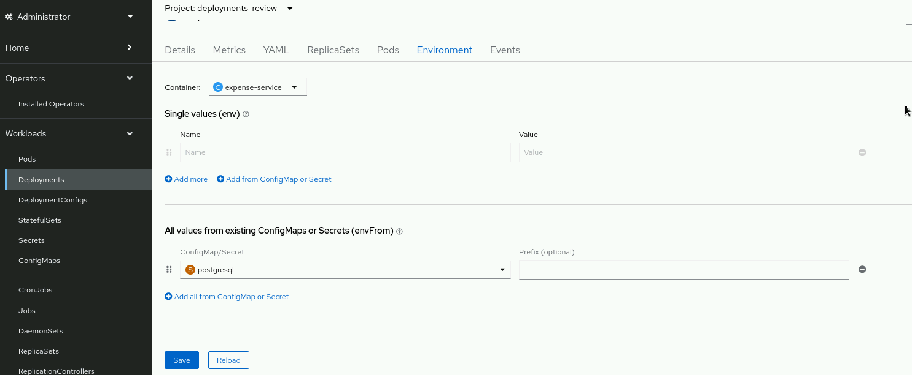

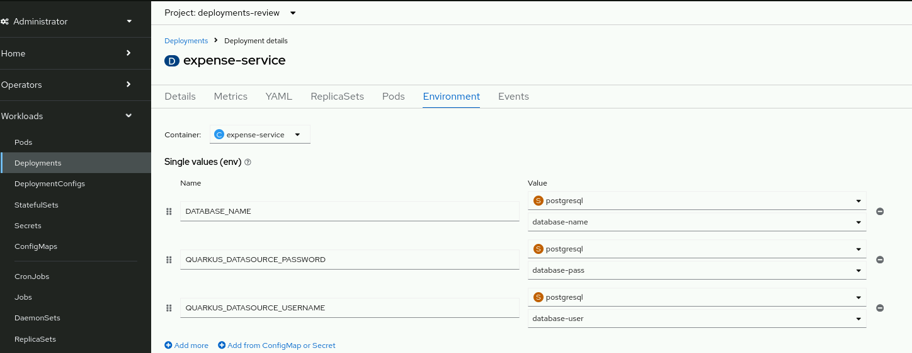

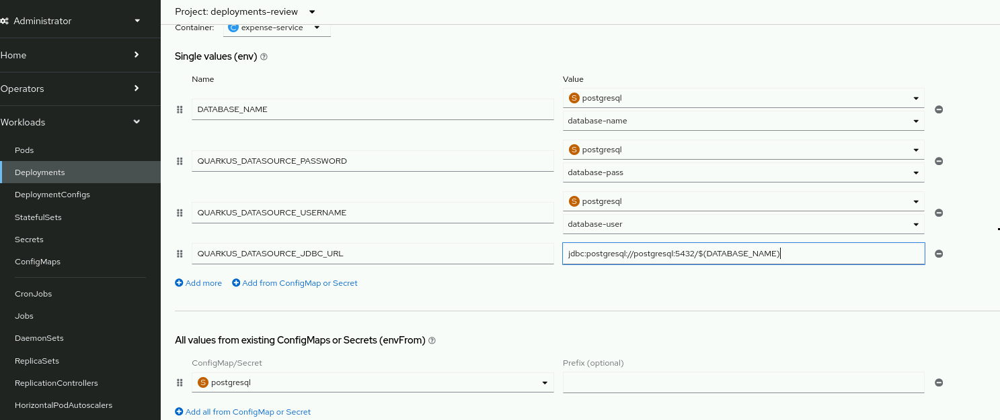

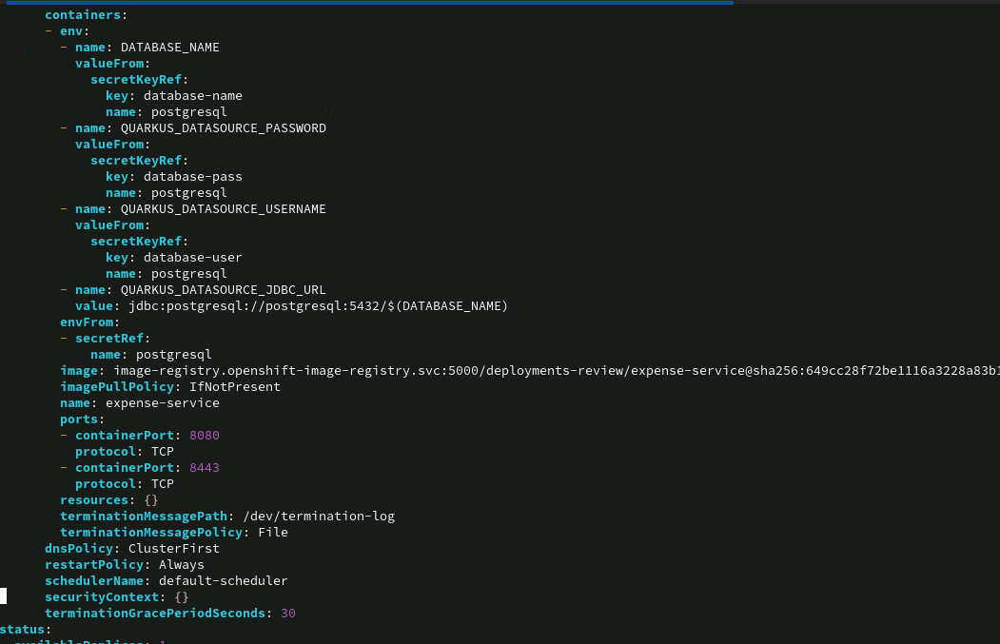

set env xong ko loi pod nua
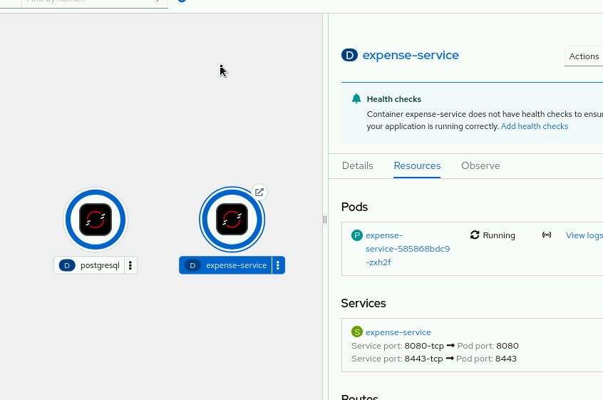

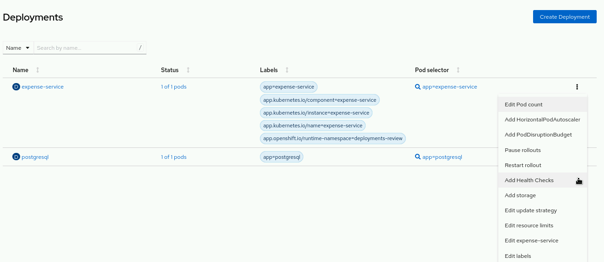


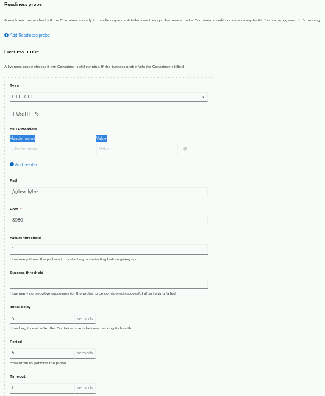

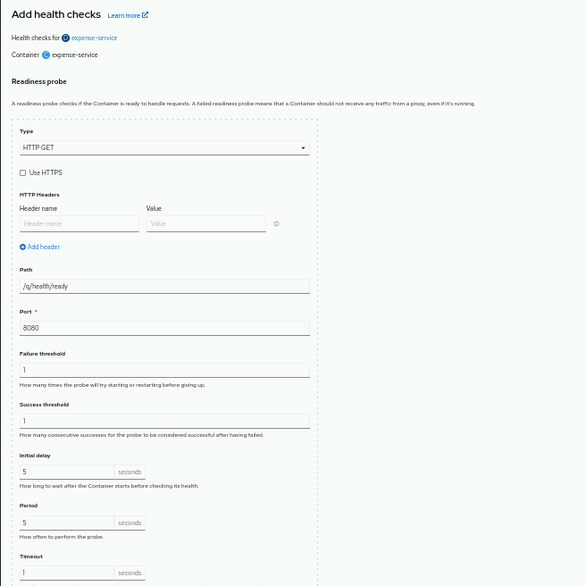

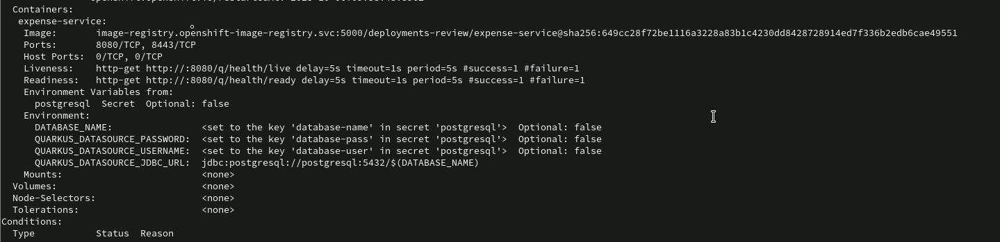


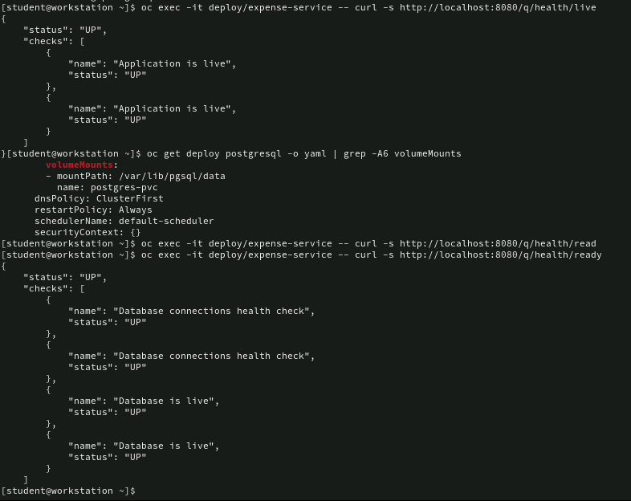

---

🧩 Tổng quan: Probe là gì?

Probe = cơ chế OpenShift (Kubernetes) dùng để kiểm tra “tình trạng sức khỏe” của container.
Có 3 loại probe:

Liveness probe → Kiểm tra xem container còn sống không.

Readiness probe → Kiểm tra xem ứng dụng đã sẵn sàng nhận request chưa.

(Ngoài ra có thêm Startup probe, dùng cho ứng dụng khởi động lâu.)

💚 1️⃣ LIVENESS PROBE — “Container có còn sống không?”

Mục đích: đảm bảo container không bị treo.

Nếu probe thất bại (fail) → Kubernetes kill container và tự khởi động lại nó.

Dùng cho các tình huống: ứng dụng bị deadlock, treo cứng, vòng lặp vô hạn,...

🔹 Ví dụ:
/q/health/live trả HTTP 200 → ứng dụng vẫn sống.
Nếu trả lỗi hoặc timeout → OpenShift restart container.

💙 2️⃣ READINESS PROBE — “App đã sẵn sàng phục vụ chưa?”

Mục đích: đảm bảo container chỉ nhận traffic khi đã sẵn sàng.

Nếu probe thất bại (fail) → container không bị restart,
nhưng bị tạm thời loại khỏi Service load balancing (không nhận request từ client).

Dùng cho: ứng dụng khởi động chậm, cần thời gian kết nối DB, tải config,...

🔹 Ví dụ:
/q/health/ready trả HTTP 200 → app sẵn sàng phục vụ.
Nếu chưa (HTTP 500 hoặc timeout) → Pod vẫn chạy, nhưng Service tạm không gửi request đến.

⚙️ 3️⃣ Các thông số bạn thấy trong lệnh

| Tham số                      | Ý nghĩa                                                      | Trong bài                               |
| ---------------------------- | ------------------------------------------------------------ | --------------------------------------- |
| `--get-url=http://:8080/...` | URL để gọi health endpoint                                   | `/q/health/live` hoặc `/q/health/ready` |
| `--timeout-seconds=1`        | Thời gian tối đa chờ phản hồi                                | 1 giây                                  |
| `--initial-delay-seconds=5`  | Chờ bao lâu sau khi container khởi động mới bắt đầu kiểm tra | 5 giây                                  |
| `--period-seconds=5`         | Khoảng cách giữa các lần kiểm tra                            | 5 giây                                  |
| `--success-threshold=1`      | Số lần thành công liên tiếp để coi là “ok”                   | 1                                       |
| `--failure-threshold=1`      | Số lần thất bại liên tiếp để coi là “fail”                   | 1                                       |


🧠 4️⃣ Tóm tắt dễ nhớ

| Loại Probe    | Mục đích                      | Khi fail                                     | Khi pass                          |
| ------------- | ----------------------------- | -------------------------------------------- | --------------------------------- |
| **Liveness**  | Kiểm tra container còn sống   | Container **bị restart**                     | Tiếp tục chạy bình thường         |
| **Readiness** | Kiểm tra app sẵn sàng phục vụ | Pod **bị loại khỏi Service** (không restart) | Pod **được thêm lại** vào Service |

🔍 5️⃣ Cách kiểm tra lại probe đã gắn
```
oc describe deploy/expense-service | grep -A5 -E "Liveness|Readiness"
```

hoặc:
```
oc get deploy/expense-service -o yaml | grep -A10 probe
```
💡 6️⃣ Ví dụ minh họa thực tế

Ứng dụng Java (Quarkus) có 2 endpoint:

/q/health/live → Kiểm tra ứng dụng còn sống

/q/health/ready → Kiểm tra DB đã kết nối

Nếu DB tạm thời bị mất:

Readiness probe fail → Pod tạm ngắt khỏi Service (người dùng không bị lỗi).

Khi DB kết nối lại → probe pass → Service tự thêm Pod lại.

Nếu app bị crash thật → Liveness probe fail → Pod bị restart.

✅ Tóm tắt dễ nhớ để thi DO288:

| Probe     | Dùng để                   | Khi fail          | Ví dụ endpoint    |
| --------- | ------------------------- | ----------------- | ----------------- |
| Liveness  | Kiểm tra còn sống         | Restart container | `/q/health/live`  |
| Readiness | Kiểm tra sẵn sàng phục vụ | Loại khỏi Service | `/q/health/ready` |

