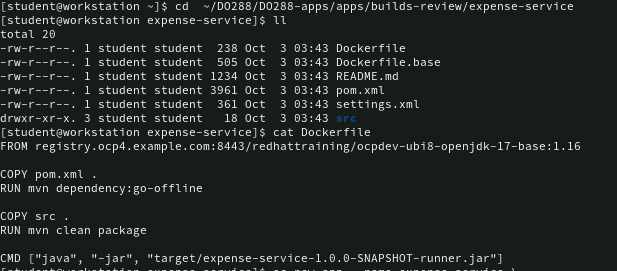
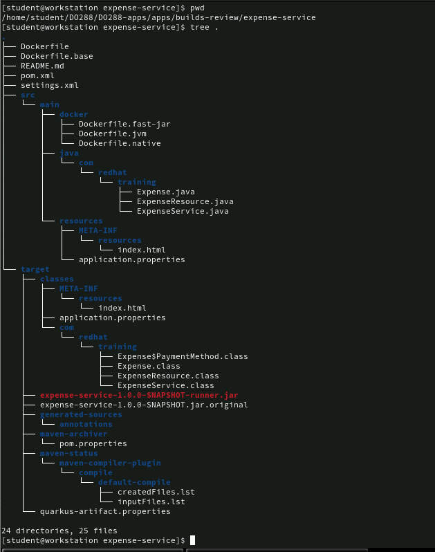
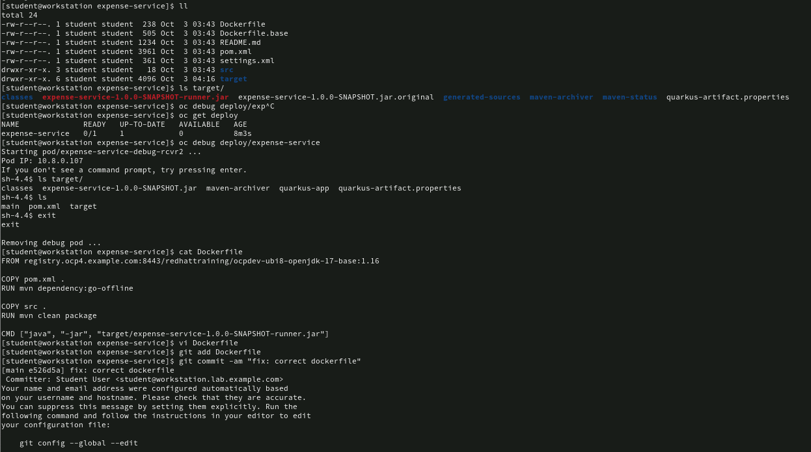
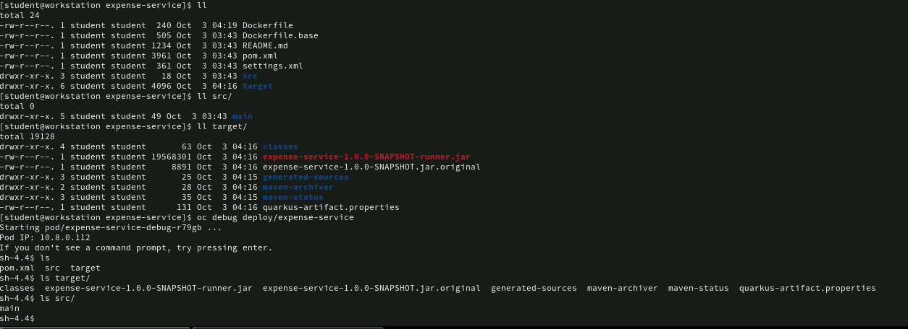
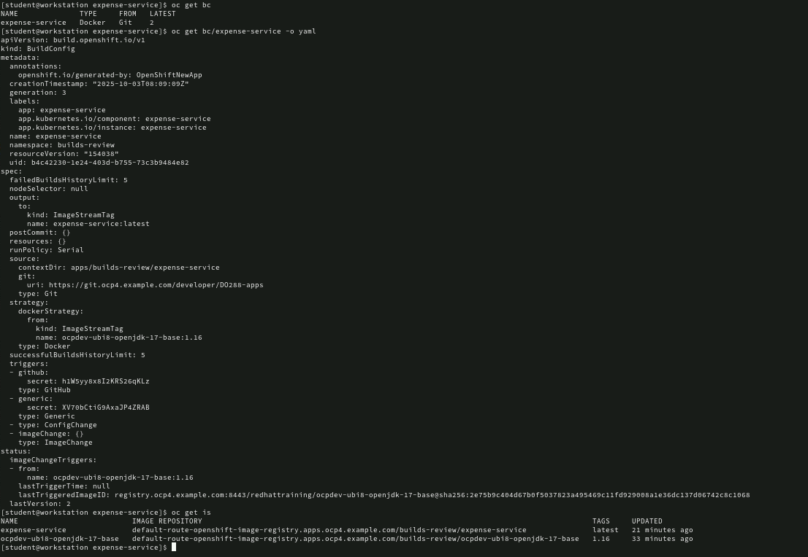

Description	|Value
---|---
Application name	|expense-service
Source code location	|https://git.ocp4.example.com/developer/DO288-apps
Source code directory	|apps/builds-review/expense-service
Build strategy	|Docker
Application URL|	http://expense-service-builds-review.apps.ocp4.example.com
GitLab username|	developer
GitLab password	|d3v3lop3r

Ban dau



```
[student@workstation expense-service]$ oc new-app --name expense-service \
--strategy Docker \
--context-dir apps/builds-review/expense-service \
https://git.ocp4.example.com/developer/DO288-apps
--> Found container image 11c20bc (23 months old) ...
...output omitted...
--> Creating resources ...
    imagestream.image.openshift.io "ocpdev-ubi8-openjdk-17-base" created
    imagestream.image.openshift.io "expense-service" created
    buildconfig.build.openshift.io "expense-service" created
    deployment.apps "expense-service" created
    service "expense-service" created
--> Success
...output omitted...
```

1. `--strategy` là gì?

👉 `--strategy` = Build Strategy = Cách OpenShift dùng để xây dựng image container.

OpenShift có nhiều chiến lược build (build strategy):

| Strategy     | Mô tả                                                                                                                                     | Khi nào dùng                                               |
| ------------ | ----------------------------------------------------------------------------------------------------------------------------------------- | ---------------------------------------------------------- |
| **Source**   | OpenShift tự động build code (Java, NodeJS, Python...) bằng S2I (Source-to-Image). Nó tìm file như `pom.xml`, `package.json`... để build. | Khi bạn có **source code thuần** (không có Dockerfile).    |
| **Docker**   | OpenShift sử dụng **Dockerfile** có sẵn trong source để build image (gọi là Docker build strategy).                                       | Khi project **có Dockerfile** và bạn muốn kiểm soát build. |
| **Pipeline** | Dùng Tekton pipeline để build và deploy.                                                                                                  | Khi bạn muốn CI/CD nâng cao.                               |
| **Custom**   | Bạn tự định nghĩa image build riêng.                                                                                                      | Ít dùng trong DO288.                                       |


2. `--context-dir` là gì?

👉 `--context-dir `= Context Directory = Thư mục con chứa ứng dụng trong repository Git.

Nói cách khác, repo của bạn có nhiều thư mục, bạn chỉ build một phần con.

Ví dụ repo này:
```
DO288-apps/
└── apps/
    ├── builds-review/
    │   ├── expense-service/
    │   │   ├── Dockerfile
    │   │   └── src/...
    │   └── ...
    └── other-app/
```
Nếu bạn chỉ muốn build ứng dụng `expense-service`, bạn phải chỉ rõ đường dẫn bên trong repo:
```
--context-dir apps/builds-review/expense-service
```

➡️ Nghĩa là: “Trong repo này, thư mục cần build nằm ở `apps/builds-review/expense-service`”.



🧩 Kết hợp lại:
```
oc new-app --name expense-service \
  --strategy Docker \
  --context-dir apps/builds-review/expense-service \
  https://git.ocp4.example.com/developer/DO288-apps
```

Giải nghĩa:

- Tạo 1 ứng dụng tên expense-service.

- Dùng Docker strategy → đọc file Dockerfile để build image.

- Lấy code trong repo https://git.ocp4.example.com/developer/DO288-apps.

- Chỉ lấy thư mục con apps/builds-review/expense-service làm build context (nơi có Dockerfile và code).

✅ Sau khi chạy lệnh này, OpenShift sẽ:

- Tạo BuildConfig (theo strategy Docker).

- Tạo ImageStream cho ứng dụng.

- Tạo Deployment và Service (nếu phát hiện port trong Dockerfile).

- Tự động trigger build đầu tiên.



--- 
🧠 Tổng quan

Ứng dụng expense-service là một ứng dụng Quarkus (Java), được build bằng Maven và đóng gói thành file .jar để chạy trong container.

Bạn build ứng dụng này bằng Docker strategy, nên OpenShift sẽ chạy Dockerfile của bạn để build image. Nếu Dockerfile sai, image build xong sẽ bị lỗi khi chạy (runtime error).

🔎 1. Lỗi ban đầu: Unable to access jarfile
```
Error: Unable to access jarfile target/expense-service-1.0.0-SNAPSHOT-runner.jar
```

👉 Nghĩa là: container không tìm thấy file jar mà câu lệnh CMD yêu cầu chạy.
Cụ thể, trong Dockerfile có dòng:
```
CMD ["java", "-jar", "target/expense-service-1.0.0-SNAPSHOT-runner.jar"]
```

Nhưng khi container chạy, file đó không tồn tại.

🧰 2. Kiểm tra build local bằng Maven

Bạn làm rất đúng khi test bằng lệnh:
```
mvn -Dmaven.compiler.release=11 clean package
```

Mục đích: Build ứng dụng trên máy local (không qua OpenShift) để chắc chắn rằng code hoạt động.

Sau đó bạn kiểm tra:
```
ls target/*runner*
target/expense-service-1.0.0-SNAPSHOT-runner.jar
```

✅ File .jar tồn tại → Nghĩa là build local OK, lỗi nằm ở trong container build.

🔍 3. Debug container runtime

Để xem bên trong container có gì, bạn dùng lệnh:
```
oc debug deploy/expense-service
```

Lệnh này tạo một debug pod chạy image của deployment hiện tại.

Bên trong, bạn chạy:
```
sh-4.4$ ls target/
```

Kết quả:
```
classes  expense-service-1.0.0-SNAPSHOT.jar  maven-archiver  quarkus-app  quarkus-artifact.properties
```

⚠️ Không có file `expense-service-1.0.0-SNAPSHOT-runner.jar`.

➡️ Nghĩa là build trong Dockerfile không sinh ra đúng file jar như local.

🔎 4. Xem nội dung Dockerfile

Trong Dockerfile gốc (ban đầu), bạn có dòng như:
```
COPY src .
RUN mvn clean package
```

❌ Sai ở chỗ:

- Lệnh `COPY src .` sẽ copy nội dung thư mục `src` vào thư mục gốc / của container,
→ không đúng cấu trúc project Maven.

- Maven cần `pom.xml` và `src` cùng cấp để build được.

Vì vậy, Maven build không đầy đủ, dẫn tới file jar bị khác hoặc bị thiếu.

🛠️ 5. Cách sửa đúng

Thay vì COPY src ., bạn cần copy thư mục đúng tên vào đúng chỗ để giữ cấu trúc project:
```
COPY src src
```
Anh sau khi fix


Giải thích:

- COPY src src nghĩa là copy thư mục src từ máy build vào thư mục src trong container.

- Giữ đúng cấu trúc project (có src và pom.xml cùng cấp).

- Giúp Maven build chính xác → tạo ra đúng file .jar.

👉 Dockerfile sửa xong:
```
RUN mvn dependency:go-offline

COPY src src
RUN mvn clean package

CMD ["java", "-jar", "target/expense-service-1.0.0-SNAPSHOT-runner.jar"]
```

✅ Giờ container có đầy đủ code để build và file .jar xuất hiện đúng chỗ.

💾 6. Commit & Push thay đổi

Vì bạn đang build từ remote Git repository, OpenShift build image mỗi khi repo thay đổi.
Nên bạn cần commit và push:
```
git commit -am "fix: correct dockerfile"
git push
```

→ Push xong, OpenShift sẽ tự động trigger lại build → image mới sẽ build đúng → deployment hoạt động.

🔁 7. Tóm tắt quy trình fix lỗi

| Bước | Hành động                            | Mục đích                              |
| ---- | ------------------------------------ | ------------------------------------- |
| 1️⃣  | Kiểm tra log: `oc logs deploy/...`   | Phát hiện lỗi `jarfile` không tồn tại |
| 2️⃣  | Build local bằng Maven               | Xác minh code & build đúng            |
| 3️⃣  | Debug pod: `oc debug deploy/...`     | Xem bên trong container có file không |
| 4️⃣  | Phát hiện `src` không được copy đúng | Nguyên nhân Maven không build đúng    |
| 5️⃣  | Sửa Dockerfile (`COPY src src`)      | Giữ cấu trúc project                  |
| 6️⃣  | `git commit` + `git push`            | Cập nhật source để OpenShift rebuild  |
| 7️⃣  | Build mới thành công                 | File jar đúng, app chạy được          |

Redeploy the application.

Start a build in OpenShift.
```
[student@workstation expense-service]$ oc start-build bc/expense-service \
--follow
build.build.openshift.io/expense-service-2 started
...output omitted...
Cloning "https://git.ocp4.example.com/developer/DO288-apps" ...
...output omitted...
Push successful
```
Verify that the application pod starts.
```
[student@workstation expense-service]$ oc get po
expense-service-1-build            0/1     Completed   0          3m32s
expense-service-2-build            0/1     Completed   0          71s
expense-service-5649479dbc-n7dpq   1/1     Running     0          9s
```



---
Rất đúng rồi 👏 — để hiểu rõ hơn, ta tách ra hai khái niệm khác nhau nhưng liên quan trong OpenShift:
🔹 BuildConfig (bc) – xây image
🔹 Deployment (hoặc DeploymentConfig) – chạy container từ image đó

🧩 Tóm tắt quan hệ giữa chúng
| Thành phần           | Vai trò                                                                     | Sinh ra bởi                         |
| -------------------- | --------------------------------------------------------------------------- | ----------------------------------- |
| **BuildConfig (bc)** | Quy định cách build image (nguồn git, strategy, context-dir, Dockerfile...) | `oc new-app`                        |
| **ImageStream (is)** | Lưu trữ image build ra                                                      | `oc new-app` hoặc `oc new-build`    |
| **Deployment**       | Chạy container từ image đó                                                  | `oc new-app` (tạo sau khi có image) |

⚙️ Khi bạn chạy lệnh này:
```
oc new-app --name expense-service \
  --strategy Docker \
  --context-dir apps/builds-review/expense-service \
  https://git.ocp4.example.com/developer/DO288-apps
```
OpenShift thực hiện:

1️⃣ Tạo BuildConfig → dùng Dockerfile để build image  
2️⃣ Tạo ImageStream → chứa image vừa build  
3️⃣ Tạo Deployment → dùng image `expense-service:latest` từ ImageStream  
4️⃣ Tự động start build đầu tiên (expense-service-1)

🔁 Khi bạn sửa Dockerfile + commit + push

➡️ Source code trên Git thay đổi  
➡️ Nhưng OpenShift chưa biết nếu bạn chưa cấu hình webhook

Vì vậy, bạn cần thủ công triggger lại build:
```
oc start-build bc/expense-service
```

Lúc này:

1️⃣ BuildConfig build lại image mới (dựa vào Dockerfile mới)  
2️⃣ Image mới → được push vào ImageStream expense-service:latest  
3️⃣ Deployment có ImageChange trigger → tự rollout (triển khai lại Pod mới)

✅ Tóm lại:

- `oc start-build bc/expense-service` chỉ build lại image, không tạo deployment mới.

- Sau khi build xong, vì Deployment đang theo dõi ImageStream expense-service:latest, nên nó sẽ tự động cập nhật và rollout pod mới.

- Bạn không cần tạo lại Deployment.

🔁 Quy trình chuẩn khi sửa Dockerfile:
| Bước | Hành động                              | Giải thích              |
| ---- | -------------------------------------- | ----------------------- |
| 1️⃣  | Sửa Dockerfile                         | Thay đổi nội dung build |
| 2️⃣  | `git commit -am "fix..."` + `git push` | Cập nhật Git            |
| 3️⃣  | `oc start-build bc/expense-service`    | Trigger build mới       |
| 4️⃣  | Build xong → ImageStream cập nhật      | Tag `:latest` mới       |
| 5️⃣  | Deployment thấy image mới → rollout    | Tự động redeploy        |


💡 Nếu bạn muốn xem trạng thái build:
```
oc get builds
oc logs build/expense-service-2
```

Và xem rollout deployment:
```
oc rollout status deploy/expense-service
```

---

S2I

Câu hỏi cực kỳ hay 👏 vì S2I (Source-to-Image) chính là một khái niệm quan trọng trong OpenShift, và nó liên quan trực tiếp đến build strategy — nhưng khác với Docker strategy mà bạn đang dùng ở trên.
Mình sẽ giúp bạn hiểu thật rõ và dễ nhớ:

🧠 1. S2I là gì?

🔹 S2I (Source-to-Image) là công cụ & cơ chế build của OpenShift, giúp bạn tạo image container trực tiếp từ source code, mà không cần Dockerfile.

👉 Nó tự động nhận dạng ngôn ngữ (Java, NodeJS, Python, v.v.), cài dependency, build, đóng gói app vào image base.

🏗️ 2. S2I hoạt động như thế nào?

Khi bạn dùng:
```
oc new-app https://git.ocp4.example.com/developer/DO288-apps --strategy source
```

hoặc đơn giản hơn:
```
oc new-app https://github.com/user/myapp.git
```

OpenShift sẽ:
1️⃣ Phát hiện ngôn ngữ (vd: có pom.xml → Java, package.json → Node.js, requirements.txt → Python).  
2️⃣ Tìm một builder image S2I phù hợp (vd: openjdk-17, nodejs-20-ubi8, v.v.)  
3️⃣ Copy source code vào builder image  
4️⃣ Chạy build (maven install, npm install, v.v.)  
5️⃣ Sinh ra một image mới chứa ứng dụng build sẵn.

🧩 → Tất cả quá trình này diễn ra tự động, bạn không cần Dockerfile.

🆚 3. So sánh S2I vs Docker strategy

| Đặc điểm                 | **S2I strategy**                          | **Docker strategy**               |
| ------------------------ | ----------------------------------------- | --------------------------------- |
| Có cần Dockerfile không? | ❌ Không cần                               | ✅ Bắt buộc có                     |
| Dành cho ai?             | Dev muốn build nhanh, ít cấu hình         | Dev muốn kiểm soát build chi tiết |
| Build image từ           | Source code (pom.xml, package.json, v.v.) | Dockerfile                        |
| Cách hoạt động           | S2I builder copy source & build           | Docker build context + Dockerfile |
| Dễ dùng                  | ✅ Dễ                                      | ⚙️ Linh hoạt, phức tạp hơn        |
| Dùng cho thi DO288       | ✅ Thường xuyên                            | ✅ Có, khi bài yêu cầu Dockerfile  |


💡 4. Ví dụ cụ thể:  
🔹 S2I:
```
oc new-app --name myapp nodejs:20-ubi8~https://github.com/user/nodejs-demo.git
```

- nodejs:20-ubi8 là S2I builder image

- ~ biểu thị S2I build từ source

- OpenShift sẽ tự npm install và tạo image mới

🔹 Docker strategy:
```
oc new-app --name expense-service \
  --strategy Docker \
  --context-dir apps/builds-review/expense-service \
  https://git.ocp4.example.com/developer/DO288-apps
```

- Bạn tự viết Dockerfile

- OpenShift dùng Dockerfile để build image

🧩 5. Trong nội dung bạn đang học (DO288):

Bạn gặp cả 2 loại:

- --strategy Docker: khi bạn cần kiểm soát build (tự viết Dockerfile)

- --strategy Source (S2I): khi code có sẵn pom.xml, package.json, bạn không cần Dockerfile

✅ Tóm lại:

🔹 S2I (Source-to-Image) là build strategy đặc biệt của OpenShift, giúp build từ source code trực tiếp, không cần Dockerfile.  
🔹 Docker strategy thì ngược lại: phải có Dockerfile, bạn chịu trách nhiệm chỉ định build ra sao.

--- 

Đúng rồi ✅ — khi bạn dùng cú pháp như:
```
oc new-app --name myapp nodejs:20-ubi8~https://github.com/user/nodejs-demo.git
```

→ OpenShift sẽ tự động làm đúng y như các bước bạn liệt kê 🎯

🧩 Diễn giải chi tiết quy trình S2I (Source-to-Image)

OpenShift (thông qua BuildConfig strategy = Source) sẽ tự động thực hiện chuỗi bước build S2I như sau:

1️⃣ Phát hiện ngôn ngữ & builder image

- Bạn đã chỉ định rõ builder image: nodejs:20-ubi8

- Builder image này là một S2I builder image, nó biết cách build Node.js apps.

> Nếu bạn không chỉ định, OpenShift sẽ cố tự nhận dạng dựa trên file trong repo (pom.xml, package.json, requirements.txt, v.v.) và chọn builder phù hợp.

2️⃣ Tạo BuildConfig & ImageStream

oc new-app sẽ tạo:

- bc/myapp (BuildConfig dùng strategy: Source)

- is/myapp (ImageStream để lưu image build ra)

- deployment/myapp và service/myapp

📁 BuildConfig sẽ chứa:
```
strategy:
  type: Source
  sourceStrategy:
    from:
      kind: ImageStreamTag
      name: nodejs:20-ubi8
```

→ Tức là: build từ source code của repo + image base là nodejs:20-ubi8.

3️⃣ Copy source vào builder

Trong giai đoạn build, OpenShift:

- Clone repo https://github.com/user/nodejs-demo.git

- Mount source vào bên trong container builder nodejs:20-ubi8 (thường tại /tmp/src)

4️⃣ Builder image chạy build script

Builder image nodejs:20-ubi8 chứa sẵn logic S2I:

- Nếu có package.json → tự động chạy npm install

- Nếu có server.js → xác định entrypoint

- Nếu có EXPOSE 8080 → tạo service port 8080

📦 Kết quả: source được build thành app hoàn chỉnh trong container.

5️⃣ Sinh ra image mới chứa ứng dụng

- Sau khi build xong, builder image sẽ chạy script assemble để:

  - Copy kết quả build (node_modules, source code đã compile, v.v.) vào layer mới

  - Commit layer đó thành image hoàn chỉnh

  - Push image mới vào ImageStream myapp:latest

6️⃣ Trigger Deployment

ImageStream được update → Trigger Deployment → Pod mới được rollout.

✅ Tóm lại:
Khi bạn chạy cú pháp S2I như trên:
```
oc new-app nodejs:20-ubi8~https://github.com/user/nodejs-demo.git
```

OpenShift sẽ tự động làm đủ 5 bước bạn nêu:

| Bước | Hành động                                      |
| ---- | ---------------------------------------------- |
| 1️⃣  | Phát hiện ngôn ngữ / chọn builder image        |
| 2️⃣  | Tạo BuildConfig + ImageStream                  |
| 3️⃣  | Copy source code vào builder                   |
| 4️⃣  | Chạy build bên trong builder (npm/mvn install) |
| 5️⃣  | Sinh image mới chứa app & trigger Deployment   |

💡 Khác biệt với Docker strategy:

- Docker strategy đọc Dockerfile do bạn viết → build như docker build

- S2I strategy dùng builder image + source code → build theo kịch bản tự động của builder


---
🎯 Chuẩn luôn! Khi bạn chạy:
```
oc new-app https://github.com/user/myapp.git
```

➡️ Mặc định, OpenShift sẽ tự động chọn build strategy = S2I (Source-to-Image) 💡
vì bạn không chỉ định Dockerfile và không chỉ định strategy nào khác.

---

Câu hỏi này rất hay 👏 — đúng là hai cách này đều dùng S2I strategy, nhưng không hoàn toàn giống nhau. Mình giải thích chi tiết để bạn biết khi nào nên dùng cách nào nhé:

🧠 Hai cú pháp bạn nói:
✅ Cách 1: Chỉ repo
```
oc new-app https://github.com/user/nodejs-demo.git
```
✅ Cách 2: Chỉ rõ builder image
```
oc new-app nodejs:20-ubi8~https://github.com/user/nodejs-demo.git
```
🔍 1. Cả hai đều là S2I build strategy

Đúng — cả hai đều sẽ sinh ra:

BuildConfig → strategy: Source

ImageStream → myapp:latest

Deployment

Service

Và tự động chạy build đầu tiên (build/myapp-1)

📦 Kết quả cuối cùng là: image chứa ứng dụng Node.js build từ source code

⚙️ 2. Nhưng khác nhau ở cách chọn builder image

| Điểm khác biệt                           | `oc new-app https://...` *(Tự động)*                | `oc new-app nodejs:20-ubi8~https://...` *(Chỉ định)* |
| ---------------------------------------- | --------------------------------------------------- | ---------------------------------------------------- |
| **Cách chọn builder image**              | OpenShift **tự đoán** ngôn ngữ → chọn image phù hợp | Bạn **chỉ rõ** builder image cần dùng                |
| **Độ chính xác**                         | Có thể sai nếu repo **không rõ ngôn ngữ**           | Luôn đúng, vì bạn nói rõ image nào                   |
| **Khi repo có nhiều loại code**          | ❌ Có thể nhầm                                       | ✅ Rõ ràng                                            |
| **Khi trong cluster thiếu imagestreams** | ❌ Có thể lỗi "no builder found"                     | ✅ Vẫn chạy nếu image tồn tại                         |
| **Cách viết trong bài thi DO288**        | Ít dùng                                             | ✅ **Khuyến nghị** (vì rõ ràng, an toàn)              |

💡 Ví dụ thực tế:
🔹 Repo có package.json
```
oc new-app https://github.com/user/nodejs-demo.git
```

OpenShift quét thấy package.json → đoán NodeJS → tìm builder image
nodejs:20-ubi8 trong project openshift

Nếu tìm thấy → build OK  
Nếu image stream nodejs:20-ubi8 không tồn tại, sẽ báo lỗi:
```
error: No builder image found for language nodejs
```
🔹 Nếu bạn chỉ rõ image
```
oc new-app nodejs:20-ubi8~https://github.com/user/nodejs-demo.git
```

➡️ Không cần đoán. OpenShift dùng đúng nodejs:20-ubi8 làm builder image, build chắc chắn thành công (nếu image tồn tại trong cluster).

🧩 3. Ký tự ~ trong lệnh là gì?

Ký tự ~ trong cú pháp:
```
builderImage~https://gitrepo
```
nghĩa là:

“Dùng builderImage này để build từ source code ở gitrepo”.

Đây là cú pháp đặc biệt của oc new-app dành riêng cho S2I builds.

✅ Kết luận:

| Tiêu chí                    | `oc new-app https://repo.git` | `oc new-app nodejs:20-ubi8~https://repo.git` |
| --------------------------- | ----------------------------- | -------------------------------------------- |
| Build strategy              | S2I (Source)                  | S2I (Source)                                 |
| Builder image               | OpenShift tự chọn             | Bạn chỉ định                                 |
| Độ an toàn                  | Có thể sai                    | Rất rõ ràng                                  |
| Khuyến nghị trong thi DO288 | ⚠️ Ít dùng                    | ✅ Dùng cách này                              |

📘 Kết luận ngắn gọn:

Bạn có thể dùng `oc new-app https://repo.git` nếu repo có file đặc trưng rõ ràng (vd: package.json, pom.xml).
Nhưng trong môi trường thực tế hoặc bài thi (EX288/DO288), nên dùng:
```
oc new-app nodejs:20-ubi8~https://repo.git
```

để rõ ràng, an toàn, và dễ kiểm soát.

---

vi du toi dang o trong thu muc rong va chay lenh nay oc new-app nodejs:20-ubi8~https://repo.git  thi dieu gi xay ra trong thu muc nay ko
ChatGPT said:

Câu hỏi này rất hay 🔥 — vì nó giúp bạn hiểu rõ hơn oc new-app không hề làm việc gì trong thư mục hiện tại cả, mà toàn bộ quá trình đều diễn ra trong cluster OpenShift, chứ không phải trên máy local.

🎯 Tóm tắt nhanh

❗ Khi bạn chạy:

oc new-app nodejs:20-ubi8~https://repo.git


trong một thư mục rỗng hoặc bất kỳ thư mục nào,
👉 Không có gì thay đổi trên máy local.

Mọi thứ đều được tạo trong OpenShift cluster.
Thư mục hiện tại của bạn chỉ là nơi bạn gõ lệnh thôi 🧑‍💻.

🧠 Cụ thể chuyện gì xảy ra

Khi chạy lệnh đó, OpenShift thực hiện chuỗi hành động trên cluster, không đụng gì đến ổ đĩa local:

🔹 1. Tạo một BuildConfig

BuildConfig định nghĩa:

Nguồn Git (https://repo.git)

Builder image (nodejs:20-ubi8)

Build strategy (Source – tức S2I)

Output image (ImageStream)

Ví dụ:

apiVersion: build.openshift.io/v1
kind: BuildConfig
metadata:
  name: nodejs-demo
spec:
  source:
    type: Git
    git:
      uri: https://repo.git
  strategy:
    type: Source
    sourceStrategy:
      from:
        kind: ImageStreamTag
        name: nodejs:20-ubi8
  output:
    to:
      kind: ImageStreamTag
      name: nodejs-demo:latest

🔹 2. Tạo một ImageStream

Lưu trữ image kết quả sau khi build:

oc get is

🔹 3. Tạo một Deployment và Service

Để OpenShift tự deploy và expose app:

oc get deploy
oc get svc

🔹 4. Tự động start build đầu tiên

OpenShift sẽ chạy 1 build job trong cluster:

oc logs -f build/nodejs-demo-1


Build này clone repo từ Git, rồi build trong Pod build, sau đó tạo image.

🔹 5. Kết quả cuối cùng

BuildConfig, ImageStream, Deployment, Service → đều trong cluster

Thư mục local của bạn vẫn trống như ban đầu

Bạn không cần có source code local

🧭 So sánh nếu bạn muốn build từ local

Nếu bạn muốn dùng code trong thư mục hiện tại, thì bạn cần dùng --binary:

oc new-build nodejs:20-ubi8 --binary --name=myapp
oc start-build myapp --from-dir=. --follow


Lúc này, OpenShift nén toàn bộ thư mục hiện tại và upload lên cluster để build (tức là dùng local code).

✅ Kết luận:
Câu hỏi	Trả lời
Có file nào được tạo trong thư mục local không?	❌ Không
Code có được clone về local không?	❌ Không
Mọi thứ diễn ra ở đâu?	✅ Trên cluster OpenShift
Dùng lệnh nào nếu muốn build local code?	oc new-build --binary + oc start-build --from-dir=.

💡 Tóm lại:
oc new-app nodejs:20-ubi8~https://repo.git chỉ gửi metadata lên cluster để OpenShift tự clone code từ Git và build trong pod.
🧱 Thư mục bạn đang đứng không bị ảnh hưởng — nó chỉ là nơi bạn gõ lệnh thôi.

Bạn có muốn mình vẽ cho bạn một sơ đồ dòng chảy (flow diagram) thể hiện rõ khi nào code local dùng, khi nào Git repo được clone bởi cluster không?

You said:
sao  oc new-app --name expense-service \
--strategy Docker \
--context-dir apps/builds-review/expense-service \
https://git.ocp4.example.com/developer/DO288-apps  toi ll lai co them thu muc target
ChatGPT said:

Câu hỏi của bạn rất tinh ý 👏 — và đúng là khi bạn dùng lệnh:

oc new-app --name expense-service \
  --strategy Docker \
  --context-dir apps/builds-review/expense-service \
  https://git.ocp4.example.com/developer/DO288-apps


thì sau khi build xong, trong image build của cluster (hoặc trong quá trình build), bạn thấy có thêm thư mục target/ — còn trong repo gốc trước đó thì chưa có.

Giờ ta phân tích vì sao có chuyện đó 👇

🧠 1. Lệnh này dùng Docker strategy, không phải S2I

Bạn đã chọn:

--strategy Docker


➡️ Nghĩa là OpenShift sẽ dùng Dockerfile trong repo của bạn để build image, chứ không dùng builder image S2I.

🚨 Khi dùng --strategy Docker, OpenShift chạy đúng y hệt các câu lệnh trong Dockerfile, bao gồm RUN, COPY, CMD, v.v.

🧩 2. Trong Dockerfile có lệnh build bằng Maven

Nếu bạn xem lại file Dockerfile trong thư mục đó, nó sẽ có đoạn kiểu như:

FROM registry.access.redhat.com/ubi8/openjdk-17

WORKDIR /app

COPY pom.xml .
RUN mvn dependency:go-offline

COPY src src
RUN mvn clean package

CMD ["java", "-jar", "target/expense-service-1.0.0-SNAPSHOT-runner.jar"]


🔹 Lúc này, trong quá trình build image, OpenShift sẽ:

1️⃣ COPY src src → copy mã nguồn Java vào container build
2️⃣ RUN mvn clean package → chạy lệnh Maven trong container, để biên dịch code và đóng gói
3️⃣ Khi Maven chạy xong, nó sinh ra thư mục target/ chứa file .jar

➡️ Thư mục target/ này chỉ xuất hiện bên trong môi trường build của container, chứ không phải ở repo gốc của bạn.

🧱 3. Vậy tại sao bạn “thấy” được thư mục target/?

Vì bạn có thể đã làm oc debug hoặc xem image build, ví dụ:

oc debug deploy/expense-service


rồi trong đó bạn gõ:

ls target/


Thì thấy:

classes  expense-service-1.0.0-SNAPSHOT.jar  ...


✅ Đúng, vì container đã build xong app, Maven tạo ra thư mục target/ trong filesystem của image, không liên quan gì đến local workspace của bạn.

⚙️ 4. Tóm lại dòng thời gian:

1️⃣ Bạn chạy oc new-app --strategy Docker
2️⃣ OpenShift clone repo → build trong 1 build pod
3️⃣ Dockerfile chạy mvn clean package
4️⃣ Maven tạo ra thư mục target/ chứa .jar
5️⃣ Image build thành công → được lưu vào ImageStream
6️⃣ Deployment được tạo, chạy container từ image đó
7️⃣ Khi bạn debug vào container, bạn thấy có target/ ✅

🔎 Khác với trường hợp local build

Khi bạn build local bằng Maven:

mvn clean package


➡️ target/ được tạo trong thư mục local của bạn.

Còn khi build trong OpenShift (Docker build):
➡️ target/ được tạo trong container build, không ảnh hưởng đến thư mục local.

✅ Kết luận
Câu hỏi	Giải thích
Vì sao có target/ khi dùng --strategy Docker?	Vì trong Dockerfile có RUN mvn clean package → Maven sinh thư mục target/
Thư mục đó ở đâu?	Trong container build (hoặc image), không phải thư mục local
Nếu muốn thấy trên local?	Bạn phải mvn package trên máy bạn
Khi debug vào pod thấy target/?	Đúng — vì image đã được build chứa thư mục này

