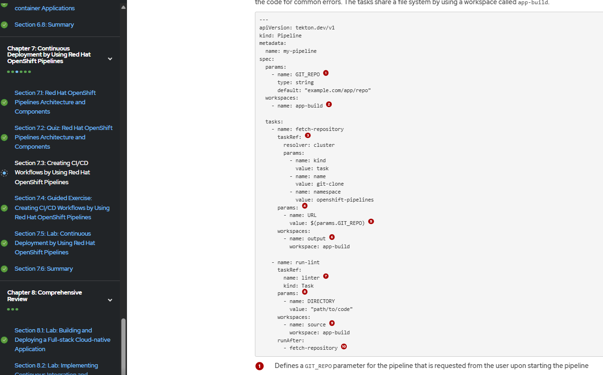

Giải thích chi tiết pipeline.yaml + cần file gì thêm  
Ngắn gọn: file bạn gửi là Pipeline (Tekton) — nó định nghĩa luồng: clone repo → build Maven → deploy lên OpenShift bằng oc → copy image với skopeo.  
Để chạy được pipeline này trên cluster bạn chắc chắn cần 1 PipelineRun (ví dụ run.yaml) để bind workspaces/params/serviceAccount; còn task.yaml chỉ cần khi các Task được pipeline tham chiếu không có sẵn trên cluster. Dưới đây là giải thích chi tiết và mẫu PipelineRun + hai Task mẫu bạn rất có thể sẽ cần.

1) Tổng quan các phần trong pipeline.yaml
- apiVersion: tekton.dev/v1 / kind: Pipeline  
Đây là Pipeline (tập hợp các Task).

- workspaces

  - shared: workspace chung để chia sẻ source/artifact giữa các tasks. Thường bind tới PVC (persistent volume) trong PipelineRun.

  - maven_config: chỗ để mount cấu hình Maven (ví dụ một ConfigMap chứa settings.xml) nếu cần.

- params (tùy chỉnh) — từng biến có ý nghĩa:

  - GIT_REPO / GIT_REVISION: repo và branch/tag để clone.

  - MVN_APP_PATH: đường dẫn trong repo tới ứng dụng Maven (relative path).

  - DEPLOY_ARTIFACT_NAME: đường dẫn artifact (relative to app path) mà oc start-build --from-file=... sẽ dùng.

  - DEPLOY_APP_NAME: tên ứng dụng / buildconfig / service trên OpenShift.

- tasks — chuỗi các bước thực thi:

`clone-repository`

- taskRef dùng resolver: cluster với name: git-clone (thường là ClusterTask có sẵn trong catalog / OpenShift Pipelines).

- Params: URL, REVISION, DELETE_EXISTING, SSL_VERIFY.
Lưu ý: SSL_VERIFY: "false" là không an toàn (bỏ verify TLS) — chỉ dùng trong môi trường phát triển hoặc khi bạn hiểu lý do. Tốt hơn là cung cấp CA hoặc SSH creds.

- Workspace output map tới shared — mã nguồn sẽ xuất ra đó.

`build`

taskRef: name: maven-task (kind: Task) → Task này phải tồn tại trên cluster (hoặc bạn phải tạo nó).

Param app_path truyền $(params.MVN_APP_PATH).

Workspaces: source ← shared, maven_config ← maven_config.

Kết quả: build Maven, tạo artifact tại $(workspaces.source.path)/$(params.app_path)/target/... (phải khớp DEPLOY_ARTIFACT_NAME).

`oc-deploy`

- taskRef dùng resolver: cluster, name: openshift-client → Task cluster-provided để chạy oc (OpenShift CLI) trong một step.

- Script thực hiện:

- cd "$(workspaces.manifest_dir.path)/$(params.MVN_APP_PATH)" — chuyển tới thư mục app (đảm bảo artifact tồn tại ở đó).

- oc new-build --binary=true --image-stream=openshift/java:8 tạo BuildConfig (nếu chưa có).

- oc start-build --from-file=$(params.DEPLOY_ARTIFACT_NAME) upload jar để build image.

- oc new-app / oc expose svc để deploy và expose.

- Lưu ý quyền (service account) cần có quyền create/build/start-build/new-app/expose.

`skopeo-copy`

- taskRef: name: skopeo-copy-internal → Task (nội bộ) chịu trách nhiệm copy image giữa registries sử dụng skopeo. Task này cũng phải tồn tại trên cluster (nếu không, pipeline sẽ fail).

- Params truyền SOURCE_IMAGE_URL, DESTINATION_IMAGE_URL, IMAGE (image chứa skopeo).

- Quan trọng: xác thực tới hai registry (source/destination) — cần mount secret .dockerconfigjson hoặc truyền creds an toàn.

2) Cần cung cấp thêm file run.yaml, task.yaml không?
- run.yaml (PipelineRun): Cần — để thực sự chạy pipeline bạn phải tạo một PipelineRun (hoặc tạo nó bằng tkn CLI). PipelineRun bind các workspaces (PVC / ConfigMap / Secret / emptyDir), params, serviceAccountName.  
=> Bắt buộc: cung cấp hoặc áp dụng PipelineRun tương ứng.

- task.yaml (Task):

  - Nếu Task bạn tham chiếu đã có sẵn trên cluster (ví dụ git-clone và openshift-client thường được cung cấp bởi OpenShift Pipelines hoặc Tekton Catalog) => không cần.

  - Nếu Task là maven-task và skopeo-copy-internal chưa có trên cluster, bạn phải cung cấp YAML để kubectl apply -f tạo chúng.
=> Kiểm tra bằng: kubectl get tasks -n <your-namespace> (hoặc tkn task list) — nếu không thấy maven-task/skopeo-copy-internal, tạo file task.yaml.

3) Mẫu PipelineRun (run.yaml) — mình khuyên dùng (thay giá trị phù hợp)
```
apiVersion: tekton.dev/v1
kind: PipelineRun
metadata:
  name: maven-java-pipeline-run
spec:
  pipelineRef:
    name: maven-java-pipeline
  serviceAccountName: pipeline  # service account phải có quyền cần thiết
  workspaces:
    - name: shared
      persistentVolumeClaim:
        claimName: tekton-pvc
    - name: maven_config
      configMap:
        name: maven-settings   # chứa settings.xml nếu bạn dùng
  params:
    - name: GIT_REPO
      value: "https://git.ocp4.example.com/developer/D0288-apps"
    - name: GIT_REVISION
      value: "main"
    - name: MVN_APP_PATH
      value: "builds-applications/apps/vertx-site"
    - name: DEPLOY_ARTIFACT_NAME
      value: "target/vertx-site-1.0.0-SNAPSHOT-fat.jar"
    - name: DEPLOY_APP_NAME
      value: "vertx-site"
```
Chú ý: maven_config binding ở trên dùng ConfigMap. Bạn cũng có thể bind secret (nếu settings chứa credentials) hoặc một PVC/emptyDir tuỳ mục đích.

4) Mẫu Task cần thiết (ví dụ maven-task & skopeo-copy-internal)
(A) maven-task — ví dụ đơn giản
```
apiVersion: tekton.dev/v1
kind: Task
metadata:
  name: maven-task
spec:
  params:
    - name: app_path
      type: string
  workspaces:
    - name: source
    - name: maven_config
  steps:
    - name: build
      image: maven:3.8-jdk-8
      script: |
        #!/usr/bin/env bash
        set -euo pipefail
        # nếu có settings.xml trong maven_config, copy vào ~/.m2/settings.xml
        if [ -f "$(workspaces.maven_config.path)/settings.xml" ]; then
          mkdir -p /root/.m2
          cp "$(workspaces.maven_config.path)/settings.xml" /root/.m2/settings.xml
        fi
        cd "$(workspaces.source.path)/$(params.app_path)"
        mvn -B -DskipTests package
```
Lưu ý: image maven:3.8-jdk-8 có thể thay bằng image nội bộ của bạn; đảm bảo JDK phù hợp.

(B) skopeo-copy-internal — ví dụ (tùy chỉnh cho secret mount)
```
apiVersion: tekton.dev/v1
kind: Task
metadata:
  name: skopeo-copy-internal
spec:
  params:
    - name: SOURCE_IMAGE_URL
      type: string
    - name: DESTINATION_IMAGE_URL
      type: string
  workspaces:
    - name: registry_creds   # bind tới Secret chứa .dockerconfigjson
  steps:
    - name: skopeo-copy
      image: registry.ocp4.example.com:8443/ubi9/skopeo:9.2
      script: |
        #!/usr/bin/env bash
        set -euo pipefail
        # nếu PipelineRun đã mount secret dockerconfigjson vào workspace:
        if [ -f "$(workspaces.registry_creds.path)/.dockerconfigjson" ]; then
          mkdir -p /root/.docker
          cp "$(workspaces.registry_creds.path)/.dockerconfigjson" /root/.docker/config.json
        fi
        # thực hiện copy (tùy registry có verify TLS hay không)
        skopeo copy --all --src-tls-verify=false --dest-tls-verify=false \
          "$(params.SOURCE_IMAGE_URL)" "$(params.DESTINATION_IMAGE_URL)"
```
Quan trọng: bạn phải đảm bảo secrets cho registry được mount (hoặc cung cấp creds qua cách an toàn khác). --src-tls-verify=false là insecure — chỉ dùng khi cần.

5) Quyền (RBAC), service accounts và secrets cần lưu ý
- ServiceAccount (ví dụ pipeline) cần quyền:

- đọc/ghi PVC, tạo BuildConfig/Builds, tạo/modify Deployments/Routes/Services (hoặc edit trong namespace).

- quyền push/pull tới internal registry nếu pipeline cần push images.

- Bạn có thể bind role edit cho SA:

  - OpenShift: oc adm policy add-role-to-user edit system:serviceaccount:<namespace>:pipeline -n <namespace>

  - Kubernetes: kubectl create rolebinding ... --clusterrole=edit --serviceaccount=<ns>:pipeline -n <ns>

- Secrets cho registry/git:

  - Git (HTTPS/SSH) credentials: mount secret (ssh key) hoặc dùng git-clone task options.

  - Docker registry creds: tạo docker-registry secret (k8s kubectl create secret docker-registry ...) rồi bind vào PipelineRun workspace secret hoặc workspaces.registry_creds.secret.secretName (mẫu bên trên dùng binding workspace->secret).

6) Những điểm cảnh báo / gợi ý cải thiện
- SSL_VERIFY: "false" trong git-clone: không khuyến khích cho production — thay bằng CA hoặc SSH key.

- Đảm bảo artifact path (DEPLOY_ARTIFACT_NAME) khớp chính xác với output của Maven build. (Nên dùng build task sao cho artifact xuất ra chỗ oc mong đợi.)

- oc new-build + oc start-build --from-file là cách hợp lý cho binary build, nhưng bạn có thể cân nhắc dùng ImageStream/BuildConfig đúng chuẩn nội bộ.

- Kiểm soát lỗi: hiện script có || echo "..." — có thể che dấu lỗi thật; cân nhắc xử lý exit code hợp lý.

- Tài nguyên (requests/limits), caching maven (~/.m2) để tăng tốc builds: mount cache PVC hoặc use maven cache Task.

- Kiểm tra tồn tại các Task cluster (git-clone, openshift-client). Nếu cluster không có, bạn phải apply Task (task.yaml) hoặc cài Tekton catalog/TaskHub.

7) Kết luận & bước tiếp theo
- Bạn cần cung cấp:

- run.yaml (PipelineRun) để chạy pipeline (ví dụ mẫu mình đã đính kèm).

- task.yaml chỉ nếu maven-task hoặc skopeo-copy-internal không có sẵn trên cluster. (Các task git-clone và openshift-client thường là task cluster-provided trên OpenShift Pipelines; kiểm tra trước.)

Mình đã đính kèm mẫu PipelineRun và mẫu Task (maven + skopeo) phía trên — bạn có thể copy & chỉnh cho phù hợp rồi kubectl apply -f. Nếu bạn muốn, mình sẽ:

- tạo sẵn run.yaml + maven-task.yaml + skopeo-copy-internal.yaml với giá trị thay thế cụ thể của bạn (ví dụ tên namespace, tên service account, chi tiết secret), hoặc

- kiểm tra giúp bạn xem cluster đã có git-clone / openshift-client / maven-task hay chưa (nếu bạn cho biết namespace hoặc đầu ra kubectl get tasks -n <ns>).

## ChatGPT said:
Tuyệt vời 👏 — bạn đã có đầy đủ 3 file chính để pipeline Tekton chạy hoàn chỉnh:
✅ pipeline.yaml (định nghĩa luồng xử lý)  
✅ task.yaml (định nghĩa maven-task)  
✅ run.yaml (tạo PipelineRun thực thi pipeline)  

Giờ mình sẽ giúp bạn kiểm tra và giải thích chi tiết từng phần, chỉ ra điểm cần chú ý hoặc cải thiện để bạn có thể chạy thành công ngay trên OpenShift.

🔹 1. task.yaml — Task build Maven
```
apiVersion: tekton.dev/v1
kind: Task
metadata:
  name: maven-task
spec:
  workspaces:
    - name: source
    - name: maven_config
  params:
    - name: app_path
      description: Path to the application source code in the directory
      type: string
  steps:
    - name: build
      image: registry.ocp4.example.com:8443/ubi8/openjdk-11:1.16-3
      workingDir: $(workspaces.source.path)/$(params.app_path)
      script: |
        mvn clean package -s $(workspaces.maven_config.path)/settings.xml
      securityContext:
        runAsNonRoot: true
        runAsUser: 65532
```
✅ Phân tích đúng:

- image: bạn dùng ubi8/openjdk-11 — rất phù hợp cho Maven + Java 11.

- workingDir: $(workspaces.source.path)/$(params.app_path) — chính xác, vì mã nguồn đã được clone vào workspace shared trong pipeline.

- mvn clean package -s settings.xml: dùng cấu hình từ secret mvn-settings.

- securityContext: runAsNonRoot + 65532 là chuẩn an toàn (OpenShift yêu cầu UID không phải root).

⚠️ Gợi ý nhỏ:

1. Đảm bảo image có Maven
→ ubi8/openjdk-11 của Red Hat thường không có sẵn Maven. Nếu bạn gặp lỗi mvn: command not found, bạn cần:

Dùng image có sẵn Maven:
```
image: registry.access.redhat.com/ubi8/openjdk-11:1.16-3
```
và kiểm tra bằng oc debug hoặc tài liệu Red Hat xem có mvn.
Hoặc dùng image chuyên dụng:
```
image: registry.access.redhat.com/ubi8/maven:3.8-openjdk-11
```
2. Nếu dùng mvn-settings secret, chắc chắn secret có file settings.xml tại root (.data["settings.xml"]).

🔹 2. run.yaml — PipelineRun
```
apiVersion: tekton.dev/v1
kind: PipelineRun
metadata:
  name: testrun
  finalizers:
    - chains.tekton.dev/pipelinerun
  labels:
    tekton.dev/pipeline: maven-java-pipeline
spec:
  params:
    - name: GIT_REPO
      value: "https://git.ocp4.example.com/developer/D0288-apps"
    - name: GIT_REVISION
      value: "main"
    - name: MVN_APP_PATH
      value: "apps/pipelines-review/vertx-site"
    - name: DEPLOY_ARTIFACT_NAME
      value: "target/vertx-site-1.0.0-SNAPSHOT-fat.jar"
    - name: DEPLOY_APP_NAME
      value: "vertx-site"

  pipelineRef:
    name: maven-java-pipeline

  taskRunTemplate:
    serviceAccountName: pipeline

  workspaces:
    - name: shared
      volumeClaimTemplate:
        metadata:
          name: shared-pvc
        spec:
          accessModes:
            - ReadWriteOnce
          resources:
            requests:
              storage: 1Gi
          storageClassName: nfs-storage
          volumeMode: Filesystem
    - name: maven_config
      secret:
        secretName: mvn-settings
```
✅ Phân tích đúng:

- pipelineRef → trỏ đúng pipeline bạn đã tạo.

- taskRunTemplate.serviceAccountName: pipeline → service account pipeline là chuẩn mặc định trên OpenShift Pipelines.

- shared → PVC động tạo từ volumeClaimTemplate (rất hay, mỗi run PVC riêng).

- maven_config → mount secret mvn-settings chứa settings.xml.

⚠️ Gợi ý nhỏ:

1. MVN_APP_PATH:

- Trong pipeline gốc bạn default "builds-applications/apps/vertx-site"

- Ở run.yaml bạn đổi "apps/pipelines-review/vertx-site"
→ Đảm bảo đường dẫn tồn tại trong repo (GIT_REPO). Nếu sai, task maven-task sẽ lỗi no such file or directory.

2. storageClassName: nfs-storage

- Hãy chắc chắn cluster có nfs-storage class (oc get sc). Nếu không, đổi thành class có thật (ví dụ gp2-csi trên AWS, ocs-storagecluster-cephfs, v.v.).

3. finalizers: chains.tekton.dev/pipelinerun

- Đây là để Tekton Chains (sigstore) ghi lại provenance. Nếu bạn chưa cài Chains, có thể bỏ để tránh stuck trạng thái Running.

- Nếu bạn đã cài Tekton Chains, giữ lại cũng được.

🔹 3. Kiểm tra các Task tham chiếu trong Pipeline
Trong pipeline.yaml bạn dùng 4 tasks:

Task name	|Có sẵn không?|	Ghi chú
---|---|---
git-clone	|✅ ClusterTask |có sẵn trong OpenShift Pipelines	Không cần tạo
maven-task	|🟢 Bạn đã cung cấp	|OK
openshift-client|	✅ ClusterTask có sẵn	|OK
skopeo-copy-internal	|❓ Cần kiểm tra|	Nếu chưa có, cần tạo Task riêng (dùng skopeo copy)

👉 Chạy lệnh kiểm tra nhanh:

tkn task list -n openshift-pipelines
hoặc

kubectl get clustertasks
Nếu không có skopeo-copy-internal, bạn cần apply Task mình gợi ý mẫu ở phần trước.

🔹 4. ServiceAccount pipeline
Đảm bảo pipeline có đủ quyền:
```
oc adm policy add-role-to-user edit system:serviceaccount:<namespace>:pipeline
```
Nếu cần thao tác oc new-build, oc new-app, oc expose, cần quyền edit hoặc cao hơn.

🔹 5. Secret mvn-settings
Kiểm tra secret có cấu trúc đúng:
```
oc get secret mvn-settings -o yaml
```
Phải có:
```
data:
  settings.xml: <base64>
```
Nếu chưa có, tạo:
```
oc create secret generic mvn-settings --from-file=settings.xml=./settings.xml
```
🔹 6. Lệnh apply & kiểm tra
```
oc apply -f task.yaml
oc apply -f pipeline.yaml
oc apply -f run.yaml
```
Kiểm tra tiến trình:
```
tkn pipelinerun logs testrun -f
```
Nếu lỗi:

- Task maven-task: kiểm tra log xem có mvn command không.

- Task oc-deploy: xem oc new-build hoặc oc start-build có quyền không.

- Task skopeo-copy: kiểm tra image, credentials, registry.

✅ Tóm tắt
Thành phần|	Trạng thái	|Gợi ý
---|---|---
pipeline.yaml|	✅ OK	
task.yaml (maven-task)	|✅ OK	|Đảm bảo image có Maven
run.yaml	|✅ OK	|Kiểm tra đường dẫn app & storage class
skopeo-copy-internal	|❓	|Tạo thêm nếu chưa có
SA pipeline	|⚠️	|Cần quyền edit
Secret mvn-settings	|⚠️|	Phải có file settings.xml

Bạn muốn mình tạo giúp Task skopeo-copy-internal.yaml luôn cho đồng bộ không? Mình có thể viết sẵn bản dùng image ubi9/skopeo:9.2 như bạn định nghĩa trong pipeline.


reply: workspaces: \- name: shared volumeClaimTemplate: metadata: name: shared-pvc spec: accessModes: \- ReadWriteOnce resources: requests: storage: 1Gi storageClassName: nfs-storage volumeMode: Filesystem \- name: maven\_config secret: secretName: mvn-settings
-> 
# You said
là sao, 2 file có 2 value khác nhau của name: MVN_APP_PATH thì hoạt động kiểu gì và mục này là tạo ra 2 workspace share dùng chung cho các task trong pipeline.yaml à, và trong task.yaml có       workingDir: $(workspaces.source.path)/$(params.app_path)  lấy giá trị biến ở đâu tôi ko thấy các biến này
## ChatGPT said:
Rất hay 👏 bạn đang hỏi đúng trọng tâm của Tekton (nhiều người hay nhầm đoạn này). Mình giải thích thật kỹ và minh họa cho dễ hiểu nhé:

🧩 1. Về MVN_APP_PATH – vì sao giá trị khác nhau giữa pipeline.yaml và run.yaml
Trong pipeline.yaml, bạn định nghĩa param và default value:
```
params:
  - name: MVN_APP_PATH
    type: string
    default: "builds-applications/apps/vertx-site"
```
👉 Đây là giá trị mặc định. Nếu người chạy pipeline không truyền gì, Tekton sẽ lấy giá trị này.

Trong run.yaml, bạn truyền giá trị override khi chạy:
```
params:
  - name: MVN_APP_PATH
    value: "apps/pipelines-review/vertx-site"
```
👉 Khi PipelineRun khởi tạo, Tekton sẽ ghi đè giá trị default trong pipeline bằng giá trị bạn truyền ở run.yaml.

📌 Tóm lại:

- Giá trị trong pipeline.yaml chỉ là mặc định (default).

- Giá trị trong run.yaml là thực tế được sử dụng khi chạy.

💡 Bạn có thể coi pipeline.yaml giống như “hàm” có tham số, còn run.yaml là “lời gọi hàm” truyền tham số thực tế.

🧩 2. Về workspace shared – có phải dùng chung giữa các task không?
Đúng ✅

Trong pipeline.yaml:
Bạn định nghĩa workspace:
```
workspaces:
  - name: shared
  - name: maven_config
```
Và bạn gán workspace này cho các Task:
```
- name: clone-repository
  workspaces:
    - name: output
      workspace: shared
- name: build
  workspaces:
    - name: source
      workspace: shared
```
→ Cả hai Task này đều dùng cùng một workspace (shared)  
==> Tức là chung 1 volume (PVC) — những file mà task đầu tạo ra (vd: source code được clone về) sẽ có sẵn cho task sau.

📦 Khi PipelineRun chạy, nó gán thật workspace shared này bằng một PVC:
```
workspaces:
  - name: shared
    volumeClaimTemplate:
      ...
```
=> Tekton sẽ tự tạo PVC mới (tên random), mount vào tất cả task tham chiếu workspace: shared.

✅ Kết quả:

- Task git-clone clone mã nguồn vào $(workspaces.output.path)

- Task maven-task truy cập lại mã nguồn qua $(workspaces.source.path) (chính là cùng 1 thư mục PVC)

🧩 3. Biến $(workspaces.source.path) và $(params.app_path) trong task.yaml lấy từ đâu?
Rất hay — đây là phần binding giữa Pipeline và Task.

Trong task.yaml:  
Bạn định nghĩa:
```
workspaces:
  - name: source
  - name: maven_config
params:
  - name: app_path
```
→ Task chỉ “khai báo” là nó nhận đầu vào có tên source và param app_path.

Trong pipeline.yaml:
Khi bạn gọi Task đó, bạn gán thật giá trị cho từng workspace / param:
```
- name: build
  taskRef:
    name: maven-task
  params:
    - name: app_path
      value: $(params.MVN_APP_PATH)
  workspaces:
    - workspace: shared
      name: source
    - workspace: maven_config
      name: maven_config
```
📌 Giải nghĩa:

- params.app_path của Task = $(params.MVN_APP_PATH) (param pipeline)

- workspaces.source của Task = workspace shared (workspace pipeline)

✅ Khi PipelineRun chạy:

1. Pipeline param MVN_APP_PATH = "apps/pipelines-review/vertx-site" (từ run.yaml)

2. Pipeline gán param đó vào Task param app_path

3. Task maven-task nhận được:

- $(params.app_path) = "apps/pipelines-review/vertx-site"

- $(workspaces.source.path) = đường dẫn thật tới PVC (vd /workspace/shared)

➡ Kết quả thực tế trong step:
```
workingDir: /workspace/shared/apps/pipelines-review/vertx-site
```
vì:
```
$(workspaces.source.path) → /workspace/shared
$(params.app_path)        → apps/pipelines-review/vertx-site
```
💡 Tóm tắt mô hình biến:
Loại	|Định nghĩa ở đâu|	Sử dụng ở đâu|	Cách gán
---|---|---|---
$(params.X)	|Trong pipeline.yaml (hoặc run.yaml)|	Trong pipeline & task	|run.yaml có thể override
$(workspaces.X.path)	|Trong pipeline.yaml (tên workspace)	|Trong task	|gán bằng workspaces: - name:

✅ Tổng kết lại cho bạn
Khía cạnh	|Giải thích
---|---
Hai giá trị MVN_APP_PATH khác nhau	|Giá trị trong run.yaml ghi đè giá trị mặc định trong pipeline.yaml
Workspace shared	|Dùng chung 1 PVC cho các Task, giúp Task sau truy cập kết quả Task trước
$(workspaces.source.path)	|Được Tekton inject vào container theo tên workspace Task yêu cầu
$(params.app_path)|	Giá trị param được gán trong pipeline ($(params.MVN_APP_PATH)) và truyền từ run.yaml

Bạn muốn mình vẽ giúp sơ đồ flow dữ liệu (workspace + params) giữa các Task để hình dung trực quan không? Mình có thể làm 1 hình minh họa để bạn thấy luồng dữ liệu Tekton đi như thế nào 👇

# You said:
`$(workspaces.X.path)` `$(params.X)` là quy định trong pipeline tekton à

## ChatGPT said:
🎯 Đúng chính xác luôn nhé!
`$(workspaces.X.path)` và `$(params.X)` không phải là biến bash — mà là biến nội suy (variable substitution) do Tekton quy định sẵn trong ngôn ngữ YAML của nó.

🧩 1. Nguồn gốc
Đây là cú pháp chính thức của Tekton Pipelines (thuộc API tekton.dev/v1).
Tekton có cơ chế template substitution, cho phép bạn dùng biến động như:

Loại biến	|Cú pháp|	Ý nghĩa
---|---|---
Parameter	|$(params.<paramName>)|	Tham chiếu tới giá trị param trong pipeline hoặc task
Workspace	|$(workspaces.<workspaceName>.path)|	Tham chiếu tới đường dẫn mount workspace
Results|	$(tasks.<taskName>.results.<resultName>)	|Lấy output từ task trước
Context	| $(context.pipeline.name) / $(context.taskRun.name)|	Metadata runtime
Pipeline params (truyền xuống Task)	|$(params.<name>)	|Dùng trong taskRef param
Workspaces trong Task	| $(workspaces.<name>.path)	|Dùng trong workingDir, script

🧩 2. Cách Tekton xử lý
Khi Tekton Controller chạy PipelineRun:

1. Nó đọc YAML Pipeline / Task

2. Thay tất cả $(...) bằng giá trị thực tế

3. Sau đó mới tạo Pod (mỗi step là container)

Ví dụ:
```
workingDir: $(workspaces.source.path)/$(params.app_path)
```
Giả sử:

- Workspace source được mount tại /workspace/shared

- Param app_path = apps/pipelines-review/vertx-site

👉 Tekton sẽ render trước khi chạy:

workingDir: /workspace/shared/apps/pipelines-review/vertx-site
Khi Pod được tạo, container sẽ có workingDir chính xác như vậy.
=> Bạn không cần export hay set env trong script.

🧩 3. Một số biến Tekton hay dùng
Biến	|Ý nghĩa
---|---
$(params.X)	|Lấy param (pipeline hoặc task)
$(workspaces.X.path)	|Đường dẫn thực tế mount workspace
$(workspaces.X.bound)	|true/false — workspace có bind không
$(tasks.<taskName>.results.<resultName>)	|Giá trị result từ Task trước
$(context.pipelineRun.name)	|Tên PipelineRun
$(context.task.name)	|Tên Task đang chạy
$(context.taskRun.name)	|Tên TaskRun
$(context.pipeline.name)	|Tên Pipeline
$(context.workspace.<workspace>.bound)	|Kiểm tra workspace có bind hay không

🧩 4. ⚠️ Lưu ý
- Các biến này chỉ dùng được trong YAML Tekton (script, args, workingDir, env, v.v.).
Không dùng trong bash trực tiếp (trừ khi Tekton render xong rồi).

- Tekton sẽ thay thế chuỗi trước khi tạo Pod, chứ không export thành $params_X trong môi trường container.

- Nếu bạn viết echo $(params.X) trong bash script, Tekton sẽ thay thành echo real_value trước khi chạy.

✅ Ví dụ minh họa
Task định nghĩa:
```
apiVersion: tekton.dev/v1
kind: Task
metadata:
  name: demo-task
spec:
  params:
    - name: message
      default: "Hello"
  workspaces:
    - name: source
  steps:
    - name: print
      image: busybox
      script: |
        echo "Message: $(params.message)"
        echo "Workspace: $(workspaces.source.path)"
```
Pipeline gọi:
```
tasks:
  - name: print-step
    taskRef:
      name: demo-task
    params:
      - name: message
        value: "Hi Tekton"
    workspaces:
      - name: source
        workspace: shared
```
Khi chạy, log hiển thị:
```
Message: Hi Tekton
Workspace: /workspace/shared
```
✅ Tóm lại
- $(params.X) và $(workspaces.X.path) là chuẩn cú pháp của Tekton, không phải shell.

- Tekton sẽ render chúng trước khi thực thi container.

- Dùng để tham chiếu giá trị động giữa Pipeline ↔ Task ↔ Step.

Bạn có muốn mình liệt kê cho bạn toàn bộ các nhóm biến Tekton hỗ trợ (params / workspaces / tasks / context / results) kèm ví dụ thực tế để tra nhanh không? Mình có thể gửi bảng tổng hợp kiểu “Tekton Variable Cheatsheet” giúp bạn dễ tra cứu sau này.


```
  workspaces:
    - name: shared
      volumeClaimTemplate:
        metadata:
          name: shared-pvc
        spec:
          accessModes:
            - ReadWriteOnce
          resources:
            requests:
              storage: 1Gi
          storageClassName: nfs-storage
          volumeMode: Filesystem
    - name: maven_config
      secret:
        secretName: mvn-settings
```
trong run.yaml là tạo ra 1 pvc xong rồi xóa đi à, hay là đang sử dụng 1 pv có sẵn bên ngoài hay như nào ?  và workspace có secret secretName: mvn-settings là gì
## ChatGPT said:

Câu hỏi này cực kỳ hay 👏 — bạn đang đụng tới cách Tekton tạo workspace tạm (ephemeral) và cách gắn secret vào workspace, là hai khái niệm rất quan trọng trong Tekton CI/CD.
Giờ mình giải thích thật kỹ để bạn hình dung rõ toàn bộ quá trình nhé.

🧩 1. Về workspace shared với volumeClaimTemplate
```
workspaces:
  - name: shared
    volumeClaimTemplate:
      metadata:
        name: shared-pvc
      spec:
        accessModes:
          - ReadWriteOnce
        resources:
          requests:
            storage: 1Gi
        storageClassName: nfs-storage
        volumeMode: Filesystem
```
🧠 Ý nghĩa:

- Bạn không tạo sẵn PVC thủ công, mà Tekton sẽ tự động tạo một PVC mới khi PipelineRun bắt đầu chạy.

- PVC này là ephemeral PVC — tức là tạm thời, dùng riêng cho PipelineRun đó.

Khi PipelineRun kết thúc:

- Nếu bạn không bật chế độ giữ lại (retention), Tekton sẽ xóa PVC tự động.

- Nếu bạn cấu hình annotation như tekton.dev/keep-workspace: "true" hoặc retention policy, PVC có thể được giữ lại.

🔁 Chu kỳ sống (Lifecycle):

1️⃣ Khi bạn oc apply -f run.yaml → Tekton Controller đọc volumeClaimTemplate  
2️⃣ Tạo PVC mới dựa trên template (sử dụng StorageClass nfs-storage)  
3️⃣ Mount PVC đó vào tất cả các Task dùng workspace: shared  
4️⃣ Sau khi PipelineRun hoàn tất → Tekton cleanup PVC (nếu không cấu hình giữ lại)

📦 => PVC này hoàn toàn độc lập, không tái sử dụng PV/PVC có sẵn.
Tuy nhiên, nó sẽ dùng PV từ StorageClass nfs-storage, vì nfs-storage là nguồn cấp (provisioner) cung cấp PV động.

📌 Nếu bạn muốn dùng PVC có sẵn (thay vì tạo mới):

Bạn có thể khai báo:
```
workspaces:
  - name: shared
    persistentVolumeClaim:
      claimName: my-existing-pvc
```

👉 Lúc này Tekton sẽ mount PVC có sẵn tên my-existing-pvc thay vì tạo mới.

🧩 2. Về workspace maven_config dùng secret
```
- name: maven_config
  secret:
    secretName: mvn-settings
```
🧠 Ý nghĩa:

- Tekton sẽ mount nội dung của Secret mvn-settings vào một thư mục tạm (ví dụ /workspace/maven_config).

- Trong Task, bạn có thể truy cập bằng:
```
$(workspaces.maven_config.path)/settings.xml
```

Secret này thường chứa:

- File settings.xml (config maven repository, credentials,…)

- Có thể chứa user/password cho private repo Maven

🧱 Secret này bạn phải tạo sẵn trước:
```
oc create secret generic mvn-settings \
  --from-file=settings.xml
```

Sau đó Tekton sẽ:

Mount secret vào container step (đọc-only)

Bạn dùng file đó trong câu lệnh Maven:
```
mvn clean package -s $(workspaces.maven_config.path)/settings.xml
```
🧩 3. Tổng kết lại
Workspace	|Loại	|Tác dụng	|Tồn tại bao lâu	|Tạo ra từ đâu
---|---|---|---|---
shared|	PVC tạm (ephemeral PVC)	|Lưu source code, artifact	|Bị xóa sau khi PipelineRun xong (mặc định)	|Tạo tự động từ volumeClaimTemplate
maven_config	|Secret mount|	Lưu file settings.xml để build Maven|	Trong thời gian Task chạy	|Secret mvn-settings tạo sẵn

🧩 4. Minh họa thực tế dòng chảy

🌀 Khi bạn oc apply -f run.yaml, Tekton làm:

✅ Tạo PVC tạm pvc-xxxxxx từ volumeClaimTemplate

✅ Mount PVC vào tất cả Task dùng workspace: shared

✅ Mount Secret mvn-settings vào thư mục $(workspaces.maven_config.path)

✅ Task git-clone ghi code vào /workspace/shared

✅ Task maven-task dùng /workspace/shared làm source và /workspace/maven_config/settings.xml

✅ Task oc-deploy đọc artifact trong /workspace/shared

✅ Sau khi PipelineRun hoàn tất → PVC tạm bị xóa

🧩 5. Nếu bạn muốn giữ lại PVC để debug:

Thêm annotation hoặc policy:
```
metadata:
  annotations:
    tekton.dev/keep-workspace: "true"
```

Hoặc dùng:
```
spec:
  workspaces:
    - name: shared
      persistentVolumeClaim:
        claimName: my-debug-pvc
```

Bạn có muốn mình vẽ sơ đồ dòng chảy Workspace (PVC tạm, Secret mount, Data flow giữa Task) để bạn hình dung trực quan luôn không? Nhìn sơ đồ sẽ thấy rất rõ pipeline share dữ liệu thế nào.

# You said:
pv pvc storageclass có mỗi quan hệ như nào ở ví dụ trên

## ChatGPT said:

Câu hỏi của bạn rất trọng tâm, vì hiểu đúng mối quan hệ giữa PV – PVC – StorageClass là nền tảng để hiểu Tekton workspace hoạt động thế nào (và thực ra là cả cơ chế lưu trữ trong Kubernetes luôn).
Mình sẽ giải thích chi tiết theo ví dụ Tekton của bạn để bạn thấy các khối ghép với nhau thế nào nhé 👇

🧩 1. Các khái niệm cơ bản trước
Thành phần	|Viết tắt|	Vai trò
---|---|---
PV	|PersistentVolume	|Là tài nguyên vật lý thật (ổ đĩa) trong cluster (NFS, iSCSI, Ceph, v.v.)
PVC	|PersistentVolumeClaim	|Là yêu cầu sử dụng dung lượng từ PV (PVC = "xin" một ổ đĩa từ cluster)
StorageClass|	StorageClass	|Là mẫu định nghĩa cách tạo PV tự động, dùng để Provision PV mới khi có PVC

📘 Nói đơn giản:

- PV = “ổ đĩa thật trong cluster”

- PVC = “phiếu yêu cầu mượn ổ đĩa”

- StorageClass = “quy định mượn ổ đĩa loại nào, dung lượng bao nhiêu, tạo bằng cách nào”

🧩 2. Ở ví dụ của bạn
```
workspaces:
  - name: shared
    volumeClaimTemplate:
      metadata:
        name: shared-pvc
      spec:
        accessModes:
          - ReadWriteOnce
        resources:
          requests:
            storage: 1Gi
        storageClassName: nfs-storage
        volumeMode: Filesystem
```

Khi PipelineRun khởi chạy, Tekton sẽ dùng volumeClaimTemplate để tạo ra một PVC mới như sau:
```
apiVersion: v1
kind: PersistentVolumeClaim
metadata:
  name: shared-pvc-<random-suffix>
spec:
  accessModes:
    - ReadWriteOnce
  resources:
    requests:
      storage: 1Gi
  storageClassName: nfs-storage
```
⚙️ Quá trình diễn ra:

1. 🎯 PVC được tạo bởi Tekton từ template trên.

2. ⚙️ Kubernetes controller nhìn thấy PVC này có storageClassName: nfs-storage

3. Nó chuyển yêu cầu đến StorageClass có tên nfs-storage

4. StorageClass gọi Provisioner tương ứng (ví dụ nfs.csi.k8s.io) để tạo một PV mới

5. ✅ PV mới được tạo, có capacity = 1Gi

6. PVC và PV được bind với nhau

7. Pod Tekton mount PVC này vào /workspace/shared

👉 Tức là bạn không tạo PV thủ công — StorageClass sẽ tự động tạo PV phù hợp với yêu cầu PVC.

🧩 3. Quan hệ trực quan:
```
+-------------------------------+
| StorageClass: nfs-storage     | <--- quy định tạo PV (Provisioner: NFS)
+---------------+---------------+
                |
                v
+---------------+---------------+
| PV (dynamic) - 1Gi from NFS   | <--- Ổ đĩa thật (provisioned tự động)
+---------------+---------------+
                |
                v
+---------------+---------------+
| PVC: shared-pvc-xxxxx         | <--- Yêu cầu dung lượng, bind với PV
+---------------+---------------+
                |
                v
+---------------+---------------+
| Tekton Task Pod               | <--- Mount PVC vào /workspace/shared
+-------------------------------+

```
🧩 4. Nếu không có StorageClass?

- Khi bạn tạo PVC mà không chỉ định storageClassName, và cluster không có default StorageClass, PVC sẽ bị kẹt ở trạng thái Pending, vì không biết lấy PV từ đâu.

- Lúc này bạn phải tạo PV thủ công (PV static) khớp với yêu cầu (dung lượng, accessMode,...).

🧩 5. Một số mô hình provisioning:
Loại	|Mô tả|	Khi nào dùng
---|---|---
Static provisioning|	Admin tạo PV thủ công, user tạo PVC bind vào|	Khi storage không hỗ trợ dynamic
Dynamic provisioning|	PVC chỉ định storageClassName, Kubernetes tự tạo PV	|Khi có provisioner như NFS, Ceph, AWS EBS,…
Ephemeral (volumeClaimTemplate)|	Tekton / StatefulSet tự tạo PVC tạm thời	|Khi workload cần ổ đĩa tạm cho mỗi phiên chạy

Bạn đang dùng ephemeral dynamic provisioning 💡

🧩 6. Về AccessMode và VolumeMode
Thuộc tính	|Ý nghĩa
---|---
accessModes|	ReadWriteOnce → chỉ một node có thể ghi đọc
volumeMode|	Filesystem → mount theo dạng thư mục (vs Block)

🧩 7. Tổng hợp mối quan hệ trong ví dụ
Thành phần	|Vai trò|	Ai tạo	|Khi nào
---|---|---|---
StorageClass (nfs-storage)|	Mẫu tạo PV	|Admin	|Tạo sẵn trong cluster
PVC (shared-pvc-xxxxx)	|Yêu cầu ổ đĩa 1Gi	|Tekton	|Khi PipelineRun bắt đầu
PV (từ NFS)	|Ổ đĩa thật (backend)	|Provisioner của StorageClass|	Tự động tạo khi PVC xuất hiện
Tekton Task Pod	|Pod chạy task	|Tekton	|Mount PVC vào /workspace/shared
Tekton Controller	|Quản lý vòng đời PVC/PV	|Tekton	|Xóa PVC khi PipelineRun kết thúc
🧩 8. Bonus: Secret workspace (maven_config)

- Secret không liên quan đến PV/PVC.

- Tekton chỉ mount secret vào container trực tiếp (không qua PV/PVC).

- Dạng ephemeral volume kiểu secretVolumeSource.

✅ Tóm lại:
- StorageClass = Cách tạo PV
- PVC = Yêu cầu ổ đĩa
- PV = Ổ đĩa thật


----

## You said:

```
---
apiVersion: tekton.dev/v1
kind: Pipeline
metadata:
  name: my-pipeline
spec:
  params:
    - name: GIT_REPO 1
      type: string
      default: "example.com/app/repo"
  workspaces:
    - name: app-build 2

  tasks:
    - name: fetch-repository
      taskRef: 3
        resolver: cluster
        params:
          - name: kind
            value: task
          - name: name
            value: git-clone
          - name: namespace
            value: openshift-pipelines
      params: 4
        - name: URL
          value: $(params.GIT_REPO) 5
      workspaces:
        - name: output 6
          workspace: app-build

    - name: run-lint
      taskRef:
        name: linter 7
        kind: Task
      params: 8
        - name: DIRECTORY
          value: "path/to/code"
      workspaces:
        - name: source 9
          workspace: app-build
      runAfter:
        - fetch-repository 10
```
## ChatGPT said:
Rất hay, bạn đang đọc một file Tekton Pipeline khá đúng cách. Giờ mình sẽ giải thích thật rõ từng phần bạn hỏi nhé 👇

🧠 Tổng quan: Workspace trong Tekton là gì?
Workspace trong Tekton là cách chia sẻ dữ liệu giữa các Task.

- Mỗi Pipeline hoặc Task có thể khai báo một hoặc nhiều workspace.

- Khi Pipeline chạy, Tekton sẽ mount cùng một volume (PVC, emptyDir, configmap, secret, v.v.) vào workspace đó, để các Task có thể đọc/ghi dữ liệu chung.

👉 Nghĩa là: Workspace chính là thư mục dùng chung giữa các Task trong pipeline — rất hay dùng cho source code hoặc artifact build.

1️⃣ workspaces: - name: app-build
```
workspaces:
  - name: app-build
```
Phần này ở mức Pipeline (top-level), nghĩa là bạn đang khai báo 1 workspace dùng chung tên là app-build.

Khi bạn chạy pipeline (tkn pipeline start my-pipeline), Tekton sẽ yêu cầu bạn cung cấp một Volume (VD: PersistentVolumeClaim) để mount vào workspace này.

Ví dụ:
```
tkn pipeline start my-pipeline \
  --workspace name=app-build,claimName=my-pvc
```
2️⃣ workspaces: - name: output workspace: app-build
```
workspaces:
  - name: output
    workspace: app-build
```
Dòng này nằm trong task fetch-repository, ý nghĩa là:

- Task fetch-repository (git-clone) có một workspace tên là output.

- Pipeline sẽ gắn workspace app-build (được khai báo ở pipeline level) vào workspace output của task.

=> Khi git-clone chạy, nó sẽ clone repo vào /workspace/output (theo chuẩn Tekton).
Tức là source code sẽ được lưu ở đây.

Sau đó, task khác (ví dụ run-lint) cũng gắn cùng workspace này (app-build) → nên task đó sẽ nhìn thấy code vừa clone xong.

👉 Đây chính là cách chia sẻ code giữa các task: git-clone tải code → run-lint đọc code → build dùng code đó để build.

3️⃣ run-lint task – phần workspace
```
workspaces:
  - name: source
    workspace: app-build
```
Task run-lint có workspace tên source.

Bạn gắn vào pipeline workspace app-build.

Kết quả:

- /workspace/source (trong container của run-lint) và /workspace/output (trong container của fetch-repository) đều trỏ đến cùng một volume.

- Nên code mà fetch-repository clone được, run-lint sẽ thấy y nguyên ở /workspace/source.

⚠️ Lưu ý: Tên output hay source là tên định nghĩa trong Task, không cần phải giống nhau — quan trọng là chúng cùng gắn vào cùng workspace (app-build) ở pipeline.

✅ Tóm tắt ý nghĩa
Thành phần	|Vai trò	|Ghi chú
---|---|---
workspaces: - name: app-build (Pipeline)	|Workspace dùng chung giữa các Task	|Gắn PVC hoặc volume khi start pipeline
workspaces: - name: output; workspace: app-build (fetch-repository)	|Gắn workspace pipeline app-build vào workspace output trong task git-clone|	Code sẽ được clone vào /workspace/output
workspaces: - name: source; workspace: app-build (run-lint)|	Gắn cùng workspace vào task linter	|Linter đọc code từ /workspace/source (chính là cùng dữ liệu đã clone)


> sao phần này là tham số truyền vào task có tên linter à , tại tôi ko thấy sử dụng ?

Không hẳn là “tham số truyền vào”.

- workspaces: không phải params: → đây là mount workspace vào task, để task có thể đọc/ghi dữ liệu trong đó.

- Task linter có thể định nghĩa như sau (giả sử):
```
spec:
  workspaces:
    - name: source
  steps:
    - name: lint
      image: some-linter
      workingDir: $(workspaces.source.path)
      script: |
        lint $(workspaces.source.path)/path/to/code
```
→ nên bạn không thấy dùng trong Pipeline, nhưng trong Task definition có thể đang dùng.

Bạn có muốn mình giúp bạn vẽ sơ đồ minh họa luồng workspace (git-clone → linter → build) không? Rất dễ hiểu nếu có hình 👀

## You said:
các task là 1 container khi chạy pipeline à, khi tạo pipeline.yaml ví dụ như trên thì cần gì nữa để có thể chạy 1 quy trình cicd
## ChatGPT said:
💡 Câu hỏi của bạn rất hay — và đúng trọng tâm Tekton luôn. Mình sẽ giải thích thật dễ hiểu, theo bức tranh tổng thể của một pipeline Tekton hoàn chỉnh nhé 👇

🧩 1. Mỗi Task là một (hoặc nhiều) Container Step
Khi Pipeline chạy, Tekton sẽ tạo 1 Pod cho mỗi Task.

Trong Pod đó, mỗi Step (trong task) là 1 container riêng biệt.

Các step chạy tuần tự trong cùng Pod, chia sẻ volume /workspace.

> 📦 Vì vậy, đúng như bạn nói:

- Một Task = Một Pod

- Mỗi Step trong Task = Một Container trong Pod

- Tất cả các step trong Task chia sẻ filesystem /workspace, còn Task khác thì không chia sẻ trừ khi cùng workspace pipeline.

⚙️ 2. Viết pipeline.yaml thôi chưa đủ để chạy CICD
File `pipeline.yaml` bạn có mới là một phần trong bức tranh Tekton.

Để Pipeline có thể chạy được, bạn cần đủ các thành phần Tekton như sau:

🔹 (1) Task
Bạn phải định nghĩa sẵn các Task mà pipeline gọi đến.

Ví dụ trong pipeline của bạn có:
```
taskRef:
  resolver: cluster
  params:
    - name: kind
      value: task
    - name: name
      value: git-clone
    - name: namespace
      value: openshift-pipelines
```
→ Task `git-clone` đã có sẵn trong cluster (ClusterTask có sẵn).  
Nhưng task linter bạn cần tạo thủ công:
```
apiVersion: tekton.dev/v1
kind: Task
metadata:
  name: linter
spec:
  params:
    - name: DIRECTORY
      type: string
  workspaces:
    - name: source
  steps:
    - name: run-lint
      image: node:18
      workingDir: $(workspaces.source.path)/$(params.DIRECTORY)
      script: |
        npm install
        npm run lint
```
👉 Tóm lại:

- Nếu bạn dùng taskRef: name: something, thì task đó phải tồn tại (Task hoặc ClusterTask).

- Nếu không, PipelineRun sẽ báo lỗi “Task not found”.

🔹 (2) Pipeline
Đây là file bạn có (pipeline.yaml).
Nó liên kết các task, xác định thứ tự chạy, tham số, workspace chia sẻ, v.v.

🔹 (3) PipelineRun (chạy pipeline thực tế)
Pipeline chỉ là định nghĩa — muốn chạy, bạn cần PipelineRun:
```
apiVersion: tekton.dev/v1
kind: PipelineRun
metadata:
  name: my-pipeline-run
spec:
  pipelineRef:
    name: my-pipeline
  params:
    - name: GIT_REPO
      value: "https://github.com/example/repo.git"
  workspaces:
    - name: app-build
      persistentVolumeClaim:
        claimName: my-pvc
```
Hoặc bạn có thể chạy bằng CLI:
```
tkn pipeline start my-pipeline \
  --param GIT_REPO=https://github.com/example/repo.git \
  --workspace name=app-build,claimName=my-pvc
```
👉 PipelineRun = “Job cụ thể” của pipeline (giống như build run của Jenkins).

🔹 (4) Workspace (PVC)
Vì pipeline có workspace app-build, nên bạn cần:

- Một PVC để mount vào (giữ code, artifact, v.v.)

Ví dụ PVC:
```
apiVersion: v1
kind: PersistentVolumeClaim
metadata:
  name: my-pvc
spec:
  accessModes:
    - ReadWriteOnce
  resources:
    requests:
      storage: 1Gi
```
Nếu không cần lưu lại dữ liệu, bạn có thể dùng emptyDir (tạm thời, bị xóa khi run xong).

🔹 (5) ServiceAccount (tuỳ chọn)
Nếu bạn cần quyền truy cập cluster / registry / git, bạn nên định nghĩa ServiceAccount chứa secrets hoặc tokens.
```
apiVersion: v1
kind: ServiceAccount
metadata:
  name: pipeline-sa
secrets:
  - name: git-secret
imagePullSecrets:
  - name: registry-secret
```
Sau đó dùng:
```
spec:
  serviceAccountName: pipeline-sa
```
✅ Tóm tắt các bước để chạy 1 CICD bằng Tekton
Bước	|Thành phần	|Mục đích
---|---|---
1	|Task|	Định nghĩa từng công việc (clone, build, lint, test, deploy...)
2|	Pipeline	|Ghép các Task theo thứ tự, chia sẻ workspace, params
3	|PVC (workspace)	|Lưu dữ liệu chung giữa các Task
4	|PipelineRun	|Thực thi pipeline, truyền tham số, workspace
5	|ServiceAccount (nếu cần)	|Cấp quyền truy cập git, registry, cluster


## You said:
dựa vào các bước trên, tôi có 3 file run.yaml (kind: PipelineRun) task.yaml (kind: Task) pipeline.yaml ( kind: Pipeline) thì chỉ cần chayyj file run.yaml là tự build được cicd à, hay phải cả 3 task và oc apply -f giống với oc create -f à
## ChatGPT said:
🔥 Bạn đang gần đúng rồi đó! Mình sẽ giải thích thật kỹ cho bạn hiểu cách Tekton hoạt động với 3 file (task.yaml, pipeline.yaml, run.yaml), và khi nào cần oc apply -f từng cái.

🧩 Tổng quan: Tekton là hệ thống declarative
Tekton hoạt động kiểu Kubernetes CRD — nghĩa là bạn phải đăng ký (apply) các tài nguyên (Task, Pipeline, ...) vào cluster trước khi chạy.

PipelineRun (run.yaml) chỉ là thực thi một pipeline đã tồn tại, chứ nó không tự tạo Task hay Pipeline mới nếu chưa apply.

✅ Quy trình chuẩn để chạy một pipeline Tekton
Giả sử bạn có:

- task.yaml → định nghĩa 1 hoặc nhiều Task

- pipeline.yaml → định nghĩa Pipeline, gọi đến các Task ở trên

- run.yaml → định nghĩa PipelineRun, chạy pipeline

🔹 Bước 1. Apply Task
```
oc apply -f task.yaml
```
📌 Lý do:
Tekton cần biết Task đó tồn tại trong cluster, để pipeline.yaml có thể gọi taskRef đến nó.
Nếu bạn chưa apply task mà pipeline tham chiếu tới nó → lỗi:

Task "linter" not found

🔹 Bước 2. Apply Pipeline
```
oc apply -f pipeline.yaml
```
📌 Lý do:
Pipeline cũng là một CRD (kind: Pipeline), nên bạn phải apply nó vào cluster.  
Pipeline chỉ là định nghĩa, không tự chạy.

🔹 Bước 3. Chạy Pipeline bằng PipelineRun
Có 2 cách:

✅ Cách 1: Apply run.yaml
```
oc apply -f run.yaml
```
Khi apply PipelineRun, Tekton controller sẽ:

- Lấy pipelineRef.name

- Lấy params, workspaces

- Tạo các TaskRun theo định nghĩa trong pipeline

- Tự động tạo các Pod để chạy từng task

🔁 Bạn có thể apply nhiều PipelineRun khác nhau để chạy nhiều lần.

✅ Cách 2: Dùng tkn CLI
Nếu bạn không muốn viết file run.yaml:
```
tkn pipeline start my-pipeline \
  --param GIT_REPO=https://github.com/example/repo.git \
  --workspace name=app-build,claimName=my-pvc \
  --showlog
``` 
⚙️ oc apply -f vs oc create -f khác gì?
Lệnh	|Hành vi
---|---
oc create -f file.yaml	|Chỉ tạo mới, nếu tài nguyên đã tồn tại → báo lỗi
oc apply -f file.yaml	|Tạo mới hoặc cập nhật nếu đã tồn tại (an toàn hơn để apply lại)

✅ Với Tekton, oc apply -f là lựa chọn an toàn hơn, vì bạn thường xuyên cập nhật pipeline/task.

🧠 Kết luận
Bước|Hành động	|Mục đích
---|---|---
1️⃣	|oc apply -f task.yaml	|Đăng ký task  
2️⃣	|oc apply -f pipeline.yaml	|Đăng ký pipeline (gọi task)
3️⃣	|oc apply -f run.yaml hoặc tkn pipeline start	|Thực thi pipeline

👉 Nếu bạn chỉ oc apply -f run.yaml mà chưa apply Task và Pipeline trước đó, thì pipeline không chạy được, vì Tekton không biết chúng là gì.

Bạn muốn mình giúp bạn tạo 3 file mẫu (task.yaml + pipeline.yaml + run.yaml) hoàn chỉnh, có thể chạy được ngay trong cluster OpenShift không? Mình có thể gửi cho bạn ví dụ git-clone → linter → build chạy thực tế luôn 🚀

## You said:

> 👉 Nếu bạn chỉ `oc apply -f run.yaml` mà **chưa apply Task và Pipeline trước đó**, thì pipeline **không chạy được**, vì Tekton không biết chúng là gì.

phải apply lần lượt 1-2-3 hay theo thứ tự nào cũng được, apply hết là tự động build được cicd đúng ko
## ChatGPT said:
Chuẩn luôn 👇 mình giải thích rõ cho bạn nhé:

✅ Thứ tự apply thế nào cho đúng?  
Về nguyên tắc Tekton, các tài nguyên (Task, Pipeline, PipelineRun) độc lập, nhưng có quan hệ phụ thuộc:

- PipelineRun → cần Pipeline tồn tại.

- Pipeline → cần Task (hoặc ClusterTask) tồn tại.

- Task → là độc lập (chỉ cần apply là có trong cluster).

👉 Vì vậy, bạn cần đảm bảo những cái được tham chiếu phải tồn tại trước, nên thứ tự khuyến nghị là:

1️⃣ oc apply -f task.yaml  
2️⃣ oc apply -f pipeline.yaml  
3️⃣ oc apply -f run.yaml  

⚙️ Nếu bạn apply không theo thứ tự
Ví dụ bạn chạy ngay:
```
oc apply -f run.yaml
```
Nhưng pipeline.yaml hoặc task.yaml chưa apply → Tekton sẽ báo lỗi:

Pipeline "my-pipeline" not found
hoặc
```
Task "linter" not found
```
=> Lúc này PipelineRun sẽ ở trạng thái Failed ngay từ đầu, vì không tìm thấy định nghĩa cần thiết.

🚀 Khi đã apply đủ 3 file
Miễn là:

- Task tồn tại

- Pipeline tồn tại

- PipelineRun có tham chiếu đúng tên (pipelineRef.name khớp với pipeline bạn apply)

Thì khi bạn oc apply -f run.yaml, Tekton sẽ tự động build & chạy CI/CD (không cần lệnh gì thêm).

📦 Nó sẽ tự tạo các TaskRun, rồi mỗi TaskRun tạo Pod để chạy từng task.

✅ Tóm lại:
Câu hỏi	|Trả lời
---|---
Có cần đúng thứ tự không?	|Không bắt buộc 100%, nhưng nên apply theo thứ tự phụ thuộc (Task → Pipeline → Run).
Apply hết 3 file là có chạy tự động không?	|✅ Có. PipelineRun khi apply sẽ trigger chạy pipeline luôn.
Có thể apply lại khi sửa file không?	|✅ Có, dùng oc apply -f (idempotent, cập nhật được).


