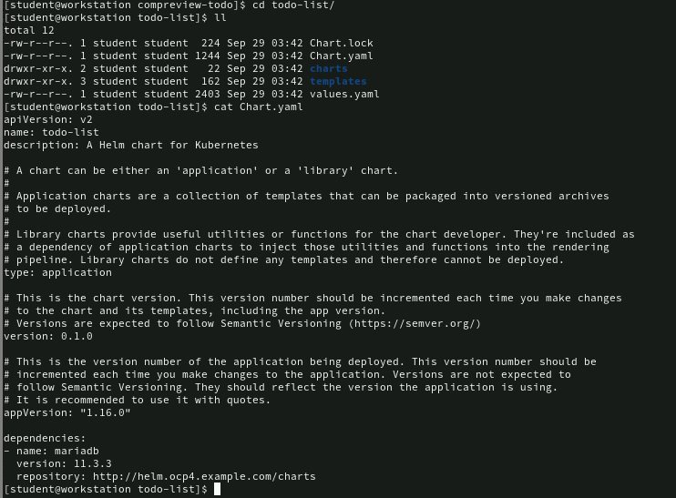
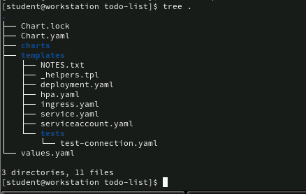
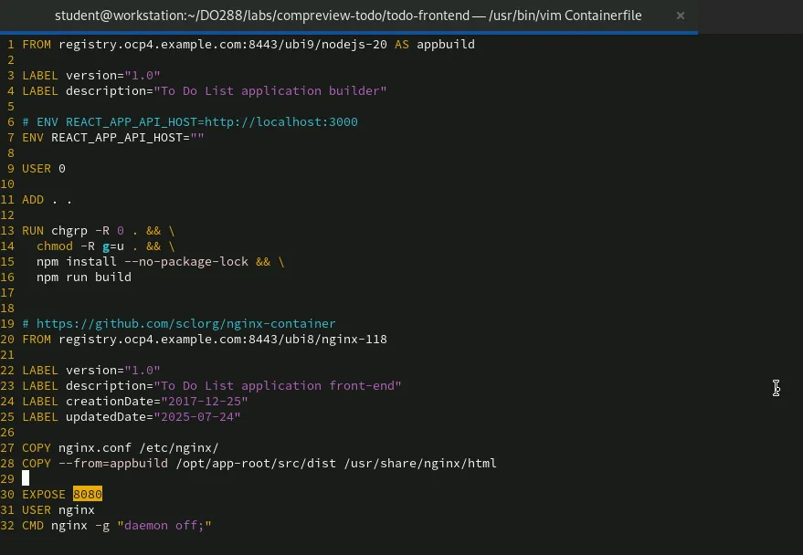
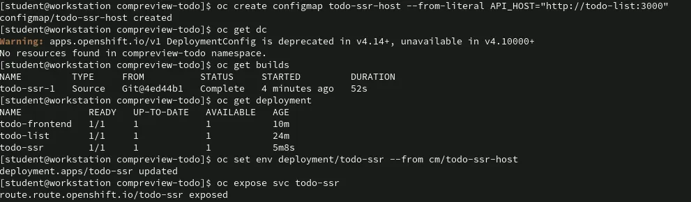

# Lab: Building and Deploying a Full-stack Cloud-native Application
```
[student@workstation compreview-todo]$ ll
total 16
-rw-r--r--. 1 student student 704 Sep 29 03:42 Containerfile-frontend-solution
-rw-r--r--. 1 student student 525 Sep 29 03:42 create-frontendspa.sh
-rw-r--r--. 1 student student 495 Sep 29 03:42 create-frontendssr.sh
-rw-r--r--. 1 student student 1399 Sep 29 03:42 create-helmchart.sh
drwxr-xr-x. 4 student student 111 Sep 29 03:42 todo-list
```


```
[student@workstation compreview-todo]$ cd todo-list/
[student@workstation todo-list]$ 11

total 12

-rw-r--r--. 1 student student 224 Sep 29 03:42 Chart.lock

-rw-r--r--. 1 student student 1244 Sep 29 03:42 Chart.yaml

drwxr-xr-x. 2 student student 22 Sep 29 03:42 charts

drwxr-xr-x. 3 student student 162 Sep 29 03:42 templates

-rw-r--r--. 1 student student 2403 Sep 29 03:42 values.yaml
```



create-frontendspa.sh






