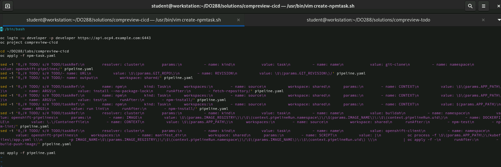
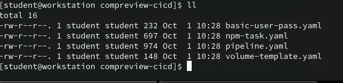
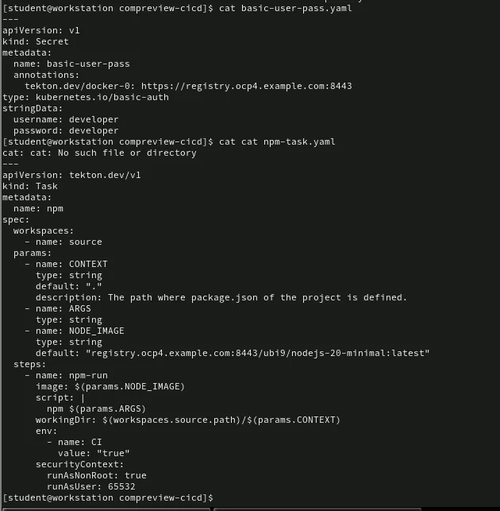
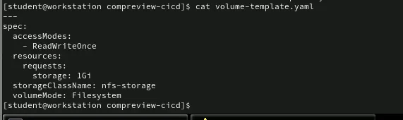
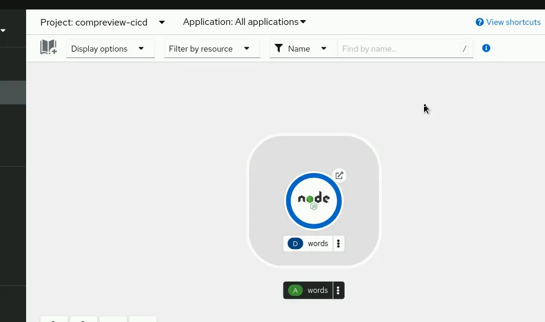

```
[student@workstation compreview-cicd]$ ll

total 12
-rw-r--r--. 1 student student 376 Sep 29 03:42 configure-tekton.sh
-rw-r--r--. 1 student student 3146 Sep 29 03:42 create-npmtask.sh
-rw-r--r--. 1 student student 3374 Sep 29 03:42 pipeline.yaml
```









```
# sau khi sua xong
oc apply -f pipeline.yaml
tkn pr delete words-cicd-pipeline-run-6cqrs 
tkn clustertask list | grep buildah
tkn pr list
tkn task list
```




```
oc get task buildah -n openshift-pipelines -o yaml > buildah-task.yaml
```

```
npm install --no-package-lock
```

Nó giúp cài dependencies mà không tạo file package-lock.json (hữu ích trong CI/CD khi bạn không muốn lock version).
```
tkn pipeline start --use-param-defaults words-cicd-pipeline -p APP_PATH=apps/compreview-cicd/words -w name=shared, volumeClaimTemplateFile=volume-template.yaml
```
🧠 Giải thích từng phần  
1. `tkn pipeline start`

Đây là lệnh chính để chạy (khởi tạo) một pipeline Tekton.

Khi chạy, Tekton sẽ tạo ra một PipelineRun (thực thi pipeline với các giá trị thực tế của tham số, workspace, resource...).

2. -`-use-param-defaults`

Flag này có nghĩa là:

> Nếu trong pipeline có các params có default thì sẽ tự động dùng giá trị mặc định đó, trừ khi bạn override (ghi đè) bằng -p.

Nhờ đó bạn không cần phải truyền tất cả tham số, chỉ truyền những cái bạn muốn thay đổi.

📌 Ví dụ:
Nếu pipeline có params:
```
params:
  - name: IMAGE_NAME
    default: "words"
  - name: APP_PATH
    default: "apps/words"
```

Thì khi bạn chạy `--use-param-defaults`, Tekton sẽ tự hiểu IMAGE_NAME=words, và bạn chỉ cần truyền `APP_PATH` nếu muốn đổi.

3. words-cicd-pipeline

- Đây là tên pipeline bạn muốn chạy (được định nghĩa trong file YAML nào đó, hoặc đã được apply lên cluster).

- Tekton sẽ tìm pipeline này trong namespace hiện tại (mặc định namespace hiện tại trong kubectl config).

4. `-p APP_PATH=apps/compreview-cicd/words`

`-p` là viết tắt của `--param`, để truyền giá trị cho một tham số cụ thể của pipeline.

Ở đây bạn gán giá trị:
```
param: APP_PATH
value: apps/compreview-cicd/words
```

- Nghĩa là pipeline này có một tham số APP_PATH và bạn override giá trị mặc định của nó bằng apps/compreview-cicd/words.

5. `-w name=shared,volumeClaimTemplateFile=volume-template.yaml`

- `-w` là viết tắt của `--workspace`, để khai báo workspace binding — Tekton cần có workspace để chia sẻ dữ liệu giữa các task.

Giải nghĩa:

- `name=shared`  
👉 Tên workspace này phải trùng với tên workspace được khai báo trong pipeline (spec.workspaces.name).

- `volumeClaimTemplateFile=volume-template.yaml`  
👉 Dùng file volume-template.yaml (chứa PersistentVolumeClaim template) để tạo PVC cho workspace này.  
Tức là Tekton sẽ tạo mới PVC từ template trong file đó mỗi khi bạn chạy pipeline.

📌 Ví dụ volume-template.yaml có thể trông như sau:
```
apiVersion: v1
kind: PersistentVolumeClaim
metadata:
  name: workspace-pvc
spec:
  accessModes:
    - ReadWriteOnce
  resources:
    requests:
      storage: 1Gi
```
🧩 Tóm tắt luồng hoạt động:

1. Tekton tìm Pipeline tên words-cicd-pipeline.

2. Tạo một PipelineRun mới.

3. Gắn các giá trị mặc định cho params (--use-param-defaults).

4. Override APP_PATH bằng giá trị bạn truyền (apps/compreview-cicd/words).

5. Gắn workspace shared bằng PVC mới tạo từ volume-template.yaml.

6. Bắt đầu thực thi từng task trong pipeline theo thứ tự.

✅ Ví dụ tương đương (nếu viết YAML PipelineRun)

Câu lệnh trên tương đương với một YAML sau:
```
apiVersion: tekton.dev/v1
kind: PipelineRun
metadata:
  generateName: words-cicd-pipeline-run-
spec:
  pipelineRef:
    name: words-cicd-pipeline
  params:
    - name: APP_PATH
      value: apps/compreview-cicd/words
  workspaces:
    - name: shared
      volumeClaimTemplate:
        spec:
          accessModes: [ "ReadWriteOnce" ]
          resources:
            requests:
              storage: 1Gi
```


