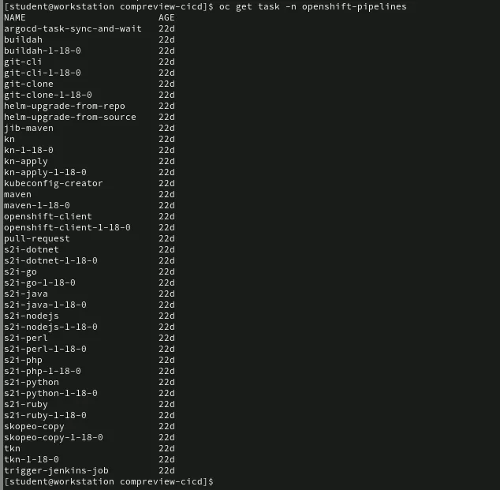

```
[student@workstation compreview-cicd]$ ll

total 12
-rw-r--r--. 1 student student 376 Sep 29 03:42 configure-tekton.sh
-rw-r--r--. 1 student student 3146 Sep 29 03:42 create-npmtask.sh
-rw-r--r--. 1 student student 3374 Sep 29 03:42 pipeline.yaml
```


```
# sau khi sua xong
oc apply -f pipeline.yaml
tkn pr delete words-cicd-pipeline-run-6cqrs 
tkn clustertask list | grep buildah
tkn pr list
tkn task list
```




```
oc get task buildah -n openshift-pipelines -o yaml > buildah-task.yaml
```

```
npm install --no-package-lock
```

Nó giúp cài dependencies mà không tạo file package-lock.json (hữu ích trong CI/CD khi bạn không muốn lock version).
