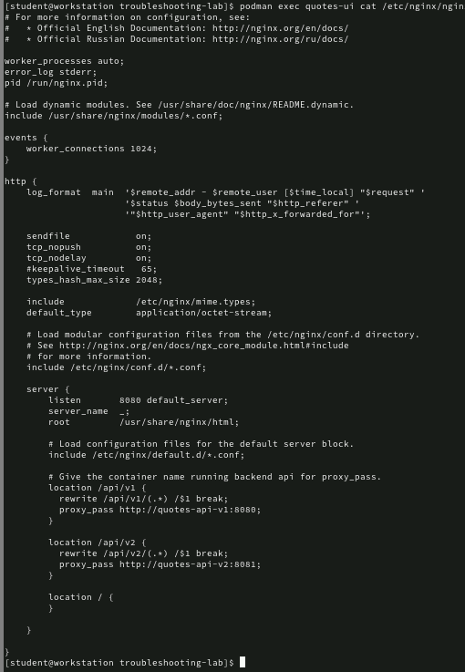
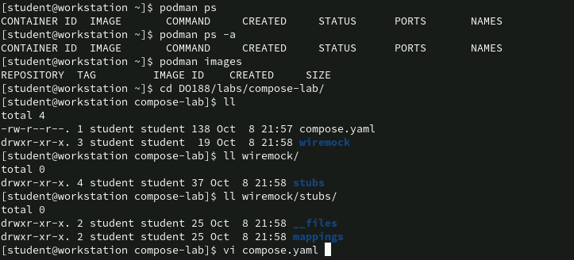
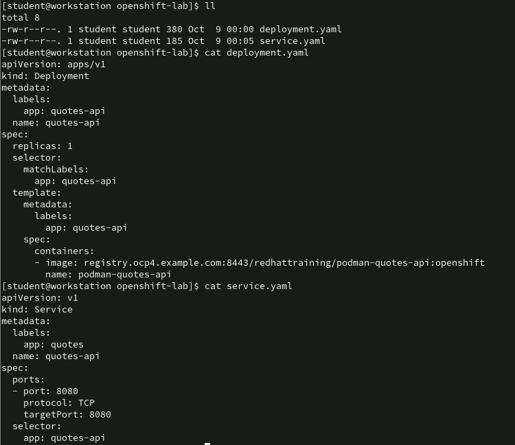
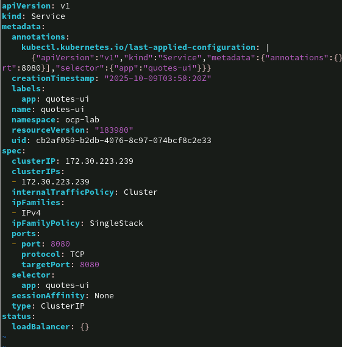
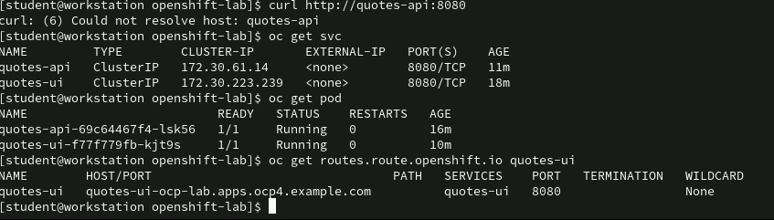
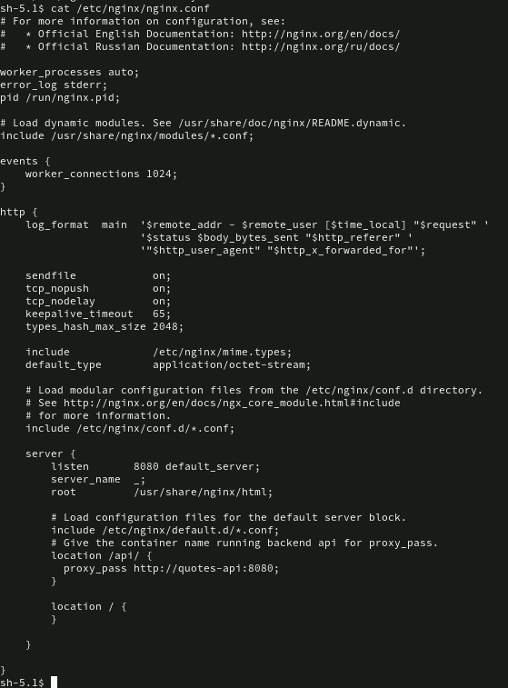

## 2.11 Lab: Podman Basics
Use Podman to manage local containers.

Outcomes

- You should be able to:

- Manage local containers.

- Copy files in and out of containers.

- Run a set of application containers that connect to one another via a Podman network.

- Forward a port from a container so that it is accessible from the host machine.


Use the ls command inside of the container to verify that the container contains the `/etc/secret-file` file.
```
[student@workstation ~]$ podman exec basics-podman-secret ls /etc/secret-file
/etc/secret-file
```

Copy the `/etc/secret-file` file from the container as the solution file in the /`home/student/DO188/labs/basics-podma`n directory.
```
[student@workstation basics-podman]$ podman cp \
  basics-podman-secret:/etc/secret-file solution
[student@workstation basics-podman]$ ls
index.html  solution
```
Start a new container with the following parameters:

- Name: `basics-podman-server`

- Image: `registry.ocp4.example.com:8443/ubi9/httpd-24`

- Ports: Route traffic from port `8080` on your machine to port `8080` inside of the container

- Network: `lab-net`

You can start the container in the detached mode for greater convenience.

Create the lab-net Podman network.
```
[student@workstation ~]$ podman network create lab-net
lab-net
```
The next objective of the lab script is passing.

Execute the podman run command to start the container.
```
[student@workstation basics-podman]$ podman run -d --name basics-podman-server \
  --net lab-net -p 8080:8080 registry.ocp4.example.com:8443/ubi9/httpd-24
8b747...3616
````

3. Copy the `/home/student/DO188/labs/basics-podman/index.html` file to `/var/www/html/` in the `basics-podman-server` container.

Verify that you are in the correct directory.
```
[student@workstation basics-podman]$ ls
index.html  solution
```
Copy the index.html file in to the container.
```
[student@workstation basics-podman]$ podman cp index.html \
  basics-podman-server:/var/www/html/
```
In a web browser, go to http://localhost:8080 and verify that you see the Hello from Podman Basics lab text.

---
# 3.5 Lab: Container Images


Build the Containerfile with the `registry.ocp4.example.com:8443/developer/images-lab` container image name.
```
[student@workstation images-lab]$ podman build --file Containerfile \
  --tag registry.ocp4.example.com:8443/developer/images-lab
```

| Option   | Viết tắt | Ý nghĩa                                        | Nếu bỏ qua                                                                |
| -------- | -------- | ---------------------------------------------- | ------------------------------------------------------------------------- |
| `--file` | `-f`     | Chỉ định file build (Containerfile/Dockerfile) | Podman sẽ tự tìm `Containerfile` hoặc `Dockerfile` trong thư mục hiện tại |
| `--tag`  | `-t`     | Gắn nhãn (tên + tag) cho image sau khi build   | Image sẽ bị gắn `<none>` làm tên và tag, khó quản lý                      |

Push the image to the `registry.ocp4.example.com:8443` registry.
```
[student@workstation images-lab]$ podman push \
  registry.ocp4.example.com:8443/developer/images-lab
...output omitted...
Writing manifest to image destination
```

Add the grue tag to the image.
```
[student@workstation images-lab]$ podman tag \
  registry.ocp4.example.com:8443/developer/images-lab \
  registry.ocp4.example.com:8443/developer/images-lab:grue
no output expected
```
➡️ Hành động của lệnh:

- podman tìm image có tag registry.ocp4.example.com:8443/developer/images-lab

- Sau đó gán thêm tag mới là registry.ocp4.example.com:8443/developer/images-lab:grue

- Không copy dữ liệu, không tạo image mới, chỉ thêm metadata.

🔍 Kiểm tra sau khi tag:

Chạy:
```
podman images
```

Bạn sẽ thấy hai dòng khác nhau về tên tag, nhưng chung IMAGE ID:
```
REPOSITORY                                   TAG      IMAGE ID       CREATED          SIZE
registry.ocp4.example.com:8443/developer/images-lab      latest   a1b2c3d4e5f6   10 minutes ago   250 MB
registry.ocp4.example.com:8443/developer/images-lab      grue     a1b2c3d4e5f6   10 minutes ago   250 MB
```

🔸 Cả hai đều trỏ đến cùng IMAGE ID (a1b2c3d4e5f6)
🔸 Chỉ là hai tên khác nhau cho cùng một image

🔹 Nếu bạn xoá một tag:

Ví dụ:
```
podman rmi registry.ocp4.example.com:8443/developer/images-lab:grue
```

➡️ Chỉ xoá tag "grue", image vẫn còn vì còn tag khác (latest).

Chỉ khi xoá hết tất cả tag trỏ đến image đó, thì Podman mới xoá image thực tế khỏi local.

✅ Tóm lại:

- `podman tag `= thêm một "bí danh" (alias) cho image → không tạo image mới
- Image cũ vẫn còn nguyên
- Các tag đều trỏ tới cùng IMAGE ID


---

# 4.7 Lab: Custom Container Images
Complete the Containerfile for an application that generates a QR code from a given text.

Outcomes
- You should be able to:
- Understand multistage builds.
- Run commands within a container.
- Set environment variables.
- Set a working directory.
- Set an entry point.
- Change the user that executes commands.

Containerfile ban dau
```
FROM \
  registry.ocp4.example.com:8443/redhattraining/podman-certificate-generator \
  as certs

FROM registry.ocp4.example.com:8443/ubi9/nodejs-22:1
USER root
RUN groupadd -r student && useradd -r -m -g student student && \
    npm config set cache /tmp/.npm --global

COPY --from=certs --chown=student:student /app/*.pem /etc/pki/tls/private/certs/
COPY --chown=student:student . /app/
```

Task  
2. In the build stage of the Containerfile, generate the TLS certificates by using the `./gen_certificates.sh` command.

The `./gen_certificates.sh` command is included in the provided container.

3. In the final stage of the Containerfile, set the following environment variables:

- TLS_PORT=8443 (the port for TLS traffic)
- HTTP_PORT=8080 (the port for HTTP traffic)
- CERTS_PATH=/etc/pki/tls/private/certs (the path that contains the TLS certificates)

4. In the final stage of the Containerfile, set the working directory of the application to the `/app` path.

Then, build the container image with the name `localhost/podman-qr-app`.

5. In the final stage of the Containerfile, set the `student` user as the user that runs the application. The `student` user exists in the Containerfile.

Then, build the container image with the name `localhost/podman-qr-app`.


6. In the final stage of the Containerfile, run the `npm install --omit=dev` command to install the production dependencies of the Node.js application.

Then, build the container image with the name `localhost/podman-qr-app`.

7. In the final stage of the Containerfile, make `npm start` the default command for this image. Additional runtime arguments should not override the default command.

Then, build the container image with the name `localhost/podman-qr-app`.

8. Start the podman-qr-app container. Call the container custom-lab and publish the container ports 8080 and 8443 to the same ports on the host.

Use the podman run command to start the application and bind the corresponding ports.
```
[student@workstation custom-lab]$ podman run --name=custom-lab \
  -p 8080:8080 -p 8443:8443 podman-qr-app
...output omitted...
TLS Server running on port 8443
Server running on port  8080
```

- Container có port 8080 sẽ được ánh xạ ra port 8080 của host

- Container có port 8443 sẽ được ánh xạ ra port 8443 của host

✅ Kết quả: bạn có thể truy cập ứng dụng từ bên ngoài container thông qua:
```
http://localhost:8080

https://localhost:8443
```
Ý nghĩa của tùy chọn -p hostPort:containerPort

Tùy chọn `-p` (viết tắt của --publish) dùng để ánh xạ (map) cổng trên container ra cổng trên máy host.
Cú pháp là:
```
-p <host_port>:<container_port>
```

Final 
```
FROM \
  registry.ocp4.example.com:8443/redhattraining/podman-certificate-generator \
  as certs

RUN ./gen_certificates.sh

FROM registry.ocp4.example.com:8443/ubi9/nodejs-22:1
USER root
RUN groupadd -r student && useradd -r -m -g student student && \
    npm config set cache /tmp/.npm --global

COPY --from=certs --chown=student:student /app/*.pem /etc/pki/tls/private/certs/
COPY --chown=student:student . /app/

ENV TLS_PORT=8443 \
    HTTP_PORT=8080 \
    CERTS_PATH="/etc/pki/tls/private/certs"

WORKDIR /app

USER student

RUN npm install --omit=dev

ENTRYPOINT npm start
```

🧱 So sánh tổng thể: RUN vs CMD vs ENTRYPOINT

| Lệnh           | Thực thi khi nào             | Mục đích                                                                     | Có trong container runtime không?          | Có bị ghi đè không?                             |
| -------------- | ---------------------------- | ---------------------------------------------------------------------------- | ------------------------------------------ | ----------------------------------------------- |
| **RUN**        | 🔨 **Trong lúc build image** | Thực thi một lệnh **để thay đổi image** (vd: cài gói, copy file, build code) | ❌ Không (chỉ để tạo layer mới trong image) | Không cần                                       |
| **CMD**        | ▶️ **Khi container chạy**    | Chỉ định **lệnh mặc định** để container chạy nếu user không truyền gì thêm   | ✅ Có                                       | ✅ Có thể ghi đè                                 |
| **ENTRYPOINT** | ▶️ **Khi container chạy**    | Chỉ định **chương trình chính bắt buộc** mà container sẽ chạy                | ✅ Có                                       | ❌ Không bị ghi đè (trừ khi dùng `--entrypoint`) |

Note: Mỗi lệnh `RUN` tạo ra một layer mới trong image → chứa kết quả của lệnh đó (file, config, binary,...).

🔹 CMD (runtime default command)

Chạy khi container khởi động, nếu bạn không truyền gì thêm.
Ví dụ:
```
CMD ["npm", "start"]
```

Khi bạn chạy `podman run myimage`, container sẽ chạy `npm start`

Nếu bạn chạy `podman run myimage bash`, bash sẽ ghi đè CMD

🧠 Tóm lại: CMD là runtime, là lệnh mặc định có thể bị ghi đè

🔹 `ENTRYPOINT` (runtime main command)

Luôn chạy khi container khởi động, không bị ghi đè trừ khi bạn chỉ định `--entrypoint`.
Ví dụ:
```
ENTRYPOINT ["npm", "start"]
```

Dù bạn chạy:
```
podman run myimage bash
```

→ vẫn chạy `npm start`, không chạy bash

Nếu muốn chạy bash, bạn phải dùng:
```
podman run --entrypoint bash myimage
```

🧠 Tóm lại: ENTRYPOINT là runtime, là chương trình chính bắt buộc

---

# 5.5 Lab: Persisting Data

Create a named volume with the following parameters:

- The volume is called postgres-vol.

- The volume contains the contents of the /home/student/DO188/labs/persisting-lab/postgres-vol.tar.gz file.

Create the volume.
```
[student@workstation ~]$ podman volume create postgres-vol
postgres-vol
```
Import the `/home/student/DO188/labs/persisting-lab/postgres-vol.tar.gz` file to the volume:
```
[student@workstation ~]$ podman volume import postgres-vol \
  ~/DO188/labs/persisting-lab/postgres-vol.tar.gz
...no output expected...
```
🧱 1. podman volume create tạo ra volume ở cấp host, không phải trong container

Khi bạn chạy:
```
podman volume create postgres-vol
```

➡️ Podman sẽ tạo một named volume (volume có tên) tên là postgres-vol.

Volume này:

- Không nằm trong container, mà nằm trên host (ở thư mục do Podman quản lý, ví dụ /var/lib/containers/storage/volumes/postgres-vol/_data)

- Là một storage độc lập, bền vững (persistent)

- Dùng để lưu dữ liệu mà bạn muốn giữ lại dù container bị xóa

📦 2. podman volume import là nạp dữ liệu vào volume đó
```
podman volume import postgres-vol ~/DO188/labs/persisting-lab/postgres-vol.tar.gz
```

➡️ Lệnh này giải nén nội dung của file postgres-vol.tar.gz vào thư mục dữ liệu của volume postgres-vol.

Cụ thể:

- File .tar.gz này chứa một số file (ví dụ database dump, cấu hình)

- Podman sẽ unpack vào bên trong /var/lib/containers/storage/volumes/postgres-vol/_data

Không có output nào (✅ đúng như đề nói “no output expected”).

🔹 Hai cách tương đương

Cách 1 — Dùng cú pháp “ngắn” -v:
```
podman run --name persisting-db -d \
  --net persisting-net \
  -e POSTGRESQL_USER=user \
  -e POSTGRESQL_PASSWORD=pass \
  -e POSTGRESQL_DATABASE=db \
  -v postgres-vol:/var/lib/pgsql/data \
  registry.ocp4.example.com:8443/rhel9/postgresql-13:1
```

Cách 2 — Dùng cú pháp “dài” --mount:
```
podman run --name persisting-db -d \
  --net persisting-net \
  -e POSTGRESQL_USER=user \
  -e POSTGRESQL_PASSWORD=pass \
  -e POSTGRESQL_DATABASE=db \
  --mount type=volume,src=postgres-vol,dst=/var/lib/pgsql/data \
  registry.ocp4.example.com:8443/rhel9/postgresql-13:1
```

👉 Hai lệnh trên kết quả hoàn toàn như nhau.


--mount='type=volume,src=postgre-vol,dst=/var/lib/pgsql/data'

---
# 6.5 Lab: Troubleshooting Containers

Troubleshoot the quotes-api application.

The application consists of the following components:

- The quotes-api-v1 service with the v1 quotes API version.

- The quotes-api-v2 service with the v2 quotes API version.

- The quotes-ui service, which accepts the quotes API version as an environment variable.

The quotes-ui container starts an NGINX proxy that performs the following tasks:

- Serves the web application.

- Acts as a reverse proxy to route the UI requests to the version specified in the QUOTES_API_VERSION environment variable.

Outcomes

- You should be able to:

- Check container logs.

- Run container commands.

- Troubleshoot container networking problems.

- Configure containers by using environment variables.

- Configure containers by overriding container configuration files with host files.

🧩 1. Mục tiêu của task

Bạn có 3 container cần chạy song song và có thể giao tiếp với nhau:

| Container       | Ảnh                            | Ghi chú                                                          |
| --------------- | ------------------------------ | ---------------------------------------------------------------- |
| `quotes-api-v1` | `.../wiremock`                 | API giả lập version 1                                            |
| `quotes-api-v2` | `.../wiremock`                 | API giả lập version 2                                            |
| `quotes-ui`     | `.../quotes-ui-versioning:1.0` | Ứng dụng frontend (Nginx) gọi `quotes-api-v1` và `quotes-api-v2` |


⚙️ 2. Cấu hình mong muốn

quotes-ui là frontend reverse proxy Nginx, nó có cấu hình như sau:
```
proxy_pass http://quotes-api-v1
```

và
```
proxy_pass http://quotes-api-v2
```

💡 Nghĩa là: trong file cấu hình, Nginx sẽ tìm hostname quotes-api-v1 và quotes-api-v2 để gửi request.

→ Vì vậy, Nginx cần có khả năng resolve (tra IP) các hostname đó.

❌ 3. Vấn đề ban đầu

Container quotes-ui bị lỗi:
```
nginx: [emerg] host not found in upstream "quotes-api-v1" in /etc/nginx/nginx.conf:45
```

Tức là:

⚠️ quotes-ui không thể tìm thấy hostname quotes-api-v1 → Nginx khởi động thất bại → container bị Exited.

🔍 4. Điều tra nguyên nhân

Bạn dùng podman inspect để xem container đang ở network nào.

quotes-api-v1:
```
map[troubleshooting-lab:0xc000a825a0]
```

quotes-api-v2:
```
map[troubleshooting-lab:0xc000a825a0]
```

quotes-ui:
```
map[pasta:0xc0006cd200]
```

🧠 Phân tích:

- Hai API (v1, v2) đang ở network `troubleshooting-lab`

- `quotes-ui` lại ở network `pasta` (network mặc định)

➡️ Kết quả: quotes-ui và quotes-api-v1/v2 không cùng mạng → không thể ping hoặc resolve tên hostname của nhau.

✅ 5. Giải pháp

Cách duy nhất để container giao tiếp qua tên hostname là:

⚙️ Chúng phải ở cùng một Podman network.

Vì vậy, bạn xoá container cũ:
```
podman rm quotes-ui
```

Rồi chạy lại với network đúng:
```
podman run -d \
  --name quotes-ui -p 3000:8080 \
  -e QUOTES_API_VERSION=v2 \
  --net troubleshooting-lab \
  registry.ocp4.example.com:8443/redhattraining/quotes-ui-versioning:1.0
```

➡️ quotes-ui giờ cùng network troubleshooting-lab với quotes-api-v1 và quotes-api-v2  
➡️ Nginx có thể resolve hostname → khởi động thành công ✅

---

🧭 1. Cú pháp tổng quát
```
podman inspect [TÊN hoặc ID] [--format MẪU]
```

🔍 Dùng để xem thông tin chi tiết của:

- container

- image

- volume

- network

🧱 2. Inspect container 
🔹 Xem toàn bộ cấu hình container:
```
podman inspect quotes-ui
```

➡️ In ra JSON chi tiết gồm:

- Tên, ID, Image

- Môi trường (env)

- Cổng (ports)

- Mạng (networks)

- Volume mount

- User, Entrypoint, CMD

- Trạng thái hiện tại

🔹 Lọc thông tin bằng --format

Dùng Go template để lọc gọn thông tin.

Ví dụ:

| Mục đích                            | Lệnh                                                                | Kết quả              |
| ----------------------------------- | ------------------------------------------------------------------- | -------------------- |
| Xem container đang dùng network nào | `podman inspect quotes-ui --format '{{.NetworkSettings.Networks}}'` | Hiển thị map network |
| Xem image của container             | `podman inspect quotes-ui --format '{{.ImageName}}'`                | Tên image            |
| Xem port mapping                    | `podman inspect quotes-ui --format '{{.NetworkSettings.Ports}}'`    | Danh sách port       |
| Xem environment variables           | `podman inspect quotes-ui --format '{{.Config.Env}}'`               | Biến môi trường      |

📦 3. Inspect image
```
podman inspect localhost/podman-qr-app
```

➡️ Thông tin về:

- Entrypoint, CMD

- Layers

- Env, ExposedPorts

- Labels

💾 4. Inspect volume
```
podman volume inspect postgres-vol
```

➡️ Cho biết:

- Tên volume

- Driver

- Mountpoint (vị trí trên host)

- Dung lượng (nếu có)

📘 Ví dụ:
```
[
  {
    "Name": "postgres-vol",
    "Driver": "local",
    "Mountpoint": "/var/lib/containers/storage/volumes/postgres-vol/_data"
  }
]
```
🌐 5. Inspect network
```
podman network inspect troubleshooting-lab
```

➡️ Cho biết:

- Tên network

- Subnet, Gateway

- Loại network (bridge, pasta, host)

- Container nào đang tham gia

📘 Ví dụ:
```
[
  {
    "Name": "troubleshooting-lab",
    "Driver": "bridge",
    "Subnets": [
      {
        "Subnet": "10.89.0.0/24",
        "Gateway": "10.89.0.1"
      }
    ],
    "Containers": {
      "quotes-api-v1": {
        "IPv4Address": "10.89.0.2/24"
      },
      "quotes-ui": {
        "IPv4Address": "10.89.0.3/24"
      }
    }
  }
]
```

📋 6. Xem danh sách hiện có

| Mục        | Lệnh                | Giải thích        |
| ---------- | ------------------- | ----------------- |
| Containers | `podman ps -a`      | Tất cả container  |
| Images     | `podman images`     | Danh sách image   |
| Volumes    | `podman volume ls`  | Danh sách volume  |
| Networks   | `podman network ls` | Danh sách network |

🧩 Tóm tắt nhanh

| Mục đích          | Lệnh                               |
| ----------------- | ---------------------------------- |
| Inspect container | `podman inspect <container>`       |
| Inspect image     | `podman inspect <image>`           |
| Inspect volume    | `podman volume inspect <volume>`   |
| Inspect network   | `podman network inspect <network>` |
| Liệt kê volume    | `podman volume ls`                 |
| Liệt kê network   | `podman network ls`                |


```
server {
    listen 8080;

    location /api/v1 {
        rewrite /api/v1/(.*) /$1 break;
        proxy_pass http://quotes-api-v1:8080;
    }

    location /api/v2 {
        rewrite /api/v2/(.*) /$1 break;
        proxy_pass http://quotes-api-v2:8081;
    }

    location / {
        root /usr/share/nginx/html;
    }
}

```



| Người dùng truy cập (host)            | Bên trong `quotes-ui` | Hành động thực hiện                                 |
| ------------------------------------- | --------------------- | --------------------------------------------------- |
| `http://localhost:3000`               | `/`                   | Trả về file tĩnh (HTML, JS, UI app)                 |
| `http://localhost:3000/api/v1/quotes` | `/api/v1/quotes`      | Proxy tới `http://quotes-api-v1:8080/api/v1/quotes` |
| `http://localhost:3000/api/v2/quotes` | `/api/v2/quotes`      | Proxy tới `http://quotes-api-v2:8081/api/v2/quotes` |


---

# 7.5 Lab: Multi-container Applications with Compose
Create a compose file to deploy your application in a testing environment. The application uses three components: a UI, a back end, and an external service that the back end uses. Because the development team does not own the external service, they decided to use a mock server called Wiremock to mock the external service interactions with the back end.

Outcomes

You should be able to:

- Create a multi-container compose file with the following features:

  - Bind mounts

  - Environment variables

  - Networks

  - Published ports

- Reload the compose file after modifying it.




```
name: compose-lab

services:
  wiremock:
    container_name: "quotes-provider"
    image: "registry.ocp4.example.com:8443/redhattraining/wiremock"
    volumes:
      - ~/DO188/labs/compose-lab/wiremock/stubs:/home/wiremock:Z
    networks:
      - backend-net
  quotes-api:
    container_name: "quotes-api"
    image: "registry.ocp4.example.com:8443/redhattraining/podman-quotesapi-compose"
    networks:
      - backend-net
      - frontend-net
    environment:
      QUOTES_SERVICE: "http://quotes-provider:8080"
  quotes-ui:
    container_name: "quotes-ui"
    image: "registry.ocp4.example.com:8443/redhattraining/podman-quotes-ui"
    networks:
    - frontend-net
    ports:
      - "3000:8080"

networks:
  backend-net: {}
  frontend-net: {}
```
🔁 Tổng sơ đồ luồng
```
[User/Host:3000] 
   ↓
quotes-ui:8080  (frontend-net)
   ↓ (calls http://quotes-api:8080)
quotes-api:8080 (frontend-net + backend-net)
   ↓ (calls http://quotes-provider:8080)
quotes-provider:8080 (wiremock, backend-net)
```

✅ Tóm tắt chức năng từng thành phần

| Service                      | Vai trò        | Mạng tham gia             | Port host | Liên kết đến      |
| ---------------------------- | -------------- | ------------------------- | --------- | ----------------- |
| `quotes-ui`                  | Frontend web   | frontend-net              | 3000:8080 | `quotes-api`      |
| `quotes-api`                 | API trung gian | backend-net, frontend-net | ❌         | `quotes-provider` |
| `quotes-provider` (wiremock) | Fake backend   | backend-net               | ❌         | —                 |


🧩 1. Có bắt buộc phải có dấu " quanh giá trị như "http://quotes-provider:8080" không?

➡️ Không bắt buộc, nhưng rất nên có trong một số trường hợp.

🔹 Khi có thể bỏ dấu ngoặc

Nếu giá trị là một chuỗi bình thường (không có ký tự đặc biệt), bạn có thể viết:
```
environment:
  QUOTES_SERVICE: http://quotes-provider:8080
```

YAML sẽ hiểu đây là một chuỗi (string).

🔹 Khi nên giữ dấu ngoặc kép " "

Một số ký tự trong YAML có nghĩa đặc biệt, ví dụ:
```
:, #, {}, [], &, *, ?, !, %, @
```
hoặc giá trị có dấu cách, ký tự đặc biệt, hoặc true, no, on, off (vì YAML có thể hiểu sai thành boolean)

Cụ thể:
```
QUOTES_SERVICE: http://quotes-provider:8080   # ✅ hợp lệ
PASSWORD: abc:123                            # ❌ lỗi cú pháp (vì có dấu :)
PASSWORD: "abc:123"                          # ✅ an toàn
```

🟢 Tóm lại:

Dấu ngoặc kép " " không bắt buộc, nhưng nên dùng khi có ký tự đặc biệt như dấu :
→ để YAML không hiểu sai cấu trúc.

💡 Nguyên nhân: YAML phân biệt danh sách (list) và bản đồ (mapping)

Trong YAML, không phải cứ “có nhiều thứ” là phải dùng số nhiều —
mà quan trọng là kiểu dữ liệu mà key đó chứa.

🔹 environment: là một mapping (bản đồ)

Nó là một tập hợp key–value, chứ không phải danh sách các mục riêng lẻ.
=> Do đó dùng số ít.

Ví dụ:
```
environment:
  APP_ENV: production
  DB_USER: user1
  DB_PASS: secret
```

hoặc dạng danh sách (tương đương):
```
environment:
  - APP_ENV=production
  - DB_USER=user1
  - DB_PASS=secret
```

➡️ Dù có nhiều biến, nhưng tất cả cùng nằm trong một cấu trúc duy nhất
gọi là environment mapping, nên YAML giữ key là số ít (environment).

🔹 networks: và ports: lại là danh sách (list)

Mỗi mục (- something) là một phần tử riêng biệt, không có cặp key–value cố định.
=> Do đó dùng số nhiều.

Ví dụ:
```
networks:
  - backend-net
  - frontend-net

ports:
  - "3000:8080"
  - "8443:8443"
```

Ở đây YAML hiểu là một list các giá trị, nên Docker/Podman Compose đặt tên là số nhiều.

🔸 So sánh trực quan

| Key            | Kiểu dữ liệu        | Ví dụ            | Ghi chú                  |
| -------------- | ------------------- | ---------------- | ------------------------ |
| `environment:` | mapping (key–value) | `DB_USER: user`  | Một khối chứa nhiều biến |
| `ports:`       | list                | `- "8080:80"`    | Danh sách các port       |
| `volumes:`     | list                | `- ./data:/data` | Danh sách mount          |
| `networks:`    | list                | `- frontend`     | Danh sách network        |

🔹 Vì sao vẫn là “số ít”?

Bởi vì environment chỉ là một phần tử duy nhất trong service:
```
services:
  web:
    image: nginx
    environment:   # <-- đây là 1 khối duy nhất
      VAR1: one
      VAR2: two
```

Docker Compose không xem mỗi biến là một cấu trúc riêng (nếu vậy thì nó mới gọi là environments:).
Nó chỉ xem environment: là một nhóm key–value, được xử lý cùng lúc.


Thử trước bằng lệnh:
```
podman-compose config
```

→ Kiểm tra xem file có hợp lệ không (nó sẽ hiển thị bản dịch thành JSON).

---
# 8.5 Lab: Container Orchestration with Kubernetes and OpenShift
Debug and deploy a multi-container application to the Red Hat OpenShift Container Platform (RHOCP).

**Outcomes**   
You should be able to:

- Verify and correct the configuration of the Service and Deployment RHOCP objects.
- Deploy RHOCP objects.








```
oc rsh deploy/quotes-ui
curl http://quotes-api:8080
```




🧩 Tóm tắt workfollow

Khi bạn truy cập từ bên ngoài cluster:
```
Client (browser)
 ↓
Route (Ingress)
 ↓
Service quotes-ui
 ↓
Pod quotes-ui (chạy NGINX)
 ↓
Service quotes-api (DNS nội bộ: quotes-api:8080)
 ↓
Pod quotes-api
```


