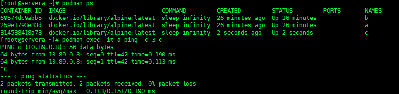
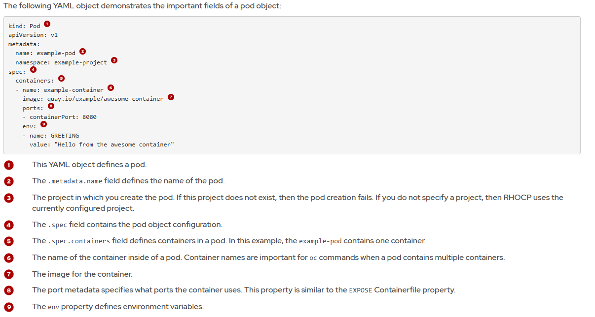

# Chapter 2.  Podman Basics

### Install podman 
```bash
[root@servera ~]# dnf install podman container-tools -y
```
### Working with Podman
The following command displays the version that you are using
```
[root@servera ~]# podman -v
podman version 5.4.0
```

### Pulling and Displaying Images
Before you can run your application in a container, you must create a container image.

```
[root@servera ~]# podman pull registry.access.redhat.com/ubi9/ubi-minimal:9.5
Trying to pull registry.access.redhat.com/ubi9/ubi-minimal:9.5...
Getting image source signatures
Checking if image destination supports signatures
Copying blob 719fed365262 done   | 
Copying config 1510d272eb done   | 
Writing manifest to image destination
Storing signatures
1510d272eb6cd858ed1ffc9674bdcb72be881d851734c2862c037743bd668564
[root@servera ~]# podman images
REPOSITORY                                   TAG         IMAGE ID      CREATED        SIZE
registry.access.redhat.com/ubi9/ubi-minimal  9.5         1510d272eb6c  4 months ago   106 MB
registry.redhat.io/rhel9/rhel-guest-image    9.4         f4da424c64cb  12 months ago  967 MB
```
### Running and Displaying Containers
```
[root@servera ~]# podman run registry.access.redhat.com/ubi9/ubi-minimal:9.5 echo "Nghiahv k8s"
Nghiahv k8s
```
By default, the `podman ps` command lists the following details for your containers.

- the container's ID
- the name of the image that the container is using
- the command that the container is executing
- the time that the container was created
- the status of the container
- the exposed ports in the container
- the name of the container.

However, stopping a container is not the same as removing a container. Although the container is stopped, Podman does not remove it
```
[root@servera ~]# podman ps
CONTAINER ID  IMAGE       COMMAND     CREATED     STATUS      PORTS       NAMES

[root@servera ~]# podman ps -a
CONTAINER ID  IMAGE                                            COMMAND           CREATED        STATUS                    PORTS       NAMES
f992cd34e156  registry.access.redhat.com/ubi9/ubi-minimal:9.5  echo Nghiahv k8s  6 seconds ago  Exited (0) 5 seconds ago              clever_leavitt
```
You can also automatically remove a container when it exits by adding the --rm option to the podman run command.

```bash
[user@host ~]$ podman run --rm registry.access.redhat.com/ubi9/ubi-minimal:9.5 \
  echo 'Red Hat'
Red Hat
[user@host ~]$ podman ps --all
CONTAINER ID     IMAGE    COMMAND    CREATED       STATUS      PORTS     NAMES
```

If a name is not provided during the creation of a container, then Podman generates a random string name for the container. It is important to define a unique name to facilitate the identification of your containers when managing their lifecycle.

```bash
[user@host ~]$ podman run --name ubi9 \
registry.access.redhat.com/ubi9/ubi-minimal:9.5 echo 'Red Hat'
Red Hat

[user@host ~]$ podman ps --all
CONTAINER ID  IMAGE               COMMAND       CREATED  STATUS   PORTS  NAMES
37dcdcc1e1b1  ...ubi9/ubi-minimal:9.5  echo Red Hat  ...      Exited...       ubi9
```
### Exposing Containers
Many applications, such as web servers or databases, keep running indefinitely waiting for connections.

You can use the `-p` option to map a port in your local machine to a port inside the container. This way, the traffic in your local port is forwarded to the port inside the container, thus, allowing you to access the application from your computer

```bash
[user@host ~]$ podman run -p 8080:8080 \
 registry.access.redhat.com/ubi8/httpd-24:latest

#You can access the HTTP server at
curl  http://localhost:8080.
```

If you want the container to run in the background, to avoid the terminal being blocked, then you can use the `-d` option.

```bash
[user@host ~]$ podman run -d -p 8080:8080 \
  registry.access.redhat.com/ubi8/httpd-24:latest
b7eb467781106e4f416ba79cede91152239bfc74f6a570c6d70baa4c64fa636a
```
### Using Environment Variables
Environment variables are variables used in your applications that are set outside of the program.

Environment variables are a useful and safe way of injecting environment-specific configuration values into your application. For example, your application might use a database hostname that is different for each application environment, such as the database.local, database.stage, or database.test hostnames.

You can pass environment variables to a container by using the -e option.
```bash
[root@servera ~]# podman run -e name='nghiahv k8s' registry.access.redhat.com/ubi9/ubi-minimal:9.5 printenv name
nghiahv k8s

[student@workstation ~]$ podman run --rm -e GREET=Hello -e NAME='Red Hat' \
  registry.ocp4.example.com:8443/ubi9/ubi-minimal:9.5 printenv GREET NAME
Hello
Red Hat
```
### Podman Desktop
Podman Desktop is a graphical user interface, which is used to manage and interact with containers in local environments.


Podman Desktop is available for Linux, MacOS, and Windows. For specific installation instructions, refer to the Podman Desktop documentation.

> Docs: https://docs.podman.io/en/v5.1.2/Introduction.html

### Guided Exercise: Creating Containers with Podman

```
[root@servera ~]# podman pull quay.io/openshifttest/httpd-24:multi

[root@servera ~]# podman images
REPOSITORY                                   TAG         IMAGE ID      CREATED        SIZE
quay.io/openshifttest/httpd-24               multi       4329faf96a1b  2 years ago    452 MB

[root@servera ~]#  podman run -d --rm -p 8080:8080 quay.io/openshifttest/httpd-24:multi 

[root@servera ~]# curl http://localhost:8080
<!DOCTYPE html PUBLIC "-//W3C//DTD XHTML 1.1//EN" "http://www.w3.org/TR/xhtml11/DTD/xhtml11.dtd">

...

```
## Container Networking Basics
You can use Podman networking to improve security and ease the communication of containerized applications.

### Managing Podman Networks
`podman network create`  
Creates a new Podman network. This command accepts various options to configure properties of the network, including gateway address, subnet mask, and whether to use IPv4 or IPv6.

`podman network ls`  
Lists existing networks and a brief summary of each. Options for this command include various filters and an output format to list other values for each network.

`podman network inspect`  
Outputs a detailed JSON object containing configuration data for the network.

`podman network rm`  
Removes a network.

`podman network prune`  
Removes any networks that are not currently in use by any running containers.

`podman network connect`  
Connects an already running container to an existing network. Alternatively, connect containers to a Podman network on container creation by using the --net option.

`podman network disconnect`  
Disconnects a container from a network.

### Example
For example, the following command creates a new Podman network called `example-net`:
```
[user@host ~]$ podman network create example-net
```
Use the `--net` option. The following example command creates a new container called my-container, which is connected to the example-net network.
```
[user@host ~]$ podman run -d --name my-container \
  --net example-net container-image:latest
```
You can connect them to multiple networks.
For example, the following command creates a new container called double-connector that connects to both the postgres-net and redis-net networks.
```
[user@host ~]$ podman run -d --name double-connector \
  --net postgres-net,redis-net container-image:latest
```
Podman uses the pasta network mode when you create a container without specifying a --net option. You cannot connect a container that uses the pasta network mode to a Podman bridge network.

For example, if the container called my-container is already running and has no networks assigned, attempting to connect it to a Podman bridge network fails.:
```
[user@host ~]$ podman run -d --name my-container example-image
CONTAINER_ID
[user@host ~]$ podman network connect example-net my-container
Error: "pasta" is not supported: invalid network mode
```
To connect the container to the network you must recreate the container with the `--net` option set to the desired network.

**Note:**  
Podman rootless (chạy với user thường, không phải root) → mặc định không dùng bridge.
- Thay vào đó, nó dùng pasta network mode (Point-to-point Adaptor to System’s TCP/IP stack).
- Container sẽ dùng thẳng stack mạng của host, không nằm trong bridge riêng.
- Nhẹ, bảo mật, nhưng không cho container "nói chuyện" trực tiếp với nhau qua tên mạng.

🔹 Hậu quả
- Nếu bạn tạo container mà không chỉ định --net, nó vào pasta mode.
- Mà đã ở pasta rồi thì không thể attach sang bridge network nữa.
- Vì vậy lệnh kiểu podman network connect (như Docker) sẽ báo lỗi.

**Note**  
Starting in Podman v4.2.0, the podman network create command supports the isolate option with the default bridge driver. This option isolates the network by blocking any traffic from it to any other network with the isolate option enabled. Use the podman network create command with the -o isolate option to enable isolation.

### Trường hợp 1: Hai network bình thường (không isolate)

```bash
# Tạo 2 mạng bridge bình thường
podman network create net-a
podman network create net-b

[root@servera ~]# podman network ls
NETWORK ID    NAME        DRIVER
8647ad33183c  net-a       bridge
dfae85de3a2f  net-b       bridge
2f259bab93aa  podman      bridge

# pull image
[root@servera ~]# podman pull docker.io/library/alpine:latest

# Tạo container A trong net-a
[root@servera ~]# podman run -d --name a --network net-a docker.io/library/alpine:latest sleep infinity

# Tạo container B trong net-b
[root@servera ~]# podman run -d --name b --network net-b docker.io/library/alpine:latest sleep infinity

```
Test ping 
```bash
[root@servera ~]# podman inspect b 
               "Networks": {
                    "net-b": {
                         "EndpointID": "",
                         "Gateway": "10.89.1.1",
                         "IPAddress": "10.89.1.6",
                         "IPPrefixLen": 24,

[root@servera ~]# podman exec -it a ping -c 3 10.89.1.6
PING 10.89.1.6 (10.89.1.6): 56 data bytes
64 bytes from 10.89.1.6: seq=0 ttl=42 time=0.195 ms
64 bytes from 10.89.1.6: seq=1 ttl=42 time=0.217 ms
64 bytes from 10.89.1.6: seq=2 ttl=42 time=0.155 ms

```
**Note:**  
Trong Podman:
- Chỉ các container trong cùng một network (bridge) mới được gắn DNS để ping bằng tên container.
- Bạn tạo a trên `net-a` và b trên `net-b` → chúng thuộc 2 mạng khác nhau → DNS không biết b là ai.
- Vì thế: 
```
[root@servera ~]# podman exec -it a ping -c 3 b ping: bad address 'b'
```


### Rootful and Rootless Container Networks
🔹 Rootful Containers (chạy với quyền root)
- Mặc định Podman sẽ dùng podman default network (bridge).
- DNS bị tắt trong default network này → container không thể ping bằng tên, chỉ ping được bằng IP.
- Muốn dùng DNS (ping bằng tên) → bạn phải tạo custom network (podman network create) rồi chạy container vào đó.
```bash
[root@servera ~]# podman network ls
NETWORK ID    NAME        DRIVER
8647ad33183c  net-a       bridge
dfae85de3a2f  net-b       bridge
2f259bab93aa  podman      bridge

[root@servera ~]# podman ps
CONTAINER ID  IMAGE                            COMMAND         CREATED         STATUS         PORTS       NAMES
69574dc9abb5  docker.io/library/alpine:latest  sleep infinity  17 minutes ago  Up 17 minutes              b
259e1793e33d  docker.io/library/alpine:latest  sleep infinity  17 minutes ago  Up 17 minutes              a

[root@servera ~]# podman exec -it a ping -c 3 serverb
PING serverb (192.168.38.128): 56 data bytes
64 bytes from 192.168.38.128: seq=0 ttl=42 time=0.724 ms
64 bytes from 192.168.38.128: seq=1 ttl=42 time=1.238 ms

# cung 1 network
podman network create lab-net
podman run -d --name a --network lab-net alpine sleep infinity
podman run -d --name b --network lab-net alpine sleep infinity
podman exec -it a ping -c 3 b   # ✅ sẽ ping được theo tên

# ko cung 1 network
[root@servera ~]# podman exec -it a ping -c 3 b ping: bad address 'b'
```

🔹 Rootless Containers (chạy bằng user thường)
- User thường không tạo được bridge interface thật trên host → Podman tạo network trong namespace riêng.
- Mặc định rootless container không nối vào default network. (container rootless thường chạy ở pasta mode (network riêng, không chung bridge))
- Nếu muốn các container rootless nói chuyện với nhau:

  1. Tạo custom network và gắn cả hai container vào đó.

```bash
podman network create lab-net
podman run -d --name a --network lab-net alpine sleep infinity
podman run -d --name b --network lab-net alpine sleep infinity
podman exec -it a ping -c 3 b   # ✅ hoạt động
```
  2. Hoặc ép nối chúng vào default podman network.
```bash
# user rootless
podman run -d --name a --network podman alpine sleep infinity
podman run -d --name b --network podman alpine sleep infinity

# Lúc này cả a và b đều nằm trong default network podman → có thể giao tiếp với nhau (ping IP).
```
**Lưu ý quan trọng**
- Trên default podman network, DNS nội bộ không bật → container không ping được bằng tên container, chỉ ping được bằng IP.
- Muốn ping bằng tên container → phải tạo custom network



### Kiểm tra container đang tiêu tốn tài nguyên (CPU, RAM, I/O, network…)

```bash
podman stats
podman top a
```

### Container Domain Name Resolution
Nếu bạn chạy container trên một network có DNS enabled (ví dụ network bạn tạo bằng podman network create test-net), thì:
- Mỗi container sẽ được gán hostname = tên container (hoặc alias nếu bạn đặt).
- Container khác trong cùng network có thể truy cập nó bằng hostname đó.
```
[user@host ~]$ podman run --net test-net --name nginx-container nginx-image
$ curl http://nginx-container:8080
```
### Referencing External Hosts by Name
Khi bạn tạo container, Podman tự động thêm vào `/etc/hosts` trong container 2 hostname đặc biệt:
- host.containers.internal
- host.docker.internal

→ Container có thể dùng những hostname này để kết nối đến dịch vụ đang chạy trên máy host.


Thêm host tùy chỉnh với --add-host
```bash
[user@host ~]$ podman run --add-host=myhostname:192.168.1.1 example-image
```
**Tóm lại**

- Container Domain Name Resolution: container trong cùng custom network có DNS → có thể gọi nhau bằng tên container thay vì IP.

- Referencing External Hosts by Name: từ container:
  - Có sẵn host.containers.internal để gọi về host.
  - Có thể thêm mapping tùy ý bằng --add-host.

## Accessing Containerized Network Services

### Port Forwarding
The `-p` option of the podman run command forwards a port. The option accepts the form `HOST_PORT:CONTAINER_PORT`.
For example, the following command maps port 8075 on the host machine to port 80 inside the container.
```
[user@host ~]$ podman run -p 8075:80 my-app
```
Without a host specified, the container is assigned the broadcast address (0.0.0.0). This means that the container is accessible from all networks on the host machine.

To publish a container to a specific host and to limit the networks it is accessible from, use the following form.
```
[user@host ~]$ podman run -p 127.0.0.1:8075:80 my-app
```
Port 80 in the my-app container is available from port 8075 only from the host machine, which is accessible via the localhost 127.0.0.1 IP address.

### List Port Mappings
To list port mappings for a container, use the podman port command. For example, the following command reveals that port 8010 of the host machine is mapped to port 8008 within the container.
```
[user@host ~]$ podman port my-app
8008/tcp -> 0.0.0.0:8010
```
The `--all` option lists port mappings for all containers.
```bash
[user@host ~]$ podman port --all
1aacd9cf1c76	8008/tcp -> 0.0.0.0:8010

# 1aacd9cf1c76 refers to the ID of the container.
```
### Networking in Containers
Containers attached to Podman networks are assigned private IP addresses for each network. Other containers can make requests to this IP address.
```bash
[user@host ~]$ podman inspect my-app \
  -f '{{.NetworkSettings.Networks.apps.IPAddress}}'
10.89.0.2

# OR
podman inspect my-app
```
### Guided Exercise: Accessing Containerized Network Services

## Accessing Containers
Syntax
```bash
podman exec [options] container [command ...]
```

Additionally, podman exec provides a number of options, such as:
- Use `--env` or `-e` to specify environment variables.
- Use --interactive or `-i` to instruct the container to accept input.
- Use --tty or `-t` to allocate a pseudo terminal.
- Use --latest or `-l` to execute the command in the last created container.

```bash
[root@servera ~]# podman exec a ls /etc
alpine-release
apk
busybox-paths.d
crontabs
fstab
...

[root@servera ~]# podman exec -it a /bin/sh
/ # ls /
bin    dev    etc    home   lib    media  mnt    opt    proc   root   run    sbin   srv    sys    tmp    usr    var
/ # pwd
/
/ # exit
```

### Copy Files In and Out of Containers

Use the podman cp command to copy files to and from a running container. The command uses the following syntax:
```
podman cp [options] [container:]source_path [container:]destination_path
```

Example
```bash
[root@servera ~]# ls
anaconda-ks.cfg  install_kafka_cluster_v0.1.sh  portscan.py
[root@servera ~]# podman cp portscan.py a:/tmp/
```

Use the following command to copy the nginx.conf file from the nginx-test container to the nginx-proxy container:
```
[user@host ~]$ podman cp nginx-test:/etc/nginx/nginx.conf nginx-proxy:/etc/nginx
```

## Managing the Container Lifecycle


*Listing Containers*
```
podman ps
podman ps --all
```

**Inspecting Containers**  
The podman inspect command returns a JSON array with information about different aspects of the container, such as networking settings, CPU usage, environment variables, status, port mapping, or volumes. 
```
podman inspect 7763097d11ab

# Or
[user@host ~]$ podman inspect \
 --format='{{.State.Status}}' redhat
running
```

**Stopping Containers Gracefully**
```bash
podman stop 1b982aeb75dd
podman stop --all
podman stop --time=100
```
Note: If a container does not respond to the SIGTERM signal, then Podman sends a SIGKILL signal to forcefully stop the container. Podman waits 10 seconds by default before sending the SIGKILL signal. You can change the default behavior by using the --time flag.

**Stopping Containers Forcefully**   
You can send the SIGKILL signal to the container by using the podman kill command. In the following example, a container called httpd is stopped forcefully.
```
[user@host ~]$ podman kill httpd
httpd
```
**Pausing Containers**  
Both podman stop and podman kill commands eventually send a SIGKILL signal to the container. The podman pause command suspends all processes in the container by sending the SIGSTOP signal.
```
[user@host ~]$ podman pause 4f2038c05b8c
4f2038c05b8c
```
The podman unpause command resumes a paused container.
```
[user@host ~]$ podman unpause 4f2038c05b8c
4f2038c05b8c
```
**Restarting Containers**

Execute the podman restart command to restart a running container. You can also use the command to start stopped containers.

```
[user@host ~]$ podman restart nginx
1b98...75dd
```

**Removing Containers**  
Use the podman rm command to remove a stopped container.
```
[user@host ~]$ podman rm c58cfd4b90df
c58c...3150
```
You cannot remove running containers by default. You must stop the running container first and then remove it

You can add the --force (or `-f`) flag to remove the container forcefully.
```
[user@host ~]$ podman rm c58cfd4b90df --force
c58c...3150
```
You can also add the --all (or `-a`) flag to remove all stopped containers. This flag fails to remove running containers. The following command removes two containers.
```
[user@host ~]$ podman rm --all
6b18...54ea
6c0d...a6fb
```
**Quadlets**  
The Quadlet unit files use the `<serviceName>.container` naming pattern and can be stored in the following paths:

Rootful |	Rootless
---|---
/run/containers/systemd/	|$XDG_RUNTIME_DIR/containers/systemd/
/etc/containers/systemd/	|$XDG_CONFIG_HOME/containers/systemd/
/usr/share/containers/systemd/	|/etc/containers/systemd/users/$(UID)
 -| /etc/containers/systemd/users/


After adding or modifying unit files, you must use the systemctl command to reload the systemd configuration.
```
[user@host ~]$ systemctl --user daemon-reload
```
Managing the Quadlet Service
To manage a Quadlet service, use the systemctl command.
```
[user@host ~]$ systemctl --user [start, stop, status, enable, disable] container-web.service
```
When you use the --user option, by default, systemd starts the service at your login, and stops it at your logout. You can start your enabled services at the operating system boot, and stop them on shutdown, by running the loginctl enable-linger command.
```
[user@host ~]$ loginctl enable-linger
```
To revert the operation, use the loginctl disable-linger command.

# Chapter 3.  Container Images

Red Hat distributes container images by using two registries:

- registry.access.redhat.com: requires no authentication
- registry.redhat.io: requires authentication

However, Red Hat provides a centralized searching utility for both registries: the Red Hat Ecosystem Catalog, available at https://catalog.redhat.com/. You can use the Red Hat Ecosystem Catalog to search for images and get technical details about them. Go to https://catalog.redhat.com/software/containers/explore to search for container images.


If you do not provide the registry URL, then Podman uses the ~/.config/containers/registries.conf or /etc/containers/registries.conf files to search other container registries that might contain the image name. These files contains registries that Podman searches to find the image, in order of preference. The user-defined ~/.config/containers/registries.conf file overrides the global /etc/containers/registries.conf file.

You can also block a registry. For example, the following configuration blocks pulling from the Docker Hub.
```
[[registry]]
location="docker.io"
blocked=true
```

## Managing Images
Image management includes different operations:

Tagging image versions so that they map to product versions and updates.
- Pulling images into your system.
- Building images.
- Pushing images to an image repository.
- Inspecting images to get metadata.
- Removing images to recover storage space.

**Image Versioning and Tags**
```
[<image repository>/<namespace>/]<image name>[:<tag>]

podman image tag LOCAL_IMAGE:TAG LOCAL_IMAGE:NEW_TAG
```
**Pulling Images**
```
[root@servera ~]# podman search apache
NAME                                                                 DESCRIPTION
registry.access.redhat.com/rhscl/httpd-24-rhel7                      Apache HTTP 2.4 Server
registry.access.redhat.com/rhscl/php-70-rhel7                        PHP 7.0 platform for building and running ap...
registry.access.redhat.com/openshift3/php-55-rhel7                   PHP 5.5 platform for building and running ap...
...

# Or specific registry 
[user@host ~]$ podman search registry.example.com:8443/developer/

```
When you pull  
Rootless (non-root user). Mỗi user có kho image/container riêng, không chia sẻ với user khác.
```
~/.local/share/containers/storage/
```
Rootful (root user). Đây là storage chung cho toàn hệ thống. Tất cả container rootful đều dùng được.
```
/var/lib/containers/storage/

# This image is only listed when `podman images` is run as root.
```
**Building Images**  
Run the podman `build --file CONTAINERFILE --tag IMAGE_REFERENCE` to build a container image.
```
[user@host ~]$ podman build --file Containerfile \
  --tag quay.io/YOUR_QUAY_USER/IMAGE_NAME:TAG
```
**Pushing Images**
For example, to push an image to Quay.io, run the following command:
```
[user@host ~]$ podman push quay.io/YOUR_QUAY_USER/IMAGE_NAME:TAG
Getting image source signatures
Copying blob fb3154998920 done
...output omitted...
Writing manifest to image destination
Storing signatures
```
**Inspecting Images**  
The podman image inspect command provides useful information about a locally available image in your system.

The following example usage shows information about a mariadb image.
```
[user@host ~]$ podman image inspect registry.redhat.io/rhel8/mariadb-103:1
 [
   {
    "Id": "6683...98ea",
    ...output omitted...
    "Config": {
      "User": "27", 1
      "ExposedPorts"
```
To inspect a remote image, you can use the Skopeo tool.

**Image Removal**
```
[user@host ~]$ podman image rm REGISTRY/NAMESPACE/IMAGE_NAME:TAG

# or
[user@host ~]$ podman rmi REGISTRY/NAMESPACE/IMAGE_NAME:TAG
```
If the image is in use by a container, then Podman fails to remove it. You must first remove any containers using the image by running podman stop container-name. Alternatively, force Podman to remove the image by providing the -f option. This automatically stops and removes any containers that use the image and then removes the image.
```
[user@host ~]$ podman rmi -f REGISTRY/NAMESPACE/IMAGE_NAME:TAG
```
Note: `rmi -f`sẽ xóa image & container sử dụng image đó  
With the --all option, you can delete all images in the local storage.
```
[user@host ~]$ podman rmi --all

[user@host ~]$ podman image rm --all
```
- podman image prune → xóa dangling images.
- podman image prune -a → xóa mọi image không dùng.
- podman image prune -af → làm sạch toàn bộ, không hỏi.

**Export and Import Containers**  
 → dùng cho container

- **Export**: lấy một container đang có (chạy hoặc đã dừng) → nén filesystem của nó thành một .tar.
```
podman export -o mytarfile.tar <CONTAINER_ID>
```

📌 Điểm quan trọng:
  - Chỉ lưu file system của container.
  - Mất metadata (history, labels, ENV, CMD…).
  - Giống như chụp snapshot máy ảo, nhưng không giữ cấu hình.

- **Import**: từ file `.tar` tạo lại image mới.
```
podman import mytarfile.tar myimage:tag
```

Sau đó có thể chạy như một image bình thường:
```
podman run -it myimage:tag
```
> Cách này thường dùng để backup/restore container hoặc tạo image từ một container đã tùy chỉnh.

**Export and Import Container Images**  
 → dùng cho image

**Save**: xuất một image (giữ nguyên toàn bộ layer, metadata).
```
podman save -o httpd-image.tar registry.access.redhat.com/ubi8/httpd-24
```

**Load**: nạp lại image từ file .tar.
```
podman load -i httpd-image.tar
```

Output sẽ báo lại image đã load + tag gốc được giữ nguyên.

> Cách này thường dùng để chia sẻ image giữa các máy (ví dụ môi trường offline).

- `export/import` = snapshot container → image (mất metadata).
- `save/load` = copy image nguyên bản (giữ metadata, layers)

Verify that there are no images associated with the httpd container
```
[root@servera ~]# podman image ls --filter reference='*httpd*'
REPOSITORY                                TAG         IMAGE ID      CREATED      SIZE
registry.access.redhat.com/ubi9/httpd-24  latest      ff278ca1805a  13 days ago  312 MB
quay.io/openshifttest/httpd-24            multi       4329faf96a1b  2 years ago  452 MB
[root@servera ~]# podman images
REPOSITORY                                   TAG         IMAGE ID      CREATED        SIZE
registry.access.redhat.com/ubi9/httpd-24     latest      ff278ca1805a  13 days ago    312 MB
docker.io/library/alpine                     latest      9234e8fb04c4  2 months ago   8.61 MB
registry.access.redhat.com/ubi9/ubi-minimal  9.5         1510d272eb6c  4 months ago   106 MB
registry.redhat.io/rhel9/rhel-guest-image    9.4         f4da424c64cb  12 months ago  967 MB
quay.io/openshifttest/httpd-24               multi       4329faf96a1b  2 years ago    452 MB
[root@servera ~]# podman image ls --filter reference=registry.access.redhat.com/ubi9/httpd-24
REPOSITORY                                TAG         IMAGE ID      CREATED      SIZE
registry.access.redhat.com/ubi9/httpd-24  latest      ff278ca1805a  13 days ago  312 MB
```

Nen & giai nen
```
[root@servera ~]# podman save -o test.tar docker.io/library/alpine:latest 
[root@servera ~]# ls
anaconda-ks.cfg  install_kafka_cluster_v0.1.sh  portscan.py  test.tar

[root@servera ~]# podman rmi -f docker.io/library/alpine:latest 

[root@servera ~]# podman load -i test.tar
Getting image source signatures
Copying blob 418dccb7d85a done   | 
Copying config 9234e8fb04 done   | 
Writing manifest to image destination
Loaded image: docker.io/library/alpine:latest
[root@servera ~]# podman images
REPOSITORY                                   TAG         IMAGE ID      CREATED        SIZE
registry.access.redhat.com/ubi9/httpd-24     latest      ff278ca1805a  13 days ago    312 MB
docker.io/library/alpine                     latest      9234e8fb04c4  2 months ago   8.6 MB
```

---
# Chapter 4.  Custom Container Images

1. Base image là gì?

Khi viết Containerfile/Dockerfile, thường bắt đầu bằng dòng:
```
FROM registry.access.redhat.com/ubi9/ubi
```

=> Cái image phía sau `FROM` chính là base image.

Nó là nền tảng của container bạn build, quyết định:
- Hệ điều hành Linux (ví dụ RHEL, Ubuntu, Alpine…).
- Công cụ quản lý gói (dnf, apt, apk…).
- Layout filesystem.
- Các gói/thư viện đã cài sẵn.

2. Red Hat UBI (Universal Base Image)

Red Hat cung cấp UBI để làm base image miễn phí, dùng trong môi trường enterprise.
UBI dựa trên RHEL, có 4 loại chính:

🔹 Standard
- Đầy đủ: Có DNF (quản lý gói), systemd, các tiện ích gzip, tar…
- Dùng khi bạn cần build ứng dụng lớn hoặc phức tạp.

🔹 Init
- Có systemd → hỗ trợ chạy nhiều dịch vụ trong cùng container.
- Ví dụ: container chạy cả Apache và MariaDB trong một container.

🔹 Minimal
- Nhỏ gọn hơn Standard, không có DNF mà chỉ có microdnf (phiên bản rút gọn).
- Thích hợp khi chỉ cần cài ít gói → tiết kiệm dung lượng.

🔹 Micro
- Nhỏ nhất: chỉ chứa những thứ tối thiểu để chạy.
- Không có package manager luôn (bạn phải COPY hoặc build thêm layer chứa binary).
- Dùng khi cần container siêu nhẹ, thường chỉ cho ứng dụng độc lập (single binary app, ví dụ Go, Rust…).

3. Khi nào dùng loại nào?
- Standard → ứng dụng enterprise phức tạp, cần đầy đủ tiện ích.
- Init → khi muốn chạy nhiều tiến trình cùng lúc (cần systemd).
- Minimal → muốn gọn nhẹ nhưng vẫn cần cài thêm gói bằng microdnf.
- Micro → build ứng dụng siêu nhẹ, thường chỉ COPY binary đã build sẵn vào.


**Containerfile Instructions**  
**FROM**  
Sets the base image for the resulting container image. Takes the name of the base image as an argument.

**WORKDIR**  
Sets the current working directory within the container. Instructions that follow the WORKDIR instruction run within this directory.

**COPY and ADD**  
Copy files from the build host into the file system of the resulting container image. Relative paths use the host current working directory, known as the build context. Both instructions use the working directory within the container as defined by the WORKDIR instruction.

The ADD instruction adds the following functionality:
- Copying files from URLs.
- Unpacking tar archives in the destination image.

Because the ADD instruction adds functionality that might not be obvious, developers tend to prefer the COPY instruction for copying local files into the container image.

**RUN**
Runs a command in the container and commits the resulting state of the container to a new layer within the image.

**ENTRYPOINT**
Sets the executable to run when the container is started.

**CMD**  
Runs a command when the container is started. This command is passed to the executable defined by ENTRYPOINT. Base images define a default ENTRYPOINT, which is usually a shell executable, such as Bash.

Note: Neither `ENTRYPOINT` nor `CMD` run when building a container image. Podman executes them when you start a container from the image.

**USER**  
Changes the active user within the container. Instructions that follow the USER instruction run as this user, including the CMD instruction. It is a good practice to define a different user other than root for security reasons.

**LABEL**  
Adds a key-value pair to the metadata of the image for organization and image selection.

**EXPOSE**  
Adds a port to the image metadata indicating that an application within the container binds to this port. This instruction does not bind the port on the host and is for documentation purposes.

**ENV**  
Defines environment variables that are available in the container. You can declare multiple ENV instructions within the Containerfile. You can use the env command inside the container to view each of the environment variables.

**ARG**  
Defines build-time variables, typically to make a customizable container build. Developers commonly configure the ENV instructions by using the ARG instruction. This is useful for preserving the build-time variables for runtime.

**VOLUME**  
Defines where to store data outside of the container. The value configures the path where Podman mounts persistent volume inside of the container. You can define more than one path to create multiple volumes.

So sánh ENTRYPOINT CMD

|    | ENTRYPOINT |CMD  |
| --- | --- | --- |
| Mục đích | App chính                    | Tham số hoặc lệnh mặc định          |
| Override | Khó (chỉ với `--entrypoint`) | Dễ (chỉ cần truyền tham số khi run) |
| Phối hợp | Thường đi với CMD            | Bổ sung cho ENTRYPOINT              |


The following is an example Containerfile for building a simple Apache web server container:


## Guided Exercise: Create Images with Containerfiles

Begin
```bash
FROM registry.ocp4.example.com:8443/redhattraining/podman-ubi9.5

COPY . /tmp/hello-server

RUN dnf module enable -y nodejs:22

RUN dnf install -y nodejs npm

RUN cd /tmp/hello-server && npm install

CMD cd /tmp/hello-server && npm start
```
Update the Containerfile 
```bash
FROM registry.ocp4.example.com:8443/redhattraining/podman-ubi9.5

WORKDIR /tmp/hello-server

COPY . .

RUN dnf module enable -y nodejs:22 && \
    dnf install -y nodejs npm && \
    npm install

CMD npm start
```
Inspect the number of image layers in the `hello-server:better` image.

```
podman image tree hello-server:better
```
Note: Notice that the Containerfile creates two layers on top of the `podman-ubi9.5` image. Reducing the number of RUN instructions also reduces the number of resulting image layers.

3. Update the Containerfile to use a better base image and use environment variables to adjust server settings.

3.1 Open the Containerfile and change the FROM instruction to use the Node.js runtime image provided by Red Hat. This image is based on the Red Hat Universal Base Image (UBI) and includes the Node.js runtime.
```
FROM registry.ocp4.example.com:8443/ubi9/nodejs-22-minimal:1
```
3.2 Because the base image includes the Node.js runtime, remove the dnf module enable -y nodejs:22 and dnf install -y nodejs part of the RUN instruction.
```
COPY . .

RUN npm install

CMD npm start
```
This update does not change the number of image layers because the number of RUN instructions remains the same.

3.3 Add ENV instructions to set environment variables within the container that the application uses.
```
FROM registry.ocp4.example.com:8443/ubi9/nodejs-22-minimal:1

ENV SERVER_PORT=3000
ENV NODE_ENV="production"

WORKDIR /tmp/hello-server
```
**Note**
Setting the NODE_ENV environment variable to production instructs NPM to ignore the dependencies listed in the devDependencies section of the package.json file.

Because the devDependencies packages are not necessary to run the application, setting the `NODE_ENV` variable to production reduces the image size.

The application uses the `SERVER_PORT` environment variable to determine the port to which it binds.

3.4 Update the working directory to /opt/app-root/src, which is a better location than /tmp/hello-server.
```
WORKDIR /opt/app-root/src
```
4. Apply appropriate metadata to the image.

4.1 Add a LABEL instruction to indicate who is responsible for maintaining the image.
```
FROM registry.ocp4.example.com:8443/ubi9/nodejs-22-minimal:1

LABEL org.opencontainers.image.authors="Your Name"

ENV SERVER_PORT=3000
```
4.2 Add further LABEL instructions to provide hints as to the version and intended usage of the container image.
```
LABEL org.opencontainers.image.authors="Your Name"
LABEL com.example.environment="production"
LABEL com.example.version="0.0.1"

ENV SERVER_PORT=3000
```
4.3 Add an EXPOSE instruction to indicate that the application within the container binds to the port defined in the SERVER_PORT environment variable.
```
ENV SERVER_PORT=3000
ENV NODE_ENV="production"

EXPOSE $SERVER_PORT

WORKDIR /opt/app-root/src
```
The EXPOSE instruction serves for documentation purposes. It does not bind the port on the host running the container.

4.4 The final Containerfile contains the following instructions:
```bash
FROM registry.ocp4.example.com:8443/ubi9/nodejs-22-minimal:1

LABEL org.opencontainers.image.authors="Your Name"
LABEL com.example.environment="production"
LABEL com.example.version="0.0.1"

ENV SERVER_PORT=3000
ENV NODE_ENV="production"

EXPOSE $SERVER_PORT

WORKDIR /opt/app-root/src

COPY . .

RUN npm install

CMD npm start
```
## Build Images with Advanced Containerfile Instructions

## Rootless Podman
Vấn đề với container chạy root

- Container dùng chung kernel với host (khác VM).

- Nếu container chạy với user root mà bị hacker khai thác → có nguy cơ thoát ra ngoài, chiếm quyền root trên host → ảnh hưởng tất cả container khác trên cùng host.

- Nguyên tắc đặc quyền tối thiểu (least privilege) → chạy ứng dụng bằng user bình thường, không root.

Rootless Container là gì?

Container được gọi là rootless (không root) khi thỏa 3 điều kiện:

1. Process trong container không chạy với root (UID=0).: Ví dụ thay vì chạy root, bạn tạo user appuser trong container.

2. Root trong container ≠ Root ngoài host : Nghĩa là root bên trong chỉ là “giả lập” (user namespace), không có đặc quyền thật sự trên host.

3. Container runtime không chạy root.
- Ví dụ: Docker daemon thường cần chạy root.
- Podman thì khác → mỗi container chỉ là một process của user bình thường, không cần root.

> Vì thế Podman hỗ trợ rootless container tốt hơn Docker.

---
# Chapter 5.  Persisting Data
## Store Data on Host Machine
Vấn đề: dữ liệu trong container không bền vững
- Container bản chất là ephemeral (tạm thời).
- Khi bạn podman rm container → mọi dữ liệu ghi trong layer COW (Copy-On-Write) bên trong container đều mất.
- Điều này không phù hợp cho ứng dụng cần lưu trữ lâu dài (CSDL, logs, upload files…).
This is useful for the following reasons:

Persistence
- Mounted data is persistent across container deletions. Because containers are ephemeral, data from the runtime read/write layer is not accessible after container deletion.

Use of Host File System
- Mounted data typically does not implement the COW file system. Consequently, write-heavy containerized processes can write data to a mount without the limitations of the COW file systems for write operations.

Ease of Sharing
- Mounted data can be shared between multiple containers at the same time. This means that one container can write to a mount and another container can read the same data.

**Volumes vs Bind Mounts**

Volume:
- Do Podman quản lý.
- Bạn chỉ định tên volume, Podman tự chọn nơi lưu trữ (thường trong `/var/lib/containers/storage/volumes/…`).
- Tiện lợi, ít phải quản lý đường dẫn.

Bind Mount:
- Do người dùng quản lý.
- Bạn chỉ định chính xác path trên host → mount vào container.
- Linh hoạt, nhưng bạn phải đảm bảo đường dẫn tồn tại, quyền đúng.

Both volumes and bind mounts can use the --volume (or -v) parameter.
```
--volume /path/on/host:/path/in/container:OPTIONS
```
- /path/on/host → thư mục/tập tin trên host.

- /path/in/container → nơi mount trong container.

- OPTIONS → thường dùng:
  - :Z → SELinux relabel cho private access.
  - :z → SELinux relabel cho shared access.
  - :ro → read-only.
  - :rw → read-write (mặc định).

   

```
[root@servera ~]# podman volume create test_volume 
test_volume

[root@servera ~]# ls /var/lib/containers/storage/volumes/
test_volume

[root@servera ~]# podman volume inspect test_volume 
[
     {
          "Name": "test_volume",
          "Driver": "local",
          "Mountpoint": "/var/lib/containers/storage/volumes/test_volume/_data",
          "CreatedAt": "2025-09-18T09:58:06.445417422+08:00",
          "Labels": {},
          "Scope": "local",
          "Options": {},
          "MountCount": 0,
          "NeedsCopyUp": true,
          "NeedsChown": true,
          "LockNumber": 0
     }
]
```
**Troubleshoot Bind Mounts**

**Storing Data with Volumes**  
Bind Mounts - Because Podman manages the volume, you do not need to configure SELinux permissions.
**Exporting and Importing Data with Volumes**  
You can import data from a tar archive into an existing Podman volume by using the podman volume import VOLUME_NAME ARCHIVE_NAME command.
```
[user@host ~]$ podman volume import http_data web_data.tar.gz
...no output expected...
```
You can also export data from an existing Podman volume and save it as a tar archive on the local machine by using the podman volume export VOLUME NAME --output ARCHIVE_NAME command.
```
[user@host ~]$ podman volume export http_data --output web_data.tar
...no output expected..
```
**Storing Data with a tmpfs Mount**

## Working with Databases
Red Hat Database Containers


Load Data with a Database Client
```
[user@host ~] podman cp SQL_FILE TARGET_DB_CONTAINER:CONTAINER_PATH
```

---
# Chapter 6.  Troubleshooting Containers


Troubleshoot Container Startup

Example
```
[root@servera ~]# podman run -d --name a --network net-a docker.io/library/alpine:latest echo "Hello Podman"
c0bd361f927f7cb9a7d191f9f6c7a55feb73206248021675de4e9f8d61d5052a

[root@servera ~]# podman ps -a
CONTAINER ID  IMAGE                            COMMAND            CREATED        STATUS                    PORTS       NAMES
b55b0403f647  docker.io/library/alpine:latest  sleep infinity     2 minutes ago  Up 2 minutes                          c
c0bd361f927f  docker.io/library/alpine:latest  echo Hello Podman  5 seconds ago  Exited (0) 5 seconds ago              a

[root@servera ~]# podman logs a
Hello Podman
```

**Troubleshoot Container Networking**  
You can use the podman port CONTAINER command to list the current container port mapping.
```
[user@host ~]$ podman port CONTAINER
8000/tcp -> 0.0.0.0:8080
```
To verify the application ports in use, list the open network ports in the running container. Use Linux commands such as the socket statistics (ss) command to list open ports. A socket is the combination of a port and an IP address. The ss command lists the open sockets in a system. You can provide the ss command with options to filter and produce the desired output:
- -p: display the process using the socket
- -a: display listening and established connections
- -n: display numeric ports instead of mapped service names
- -t: display TCP sockets
```
[user@host ~]$ podman exec -it CONTAINER ss -pant
Netid State  ... Local Address:Port   Peer Address:Port   Process
tcp   LISTEN ...       0.0.0.0:9091        0.0.0.0:*      users:("python",pid=...)
...output omitted...
```

To monitor events in Podman, use the podman events command. By default, the podman events command follows new events as they occur continuously. You can use the --stream=false option to force the command to exit after reading the last known event. The following example prints the image pull and container create events.
```
[user@host ~]$ podman events --stream=false
2024-01-16 13:51:46.074958359 -0500 EST system refresh
2024-01-16 ... -0500 EST image pull 699...47d registry.redhat.io/ubi9/httpd-24  (1)
2024-01-16 ... -0500 EST container create fb6...ce4 (image=registry.access.redhat.com/ubi9/httpd-24:9.5 (2)
...output omitted...

# Or
podman events --since 5m --stream=false
```
- (1) - The image pull event.
- (2) - The container create event.

---
# Chapter 7.  Multi-container Applications with Compose
The Compose File
The Compose file is a YAML file that contains the following sections:
- version (deprecated): Specifies the Compose version used.
- services: Defines the containers used.
- networks: Defines the networks used by the containers.
- volumes: Specifies the volumes used by the containers.
- configs: Specifies the configurations used by the containers.
- secrets: Defines the secrets used by the containers.

The secrets and configs objects are mounted as a file in the containers.

**Start and Stop Containers with Podman Compose**

```bash
[user@host ~]$ podman-compose up
[user@host ~]$ podman-compose down

```
The following list shows common podman-compose up command options in their short and long versions:
- -d, --detach: Start containers in the background.
- --force-recreate: Re-create containers on start.
- -V, --renew-anon-volumes: Re-create anonymous volumes.
- --remove-orphans: Remove containers that do not correspond to services that are defined in the current Compose file.

**Networking**


**Volumes**


Note:
|    | **volumes: db-vol: {}** | **volumes: my-volume: external: true**         |
| --- | --- | --- |
| Ai tạo volume?  | Podman Compose tự tạo   | Bạn phải tự tạo trước (`podman volume create`) |
| Quản lý bởi ai? | Podman Compose quản lý  | Người dùng quản lý (Podman Compose chỉ “mượn”) |
| Dùng cho        | Tạo mới volume dễ dàng  | Tái sử dụng volume đã tồn tại (dữ liệu cũ)     |

You can also define bind mounts by providing a relative or absolute path on your host machine. In the following example, Podman mounts the ./local/redhat directory on the host machine as the /var/lib/postgresql/data directory in the container.
```
services:
  db:
    image: registry.redhat.io/rhel8/postgresql-13
    environment:
      POSTGRESQL_ADMIN_PASSWORD: redhat
    ports:
      - "5432:5432"
    volumes:
      - ./local/redhat:/var/lib/postgresql/data:Z
```
- :Z → để Podman relabel thư mục này cho SELinux (bắt buộc trong RHEL/CentOS/Fedora). Nếu không bật SELinux trên host thì có thể bỏ :Z.

Đường dẫn tuyệt đối (absolute path)
```
volumes:
  - /srv/db-data:/var/lib/postgresql/data:Z
```

Đường dẫn tương đối (relative path)
```
volumes:
  - ./local/redhat:/var/lib/postgresql/data:Z
```

---
# Chapter 8.  Container Orchestration with OpenShift and Kubernetes


**The RHOCP Web Console**


**The RHOCP CLI**

*oc login*  
Before you can interact with your RHOCP cluster, you must authenticate your requests. Use the login command to authenticate your requests.
```
[user@host ~]$ oc login https://api.ocp4.example.com:6443
Username: developer
Password: developer
Login successful.
```
*oc get*  
Use the get command to retrieve a list of selected resources in the selected project.

You must specify the resource type to list.
```
[user@host ~]$ oc get pod
NAME                          READY   STATUS    RESTARTS   AGE
quotes-api-6c9f758574-nk8kd   1/1     Running   0          39m
quotes-ui-d7d457674-rbkl7     1/1     Running   0          67s
```
*oc create*  
Use the create command to create an RHOCP resource. Developers commonly use the -f flag to indicate the file that contains the JSON or YAML representation of an RHOCP resource.

For example, to create resources from the pod.yaml file, use the following command:
```
[user@host ~]$ oc create -f pod.yaml
pod/quotes-pod created
```
*oc delete*  
Use the delete command to delete an existing RHOCP resource. You must specify the resource type and the resource name.

For example, to delete the quotes-ui pod, use the following command:
```
[user@host ~]$ oc delete pod quotes-ui
pod/quotes-ui deleted
```
*oc logs*  
Use the logs command to print the standard output of a pod. This command requires a pod name as an argument. You can print only logs of a container in a pod, which means the resource type is omitted.

For example, to print the logs from the react-ui pod, use the following command:
```
[user@host ~]$ oc logs react-ui
Compiled successfully!

You can now view ts-page in the browser.

  Local:            http://localhost:3000
  On Your Network:  http://10.0.1.23:3000
...output omitted...
```
**RHOCP Resources**


Use the oc explain command to get information about valid fields for an object. For example, execute oc explain pod to get information about possible Pod object fields. You can use the YAML path to get information about a particular field, for example:
```
[user@host ~]$ oc explain pod.metadata.name
KIND:     Pod
VERSION:  v1

FIELD:    name <string>

DESCRIPTION:
...output omitted...
```
**Label Kubernetes Objects**  
Labels are key-value pairs that you define in the .metadata.labels object, for example:
```
kind: Pod
apiVersion: v1
metadata:
  name: example-pod
  labels:
    app: example-pod
    group: developers
...object omitted...
```
The preceding example contains the app=example-pod and group=developers labels. Developers often use labels to target a set of objects by using the -l or the equivalent --selector option. For example, the following oc get command lists pods that contain the group=developers label:
```
[user@host ~]$ oc get pod --selector group=developers
NAME                          READY   STATUS    RESTARTS   AGE
example-pod-6c9f758574-7fhg   1/1     Running   5          11d
```


You can create the pod object by saving the YAML definition into a file and then using the oc command, for example:
```
[user@host ~]$ oc create -f pod.yaml
pod/example-pod created
```
**Application Networking in RHOCP**


## Multi-pod Applications


The preceding route routes requests to the app-ui service endpoints on port 8080. Because the app-ui route does not specify the hostname in the .spec.host field, the hostname is generated in the following format:
```
route-name-project-name.default-domain

# 
<route-name>-<namespace>.<apps-domain>
```
Create Routes Imperatively
You can use the oc expose service command to create a route:
```
[user@host ~]$ oc expose service app-ui
route.route.openshift.io/app-ui exposed
```
You can also use the --dry-run=client and -o options to generate a route definition, for example:
```
[user@host ~]$ oc expose service app-ui \
  --dry-run=client -o yaml
apiVersion: apps/v1
kind: Route
metadata:
  creationTimestamp: null
...output omitted...
```
Note that you can use the oc expose imperative command in the following forms:
- oc expose pod POD_NAME: create a service for a specific pod.
- oc expose deployment DEPLOYMENT_NAME: create a service for all pods managed by a controller, in this case a deployment controller.
- oc expose service SERVICE_NAME: create a route that targets the specified service.

---
# Một số nhóm lệnh oc
🔹 1. Thông tin chung về cluster
```bash
oc login https://api.cluster.example.com:6443   # Đăng nhập cluster
oc whoami                                      # Xem user hiện tại
oc project                                     # Xem project (namespace) hiện tại
oc projects                                    # Liệt kê tất cả project
oc status                                      # Tóm tắt trạng thái project hiện tại
```
🔹 2. Làm việc với resource (Pod, Service, Route, Deployment…)
```bash
oc get pods                                   # Liệt kê pod trong project hiện tại
oc get svc                                    # Liệt kê services
oc get routes                                 # Liệt kê routes
oc get all                                    # Liệt kê tất cả resource

oc describe pod <pod-name>                    # Xem chi tiết pod
oc logs <pod-name>                            # Xem log của pod
oc logs -f <pod-name>                         # Tail log (theo dõi liên tục)

oc exec -it <pod-name> -- /bin/bash           # Vào shell trong container
```
🔹 3. Tạo & xóa resource
```bash
oc new-project myproject                      # Tạo project mới
oc new-app nginx                              # Deploy nhanh 1 app từ image
oc apply -f myapp.yaml                        # Tạo/Update resource từ file YAML
oc delete -f myapp.yaml                       # Xóa resource từ file YAML
oc delete pod <pod-name>                      # Xóa pod cụ thể
```
🔹 4. Route & expose service
```bash
oc expose svc my-service                      # Tạo route public cho service
oc get route                                  # Xem route (URL public)
```
🔹 5. Xem & chỉnh sửa cấu hình
```bash
oc edit deployment myapp                      # Mở file YAML của deployment để sửa
oc scale deployment myapp --replicas=3        # Scale app lên 3 pod
oc rollout status deployment/myapp            # Theo dõi trạng thái rollout
oc rollout undo deployment/myapp              # Rollback deployment
```
🔹 6. Quản lý image & build (OpenShift đặc thù)
```bash
oc new-build --binary --name=myapp -l app=myapp     # Tạo build config
oc start-build myapp --from-dir=. --follow          # Build từ source local
oc get is                                          # Liệt kê ImageStreams
```

> Nói ngắn gọn:
- oc get/describe/logs/exec → Quan sát resource.
- oc new-app/apply/delete → Tạo và xóa resource.
- oc expose → Mở service ra ngoài bằng Route.
- oc scale/rollout → Triển khai và quản lý app.

| Kubernetes | OpenShift |
| --- | --- |
| Namespace                           | Project                                  |
| Chỉ là logical group resource       | Namespace + quyền, quota, network policy |
| Tạo bằng `kubectl create namespace` | Tạo bằng `oc new-project`                |
| RBAC phải tự cấu hình               | Tự gán quyền cho user tạo project        |
| Thuần resource grouping             | Enterprise-ready, phục vụ multi-tenancy  |

