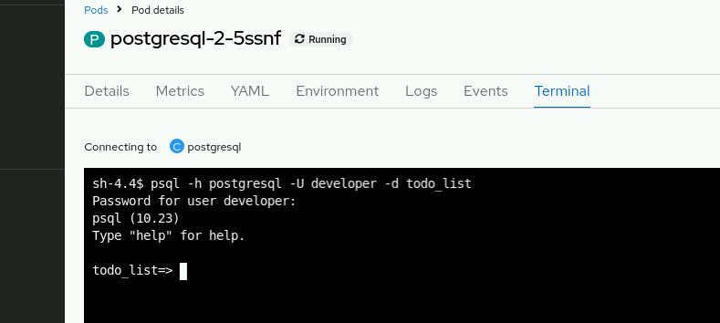

# Chapter 1.  Red Hat OpenShift Container Platform for Developers

## Guided Exercise: Setting up the Developer Environment
Verify that the classroom image registry is accessible and log in by using Podman.
```bash
[student@workstation ~]$ podman login -u="developer" -p="ENCRYPTED_PASSWORD" \
registry.ocp4.example.com:8443
Login Succeeded!
```
Log in to the classroom cluster by using the oc CLI and the Red Hat OpenShift web console.
```bash
[student@workstation ~]$ oc login -u developer -p developer \
  https://api.ocp4.example.com:6443
Login successful.

...output omitted...
```
Change to the architecture-setup project.
```
[student@workstation ~]$ oc project architecture-setup
...output omitted...
```
To get the web console URL, run the `oc whoami` command with the `--show-console` option.
```
[student@workstation ~]$ oc whoami --show-console
https://console-openshift-console.apps.ocp4.example.com
```
---
# Chapter 2. Deploying Simple Applications
## 2.2 Guided Exercise: Navigating the Red Hat OpenShift Web Console


src/__init__.py rong


## 2.4 Guided Exercise: Deploying Applications by Using the Red Hat OpenShift Web Console

**Deploy the PHP application from the Git repository.**


In the Git type field, select GitLab. The web console validates the repository.


Click the Open URL icon.

Verify that the hello-world PHP application has been deployed successfully.


On the hello-world tab that opens, verify that the application response is similar to the following message:
```
Hello, World! php version is ...
```

**Deploy the Node.js application from container images**


Under the General section, select Create application in the Application field.


Copy the URL under the Routes section.


Test that the application can create items.

Return to the terminal and use the copied URL to send a POST request to the /todos endpoint by running the following command:
```
[student@workstation ~]$ curl -i -H "Content-Type: application/json" \
https://todo-list-deploy-console.apps.ocp4.example.com/todos \
--data '{ "task": "Say hello" }'
HTTP/1.1 201 Created
...output omitted...
```
The application saves the item and returns a 201 Created HTTP response.

Retrieve the list of items by running the following command:
```
[student@workstation ~]$ curl -s \
https://todo-list-deploy-console.apps.ocp4.example.com/todos | jq
[
  {
    "task": "Say hello"
  }
]
```
## 2.6 Guided Exercise: Deploying Applications by Using the oc and odo CLIs

**Deploy the application by using the `oc new-app` command and activate external access.**

```bash
[student@workstation ~]$ oc new-app registry.ocp4.example.com:8443/\
redhattraining/openshift-dev-deploy-cli-weather:1.0
--> Found container image 6ef27a6 ...
...output omitted...
--> Success
```
Verify that the `oc new-app` command creates the following resources:
- Pod
- ReplicaSet
- Deployment
- Service
- Image stream
```
[student@workstation ~]$ oc get all
NAME ...
pod/openshift-dev-deploy-cli-weather-7f78cd4969-cfgts ...

NAME ...
service/openshift-dev-deploy-cli-weather ...

NAME ...
deployment.apps/openshift-dev-deploy-cli-weather ...

NAME ...
replicaset.apps/openshift-dev-deploy-cli-weather-74b5454bc4
replicaset.apps/openshift-dev-deploy-cli-weather-7f78cd4969 ...

NAME ...
imagestream.image.openshift.io/openshift-dev-deploy ...
```


**Expose the application outside of the cluster.**  
Create an external route by using the oc expose command with the --name=weather option to name the route.
```
[student@workstation ~]$ oc expose --name=weather \
service/openshift-dev-deploy-cli-weather
route.route.openshift.io/weather exposed
```
Use the oc get command to get the URL for the weather route.
```
[student@workstation ~]$ oc get route weather
NAME          HOST/PORT ...
weather   weather-deploy-cli.apps.ocp4.example.com ...
```
Verify that you can access the application from the workstation machine by running the curl command with the previous URL and the /tomorrow path.
```
[student@workstation ~]$ curl \
weather-deploy-cli.apps.ocp4.example.com/tomorrow
{"rain_chance":"5%","weather":"sunny"}
```
Log out by using the oc logout command.
```
[student@workstation ~]$ oc logout
Logged "developer" out on "https://api.ocp4.example.com:6443"
```

**`odo` command**

Run the `odo` login command with the developer user and the developer password. If the command prompts you to collect usage data, then you can press Enter to accept.
```
[student@workstation ~]$ odo login -u developer -p developer \
https://api.ocp4.example.com:6443
Connecting to the OpenShift cluster

Login successful.

...output omitted...
```
Use `odo` to create a project with the `odo-deploy-cli` name.
```
[student@workstation ~]$ odo create project odo-deploy-cli
 ✓  Creating the project "odo-deploy-cli" ...
 ✓  Project "odo-deploy-cli" is ready for use
 ✓  New project created and now using project: odo-deploy-cli

...output omitted...
```
Note: On some occasions the odo create project command might not change to the new project. You might want to run the following command to ensure that you use the odo-deploy-cli project:
```
[student@workstation ~]$ oc project odo-deploy-cli
```
**Container Image Renaming with odo**

The image renaming logic only triggers if you define the ImageRegistry preference by running the following command:
```
[user@host ~]$ odo preference set ImageRegistry REGISTRY_URL/NAMESPACE
```
The final image names have the following pattern:
```
ImageRegistry/DevfileName-ImageName:UniqueId
```


## 2.7 Lab: Deploying Simple Applications


Return to the terminal and delete all the application's objects with the following command:
```
[student@workstation ~]$ oc delete all -l app=todo-list
service "todo-list" deleted.
deployment.apps "todo-list" deleted
imagestream.image.openshift.io "todo-list" deleted
```


Cách kết nối tới PostgreSQL bằng psql

Nếu bạn đã có psql trong pod hoặc trên workstation, dùng lệnh:
```
psql -h postgresql -U developer -d todo_list
```

Hệ thống sẽ hỏi mật khẩu → nhập test.



Fix bug database name psql
```
[student@workstation ~]$ echo -n "todo_list" | base64

dG9kb19saXN0

[student@workstation ~]$ oc edit secrets postgresql

secret/postgresql edited
```

## 3.2 Guided Exercise: Building Container Images for Red Hat OpenShift


## 3.4 Guided Exercise: Using External Registries in Red Hat OpenShift


## 3.6 Guided Exercise: Creating Image Streams

Truoc do

Sau khi doi tag image


## 3.7 Lab: Building and Publishing Container Images


## 4.4 Guided Exercise: Managing Application Builds


## 4.6 Guided Exercise: Triggering Builds


Commit the index.html file, and push the content into the git repository:
```
[student@workstation builds-triggers]$ git add index.html
[student@workstation builds-triggers]$ git commit -m "Initial commit"
[main (root-commit) 3edb013] Initial commit
...output omitted...
 1 file changed, 1 insertion(+)
 create mode 100644 index.html
[student@workstation builds-triggers]$ git push
Username for 'https://git.ocp4.example.com': developer
Password for 'https://developer@git.ocp4.example.com':
...output omitted...
To https://git.ocp4.example.com/developer/builds-triggers.git
 * [new branch]      main -> main
```


```
[student@workstation builds-triggers]$ oc create secret generic gitlab \
--from-literal=username=developer --from-literal=password=d3v3lop3r
secret/gitlab created
```


Miss `oc get bc`

## Guided Exercise: Customizing an Existing S2I Base Image


Create an application called bonjour from the provided sources. You must prefix the Git URL with the httpd:2.4-ubi9 image stream by using the tilde (~) notation to ensure that the application uses the ubi9/httpd-24 builder image.
```
[student@workstation s2i-scripts]$ oc new-app --name bonjour \
--context-dir labs/builds-s2i/s2i-scripts \
httpd:2.4-ubi9~https://git.ocp4.example.com/developer/DO288-apps
...output omitted...
--> Creating resources ...
imagestream.image.openshift.io "bonjour" created
buildconfig.build.openshift.io "bonjour" created
deployment.apps "bonjour" created
service "bonjour" created
--> Success
...output omitted..
```


View the build logs.
```
[student@workstation s2i-scripts]$ oc logs -f bc/bonjour
...output omitted...
Cloning "https://git.ocp4.example.com/developer/DO288-apps" ...
...output omitted...
STEP 9/10: RUN /tmp/scripts/assemble
---> Enabling s2i support in httpd24 image
    AllowOverride All
---> Installing application source
---> Creating info page
STEP 10/10: CMD /tmp/scripts/run
COMMIT temp.builder.openshift.io/builds-s2i/bonjour-1:986469c8
...output omitted...
Push successful
```


## 4.9 Lab: Managing Red Hat OpenShift Builds


## 5.2 Guided Exercise: Selecting the Appropriate Deployment Strategy


Edit the Deployment resource in the application.yaml manifest file to use the Recreate strategy. Also, be sure to update the number of replicas to five (5) to maintain the correct number of pods. Your application.yaml file should match the following excerpt by updating replicas and replacing the line strategy: {}:
```
- apiVersion: apps/v1
  kind: Deployment
  metadata:
...output omitted...
    name: users-db
  spec:
    replicas: 5
    selector:
      matchLabels:
        deployment: users-db
    strategy:
      type: Recreate
      recreateParams:
        post:
          failurePolicy: Abort
          execNewPod:
            containerName: users-db
            command: ["/post-deploy/import.sh"]
    template:
      metadata:
...output omitted...
```


## 5.4 Guided Exercise: Managing Application Deployments


## 5.6 Guided Exercise: Deploying Stateful Applications


Create configmap from file


## 5.8 Guided Exercise: Monitoring Application Health


