# Chapter 1.  Red Hat OpenShift Container Platform for Developers


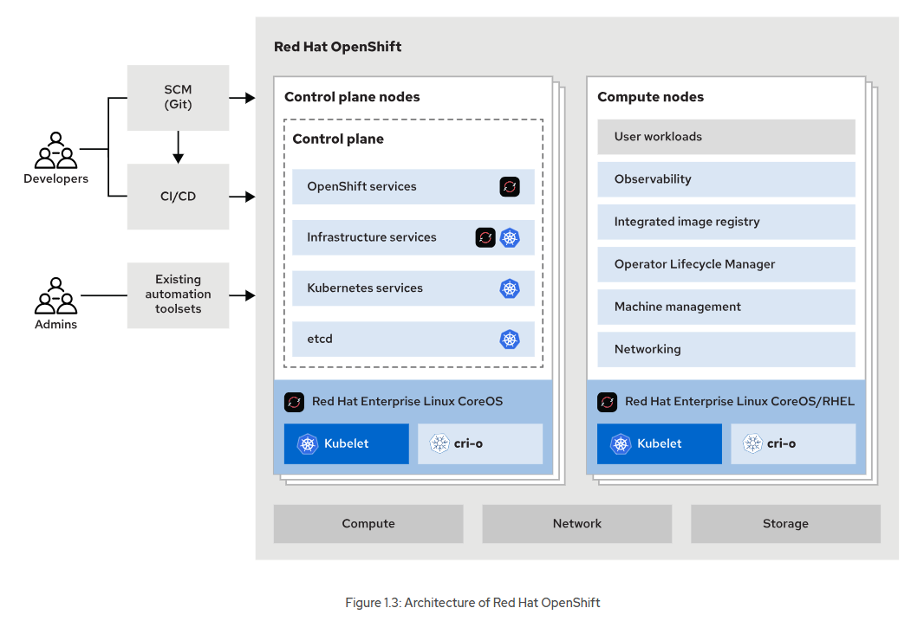
Control Plane

Kubernetes services
- etcd: the distributed key-value store, which Kubernetes uses to store configuration and state information about the containers and other resources inside the cluster.
- kube-apiserver: validates and configures cluster objects and provides the access point to the shared state of the cluster.
- kube-controller-manager: monitors etcd for changes and uses the Kubernetes API to apply changes to the cluster.
- kube-scheduler: selects the nodes where a workload must run.

## Red Hat OpenShift Concepts and Terminology

### Kubernetes Concepts

**Pods**  
A Pod is a collection of containers that share the same storage and network. Pods share the context by using Linux namespaces, cgroups, and other isolation technologies.

Each container in a pod usually contains applications that are more or less logically coupled.

**ReplicaSet**  
The ReplicaSet object indicates the number of pods that are available to attend a request. This object also ties all the pods replicas together so you can operate on them at the same time.

**Deployments**  
A Deployment contains the desired state of an application's pods and uses a ReplicaSet to achieve this desired state. Some changes in the application's state can be: creating pods, declaring a new state of pods, changing the number of pods, or rolling back to a previous Deployment revision.

**Service**  
A Kubernetes Service exposes a set of pods over a network. This abstraction allows internal or external clients of the application running on said pods to connect to them regardless of the actual state of the replicas or varying network IPs.

**Ingress**  
An Ingress exposes services inside the cluster to outside clients by using HTTP or HTTPS. A service ingress can also provide external URLs, load balancing, name-based virtual hosting, or SSL/TLS termination.

**Namespace**  
A Namespace can enable you to isolate resources, encapsulate objects under a unique name, and provide resource quotas.

**Custom Resource**  
Custom Resource (CR) allows extending the Kubernetes API. Custom resources represent entities other than the default ones in Kubernetes. Additionally, Custom resources interact with other cluster objects, regardless of whether those other objects are default or custom.

**Operator**  
An Operator is a custom Kubernetes controller that uses custom resources to deploy and manage applications. It takes high-level user configuration and acts to make the cluster match the desired state.

**Service Account**    
A Service Account is a special kind of account that does not correspond to an actual user, but it is used internally by cluster tools. It is useful for pods to connect to objects in the cluster, such as CI/CD pipelines, secrets, or external resources (outside of the namespace or the cluster).

**Storage Class**   
A Storage Class is a name that identifies a particular kind of storage defined by the cluster administrator. A storage class also defines its characteristics, such as backup policies, service level quality, or any other specification the administrator might choose.

**Persistent Volume**  
A Persistent Volume (PV), is a persistence storage unit offered by the cluster, independent of cluster nodes. This object holds information regarding the size, type, or ability to share storage.

**Persistent Volume Claim**  
Users claim the storage that a PV offers by using a Persistent Volume Claim (PVC). A PVC is a request to access a specific kind of storage of the required size. After acquiring the PVC, the storage is attached to the pods claiming it.

---
# Chapter 2.  Deploying Simple Applications

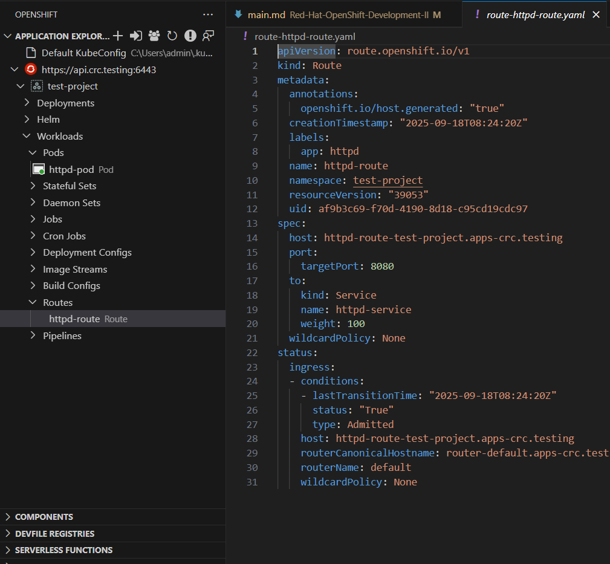

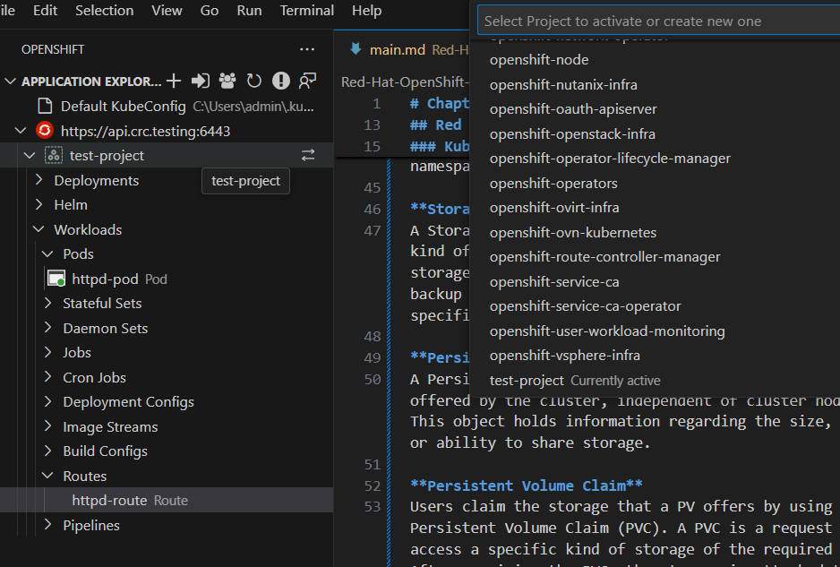

Deploying Applications by Using the Red Hat OpenShift Web Console
- Deploy an application by using a Git repository.
- Deploy an application by using an image from a container registry.

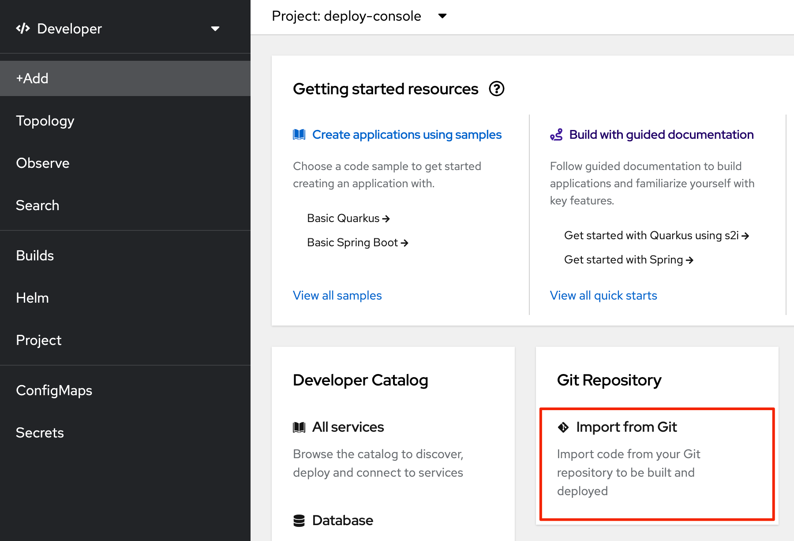


## Deploying Applications by Using the oc and odo CLIs


**Deploying Applications with the OpenShift CLI**   
For complex applications, you can use the oc apply command with the -f option. You provide a manifest file that defines the Kubernetes resources for your application.
```
[user@host ~]$ oc apply -f my-manifest.yaml
```
Deploying Applications with oc new-app

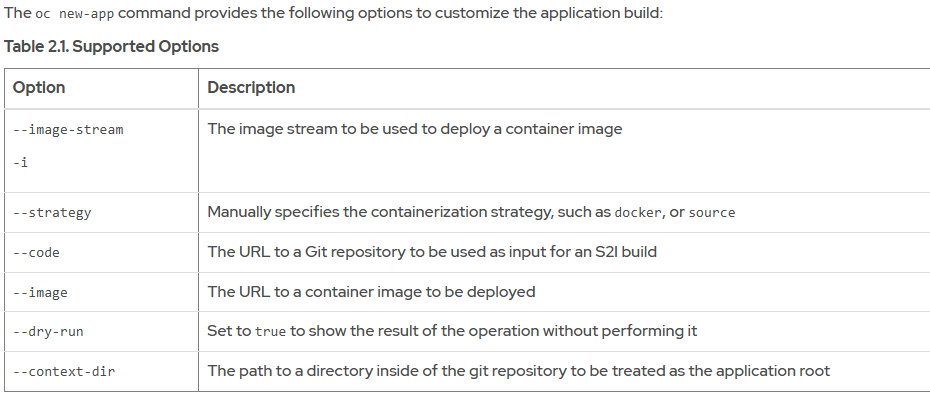

To get a complete list of options and to see a list of examples, run the `oc new-app -h` command.

Example

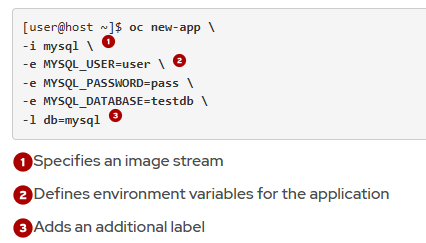

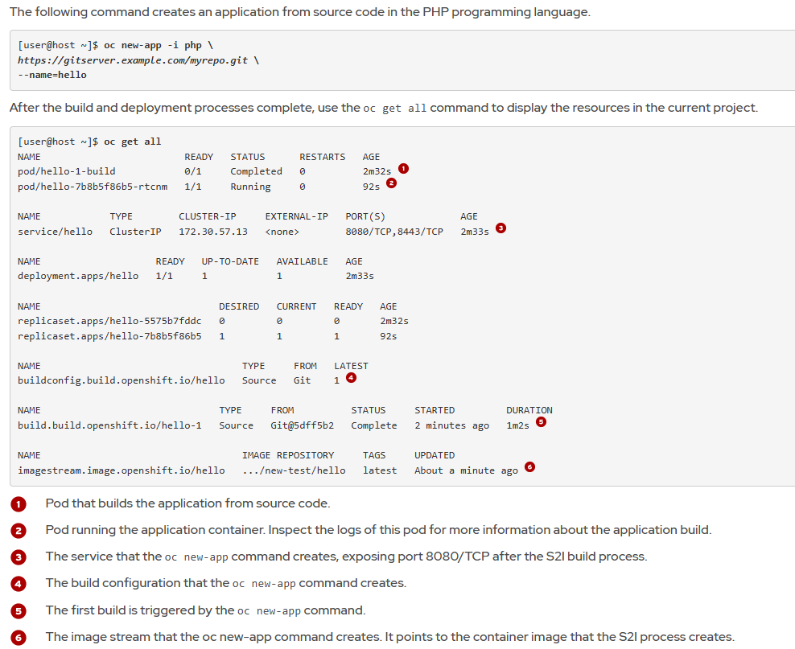

You can delete resources that the oc new-app command creates by using a single oc delete command with the --selector option and the app label. The following command deletes the resources created by the previous oc new-app command:
```
[user@host ~]$ oc delete all --selector app=hello
```

Use the `-o` option to inspect resource definitions without creating resources.
```
[user@host ~]$ oc new-app \
-o yaml registry.example.com/mycontainerimage
apiVersion: v1
items:
- apiVersion: image.openshift.io/v1
  kind: ImageStream
  ...output omitted...
- apiVersion: build.openshift.io/v1
  kind: BuildConfig
  ...output omitted...
- apiVersion: apps/v1
  kind: Deployment
  ...output omitted...
- apiVersion: v1
  kind: Service
  ...output omitted...
kind: List
metadata: {}
```
**Exposing Applications Outside the Cluster.**  
Service resources are only accessible from within the cluster. To provide external access to your application, you can use the oc expose command.

The `oc expose` command creates a Route resource, a type of OpenShift-specific resource. This resource defines the port and protocol for access outside the cluster.

Syntax
```
oc expose [RESOURCE/NAME] [options]
```
Trong đó:

- RESOURCE/NAME: loại resource và tên (thường là service/<service-name> hoặc deployment/<deploy-name>).
- [options]: các tùy chọn để định nghĩa route hoặc service.


Một số option quan trọng

- `--name=<string>`
→ Đặt tên cho resource mới được tạo (ví dụ: route).

- `--port=<port-name|number>`
→ Chỉ định cổng từ Service mà Route sẽ expose (nếu Service có nhiều port).

- `--target-port=<number>`
→ Chỉ định chính xác cổng đích trên Pod container.

- `--hostname=<string>`
→ Đặt hostname (FQDN) cho Route. Nếu không có, OpenShift sẽ generate.

- `--path=<string>`
→ Gắn path cho Route (ví dụ /api).

- `--type=<string>`
→ Loại service muốn expose (ClusterIP, NodePort, LoadBalancer).

- `--generator=<string>`
→ Kiểu resource generator. Mặc định khi expose Service là route/v1

Cú pháp đầy đủ nhất (hay dùng):
```
oc expose service <service-name> \
  --name=<route-name> \
  --port=<service-port> \
  --hostname=<custom-host> \
  --path=<url-path>
```
🔹 `--hostname=<custom-host>`

- Dùng khi bạn muốn Route có hostname cụ thể thay vì hostname ngẫu nhiên OpenShift generate.
- Trường hợp dùng:
  - Bạn muốn public domain dễ nhớ, ví dụ:
```
oc expose service myservice --hostname=weather.apps.ocp.example.com
```
- Khi bạn đã có DNS record trỏ về OpenShift router (Ingress).
- Trong môi trường production, hostname thường được quy định trước (VD: api.company.com, shop.company.com).

👉 Nếu không set, OpenShift sẽ tự tạo tên dạng:
```
<route-name>-<project>.apps.<cluster-domain>
```
🔹`--path=<url-path>`
- Dùng để thêm context path cho route.
- Trường hợp dùng:
  - Khi bạn muốn nhiều ứng dụng share chung 1 hostname, nhưng phân biệt bằng path.
Ví dụ:
```
oc expose service backend --hostname=api.apps.ocp.example.com --path=/backend
oc expose service frontend --hostname=api.apps.ocp.example.com --path=/frontend
```
- Khi ứng dụng của bạn lắng nghe trên root /, nhưng bạn chỉ muốn expose dưới một nhánh /app1 chẳng hạn.

👉 Nếu không set, mặc định path là `/` (root).

- `--hostname` → dùng khi bạn muốn route có domain cụ thể, nhất là trong production (gắn DNS chuẩn).

- `--path` → dùng khi muốn chạy nhiều service/app dưới cùng 1 domain nhưng phân biệt bằng đường dẫn.


OpenShift chọn port nào để expose khi dung `oc expose` command ? 
- oc expose service ... mặc định lấy port từ Service.
- Nếu Service có 1 port → Route dùng port đó.
- Nếu Service có nhiều port → bạn phải chỉ định --port.

*Cách kiểm tra port service*
```
oc get service openshift-dev-deploy-cli-weather -o yaml
---
ports:
- name: 8080-tcp
  port: 8080
  targetPort: 8080

```
Service có 8080 và 8443 → phải chỉ định:
```
oc expose service myservice --port=8080
```

**Inner loop vs Outer loop**

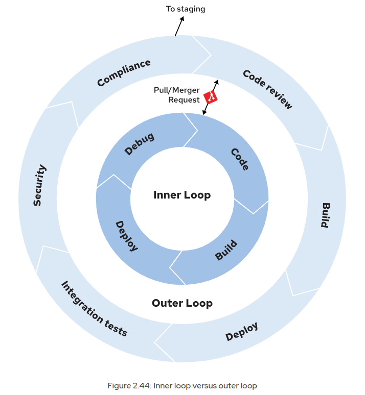

1. Inner loop vs Outer loop

- Inner loop: vòng lặp ngắn của dev → code → build → test nhanh → debug → lặp lại.
  - Đây là phần mà odo hỗ trợ mạnh nhất (deploy code nhanh lên cluster để test).

- Outer loop: vòng lặp dài hơn → build artifact chính thức → chạy integration test, security test → deploy vào môi trường prod/staging.
  - odo cũng có thể định nghĩa được qua devfile.yaml.

2. Devfile (devfile.yaml)

Là file trung tâm, mô tả:
- Components: container images, manifests, volume…
- Commands: các bước cần chạy (build, run, test, debug, deploy).
- Command groups: gom lệnh theo nhóm (`build, run, test, debug, deploy`).
Nhờ devfile, odo biết phải làm gì khi bạn gõ:
- odo build
- odo run
- odo test
- odo debug
- odo deploy

Note: 
- Nếu muốn odo <kind> chạy mặc định, bạn phải bật isDefault: true.
- Nếu có nhiều command cùng kind thì chỉ 1 được default, còn lại phải gọi bằng --command <id>.

3. `odo init`
- Tạo file devfile.yaml ban đầu.
- odo sẽ cố gắng đoán runtime từ source code (ví dụ thấy package.json → Node.js, thấy requirements.txt → Python).
- Nếu bạn không truyền options, nó sẽ mở interactive mode để bạn chọn.
- Nó cần kết nối tới devfile registry (mặc định: https://registry.devfile.io
) để lấy template phù hợp.

> Sau khi có devfile.yaml, bạn có thể sửa để phù hợp với project.

4. Lệnh `odo create project`
```
odo create project PROJECT_NAME
```
- Tạo một OpenShift Project (namespace) mới trực tiếp từ odo.
- Tương đương với lệnh: `oc new-project PROJECT_NAME`

The following devfile provides a simplified example for outer loop development with odo. The devfile adheres to the following requirements:

- The `Dockerfile` must exist in the same directory as the `devfile.yaml`.

- The `deploy.yaml` contains the Kubernetes resources for the application.

- The parent devfile must exist.

- The odo command must be able to access Podman and an authenticated image registry.

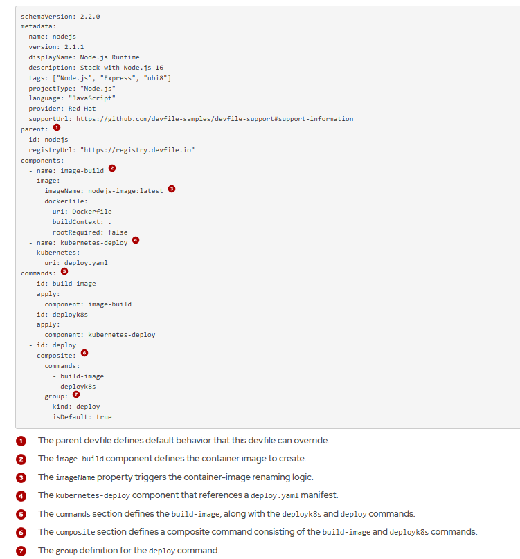

Example deploy.yaml
```bash
apiVersion: apps/v1
kind: Deployment
metadata:
  name: nodejs-app
  labels:
    app: nodejs-app
spec:
...
---
apiVersion: v1
kind: Service
metadata:
  name: nodejs-app
  labels:
    app: nodejs-app
spec:
  selector:

...
---
apiVersion: route.openshift.io/v1
kind: Route
metadata:
  name: nodejs-app
spec:
  to:

```
**Container Image Renaming with odo**  
*Vấn đề*
- Trong devfile.yaml bạn có thể định nghĩa image component để build/push image.
- Nếu bạn viết thẳng image name đầy đủ (ví dụ: quay.io/myuser/nodejs-app:1.0), thì devfile bị gắn chặt với registry đó → khó chia sẻ cho người khác.
- Vì vậy, odo hỗ trợ image renaming để làm devfile portable (dùng lại ở nhiều cluster/registry khác nhau).

*Cách hoạt động*

1. Khai báo `ImageRegistry`
Bạn set registry mặc định để odo push image:
```
odo preference set ImageRegistry quay.io/myuser

# syntax
[user@host ~]$ odo preference set ImageRegistry REGISTRY_URL/NAMESPACE
```
→ Sau đó mọi image sẽ được push về quay.io/myuser/....

2. Dùng imageName tương đối trong devfile  
Trong `devfile.yaml`:
```
components:
  - name: relative-image
    image:
      imageName: "my-relative-image"   # chỉ có tên, không có registry
```

👉 Đây gọi là relative image name.

3. Khi build/push, odo sẽ tự đổi tên image thành:
```
<ImageRegistry>/<DevfileName>-<ImageName>:<UniqueId>
```
- ImageRegistry: giá trị bạn set (quay.io/myuser)
- DevfileName: tên devfile (ví dụ nodejs-app)
- ImageName: phần bạn định nghĩa (my-relative-image)
- UniqueId: giá trị random để tránh trùng

📝 Ví dụ cụ thể

Devfile nodejs-app có:
```
components:
  - name: relative-image
    image:
      imageName: "my-relative-image"
```

Bạn set:
```
odo preference set ImageRegistry quay.io/nghia
```

Khi odo deploy, image thực tế được push sẽ thành:
```
quay.io/nghia/nodejs-app-my-relative-image:abc123
```
✅ Lợi ích

- Devfile không bị hard-code registry → portable, dễ chia sẻ cho team khác.
- odo tự động đổi tên và push image đúng registry bạn chỉ định.
- Bạn có thể kiểm tra:
  - Trong registry (quay.io/nghia/...)
  - Hoặc trong resource YAML mà odo apply lên cluster.

**Syntax hữu ích của oc new-app**
```bash
oc new-app <image>                  # Tạo từ image
oc new-app --image=<image>
oc new-app <image>~<git-repo>       # S2I build từ source code
oc new-app -f template.yaml         # Dùng template file
oc new-app --name=myapp             # Đặt tên app
oc new-app <image> -e VAR=VALUE     # Thêm biến môi trường
oc new-app <image> --as-deployment-config  # Dùng DeploymentConfig thay vì Deployment
```

**Image mà oc new-app dùng từ đâu ra?**

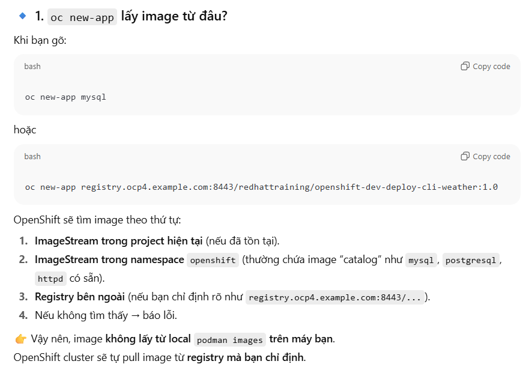

🔹 2. Vậy podman build liên quan gì?
- Nếu bạn tự build một image bằng podman build trên máy local thì image đó chỉ nằm trong local host.
- Để OpenShift dùng được, bạn phải push image đó lên một registry (ví dụ: quay.io, docker.io, hoặc internal OpenShift registry image-registry.openshift-image-registry.svc:5000).

Sau đó bạn mới dùng:
```
oc new-app <registry>/<namespace>/<image>:<tag>
```

Mặc định `oc new-app` chỉ giúp bạn deploy nhanh để test, còn nếu muốn tùy chỉnh chi tiết thì có vài cách:

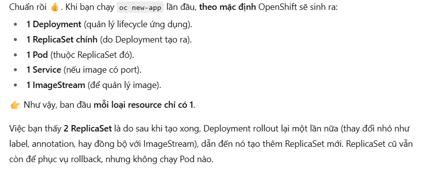

**Tùy chỉnh**

- Tùy chỉnh ngay từ lệnh `oc new-app`
```bash
# Example
oc scale deployment myapp --replicas=3
oc expose deployment myapp --port=8080 --target-port=8080
```
- Chỉnh sau khi resource được tạo
```bash
# Xuất YAML ra file để chỉnh:
oc get deployment myapp -o yaml > myapp-deploy.yaml

# -> Sửa YAML (replicas, resource limits, volume, env, liveness probe…)

# Apply lại:
oc apply -f myapp-deploy.yaml
```
3. Dùng workflow hiện đại (recommended)  
Thay vì `oc new-app` (quick & simple), bạn có thể:
- Viết sẵn Deployment + Service YAML → `oc apply -f`.
- Hoặc dùng odo với devfile.yaml nếu phát triển app.
- Hoặc dùng BuildConfig + ImageStream nếu muốn workflow CI/CD theo kiểu OpenShift truyền thống.

---
# Chapter 3.  Building and Publishing Container Images

Red Hat Universal Base Images
When defining custom container images, Red Hat recommends the use of Red Hat Universal Base Images (UBI) as the base container images for your applications. UBI images are certified, tested, and regularly maintained images that Red Hat provides at no cost.

UBI images also provide the following major benefits:

**Universal**  
UBI images are designed to be used as the base images for developing container-based applications.

**Robust**  
UBI images are based on Red Hat Enterprise Linux (RHEL). This brings characteristics such as stability and vulnerability management to your base container images.

**Standard**  
UBI images are compliant with the Open Container Initiative (OCI).

**Extensible**  
UBI images provide package managers and other tools for installing additional software.

**OpenShift-optimized**  
UBI images are tailored to work well on Red Hat OpenShift.

**Redistributable**  
The UBI End-User Licensing Agreement (EULA) permits free distribution of the applications that you build on top of UBI images.

Red Hat provides four types of UBI images, designed to cover most use cases.

Image type	|Image name	|Uses
---|---|---
Standard	|ubi|	For most applications and use cases
Init	|ubi-init|	For containers that run multiple systemd services
Minimal	|ubi-minimal	|Smaller image for applications that manage their own dependencies and depend on fewer OS components
Micro	|ubi-micro	|Smallest image for optimized memory-footprint use cases; for applications that use almost no OS components

Runtime UBI Images For Developers
Red Hat provides UBI images for the following runtime languages:
- OpenJDK
- Node.js
- Python
- PHP
- .NET
- Go
- Ruby
 
Optimize Containerfiles for OpenShift  
Format
```
registry.access.redhat.com/NAMESPACE/NAME[:TAG]
```
Example 
```
FROM registry.access.redhat.com/ubi10/nodejs-22-minimal:10.0
```
**Ensure That Your Containers Handle Interruption Signals**

🔹 1. Cơ chế shutdown mặc định

Khi bạn xóa Pod hoặc rollout Deployment mới, OpenShift sẽ:
- Gửi tín hiệu SIGTERM đến process PID 1 trong container.
- Container/app của bạn có trách nhiệm ngắt kết nối, đóng resource, lưu data….
- Nếu trong thời gian terminationGracePeriodSeconds (mặc định 30s) app không tắt → OpenShift gửi SIGKILL (kill ngay lập tức).

👉 Do đó, ứng dụng phải biết cách handle SIGTERM để shutdown “êm đẹp” (graceful shutdown).

🔹 2. Trường hợp ứng dụng không handle SIGTERM

Ví dụ:
- Một app Java chạy bằng java -jar example.jar.
- Nếu bạn không trap SIGTERM, khi Pod bị kill → Java process sẽ tắt ngay → có thể mất data, chưa commit transaction, connection bị cắt đột ngột.

Cách xử lý:
- Viết entrypoint script (như ví dụ trong bài): trap tín hiệu SIGTERM và forward cho app, rồi wait cho app shutdown.
```
trap graceful_shutdown SIGTERM
java -jar example.jar &
java_pid=$!
wait "$java_pid"
```

Ở đây:

- trap graceful_shutdown SIGTERM: khi nhận SIGTERM → gọi hàm graceful_shutdown.

- Hàm này gửi SIGTERM đến process Java (kill -SIGTERM $java_pid) và đợi nó shutdown.

🔹 3. Khi app không sửa code được

Nếu ứng dụng không có cơ chế nhận SIGTERM (hoặc bạn không thể thay đổi entrypoint), bạn có thể dùng Pod lifecycle hook:
```
lifecycle:
  preStop:
    httpGet:
      path: /shutdown
      port: 8080
```

- Khi Pod chuẩn bị bị xóa, kubelet sẽ gọi HTTP GET vào /shutdown.

- Ứng dụng sẽ nhận request này và thực hiện cleanup (đóng kết nối, flush cache, lưu trạng thái, v.v).

- Sau đó mới nhận SIGTERM để tắt hẳn.

🔹 4. Nếu app vẫn không tắt?

- Sau khi hết thời gian terminationGracePeriodSeconds, kubelet/OpenShift gửi SIGKILL → process bị kill ngay lập tức.

- Lúc này không có cơ hội cleanup → nguy cơ mất dữ liệu hoặc lỗi.

✅ Tóm lại

- OpenShift/K8s luôn gửi SIGTERM trước để cho app tự shutdown êm đẹp.

- App nên handle SIGTERM (qua entrypoint script).

- Nếu không thể → dùng preStop hook để app cleanup trước khi bị kill.

- Nếu app vẫn không shutdown kịp → cuối cùng bị SIGKILL (force kill).

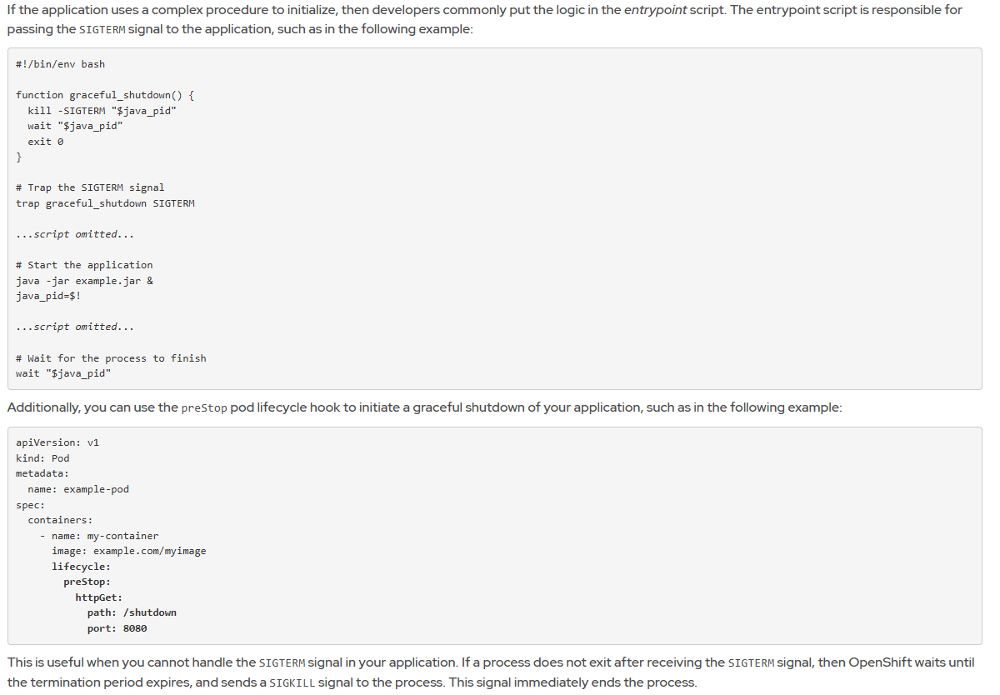

**Reduce Image Size**

1. Giảm số lượng RUN
- Kết hợp nhiều lệnh thành 1 RUN để giảm số layer.

2. Giảm build context
- Dùng .dockerignore / .containerignore để loại bỏ file/thư mục không cần thiết.

3. Multistage build
- Stage đầu: build app bằng image đầy đủ (ví dụ: ubi9/nodejs-22).
- Stage cuối: copy artifact sang image minimal/runtime (ubi9/nodejs-22-minimal).
- → Kết quả: image nhỏ gọn, chỉ chứa runtime + app.

4. Dùng minimal image

- Node.js: nodejs-22-minimal.
- OpenJDK: ubi9/openjdk-21-runtime.

5. LABEL
- Dùng LABEL để khai báo metadata.
- Ví dụ: LABEL io.openshift.min-cpu 2 → UI OpenShift cảnh báo cần ít nhất 2 CPU.

6. WORKDIR
- Luôn dùng WORKDIR với absolute path thay vì nhiều lần cd trong RUN.
7. ENV và ARG
- Dùng ENV để cấu hình đường dẫn, version, PATH…
- Dùng ARG cho biến build-time → tạo image tái sử dụng được.
8. VOLUME
- Khai báo rõ VOLUME để người dùng biết mount dữ liệu.
- Nếu không mount, OpenShift sẽ tự gắn EmptyDir (ephemeral).

9. EXPOSE
- Chỉ expose port >1024 (không cần quyền root).
- oc new-app sẽ tự tạo Deployment + Service theo port được EXPOSE.
- Web console cũng nhận diện các port này để cấu hình service.

👉 Tóm gọn lại:
- Multistage + minimal UBI image → giảm size.
- LABEL, ENV, VOLUME, EXPOSE → giúp OpenShift hiểu rõ image, hỗ trợ cấu hình dễ dàng.
- WORKDIR và ít RUN → làm Containerfile gọn, dễ maintain.

**Build and Push Images with Podman**  
You can use a tool such as Podman to build a container image locally and push the image to a container registry.

> Note
You can also use OpenShift to build your container images. The OpenShift build capabilities, such as Source-to-Image (S2I) and Docker builds, are covered later in this course. OpenShift also provides the OpenShift Builds framework, which is based on the Shipwright project.

Use the podman build command to create a container image from a Containerfile, as the following example shows:
```
[user@host ~]$ podman build CONTEXT_DIR -t IMAGE
```
The preceding command creates a local container image by using the Containerfile or Dockerfile at the CONTEXT_DIR directory. The produced image is called IMAGE. After building the container image locally, push the image to a container registry by using the podman push command.
```
[user@host ~]$ podman push IMAGE
```
> Note
You must be logged in to the registry to push images. You can log in with the podman login command.

After the image is published in the container registry, you can deploy the image by using any of the methods that Red Hat OpenShift provides, such as the web console, or the oc and odo CLIs.

## Guided Exercise: Building Container Images for Red Hat OpenShift


```bash
oc new-app \
--name greetings \
--image=registry.ocp4.example.com:8443/developer/images-ubi-greetings:1.0.0
```
File Containerfile
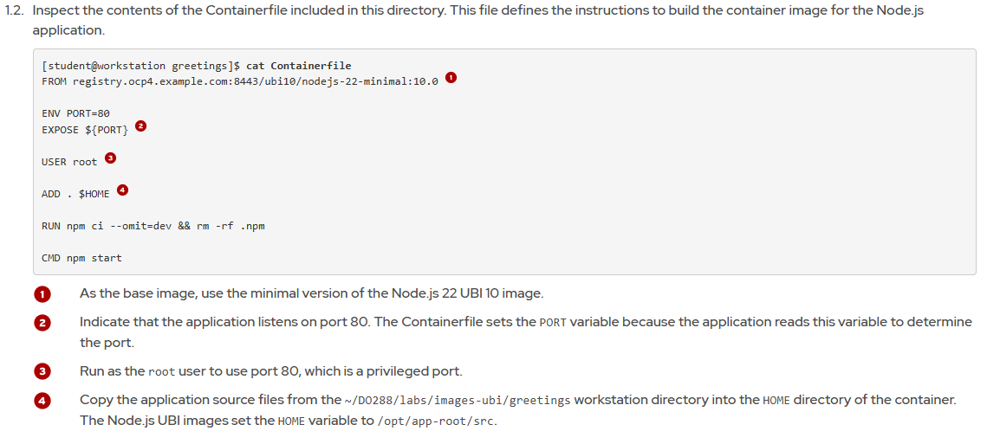

3 error khi `oc new-app`  
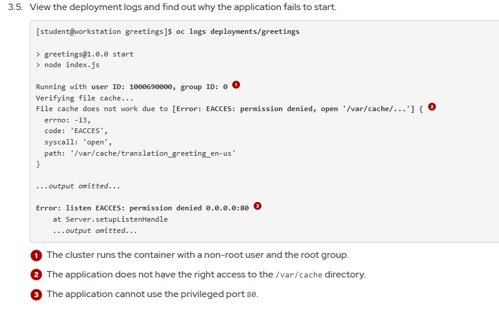

**Fix 1**  
Remove the USER instruction from the Containerfile. The file must look as follows:
```
FROM registry.ocp4.example.com:8443/ubi10/nodejs-22-minimal:10.0

ENV PORT=80
EXPOSE ${PORT}

ADD . $HOME

RUN npm ci --omit=dev && rm -rf .npm

CMD npm start
```

**Fix 2**  
Trong Linux (và cũng đúng trong container), có quy tắc:
- Port < 1024 = privileged ports → chỉ process chạy bằng root user mới bind được.
- Port ≥ 1024 = unprivileged ports → bất kỳ non-root user nào cũng bind được.

Vì sao lỗi xảy ra?
- Ứng dụng của bạn cố gắng lắng nghe trên cổng 80:
```
Error: listen EACCES: permission denied 0.0.0.0:80
```
- Nhưng trong OpenShift, container chạy với một UID ngẫu nhiên, không phải root.
- Do đó, process đó không thể mở được cổng 80 → báo lỗi EACCES.

**Fix 3**  
Fix the permissions of the /var/cache directory. In the Containerfile, add a RUN instruction that runs as the root user and ensures that the group assigned to the /var/cache directory is the root group (0). Then, it should grant the root group the same permissions as the user that owns this directory. Finally, it should restore 1001 as the user ID that runs the application.
```bash
...omitted...
RUN npm ci --omit=dev && rm -rf .npm

USER root
RUN chgrp -R 0 /var/cache && \
    chmod -R g=u /var/cache
USER 1001

CMD npm start
```
-> rebuild image, run -rm , podman push -> oc new-app -> expose > get url


