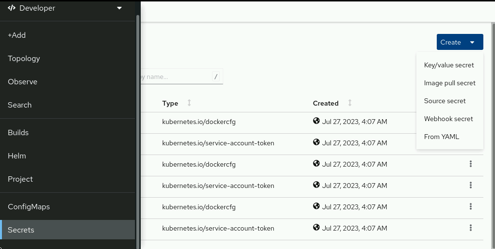
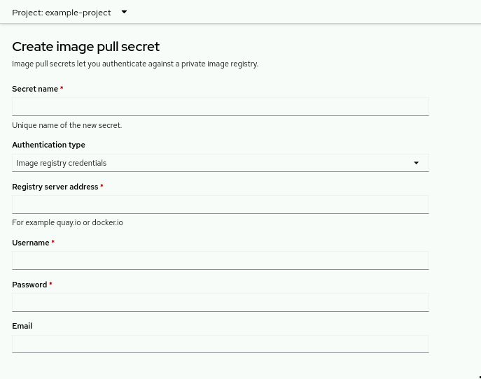
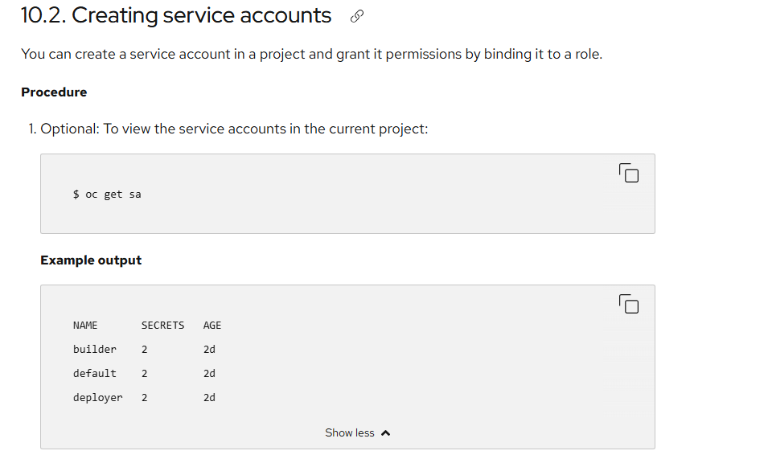
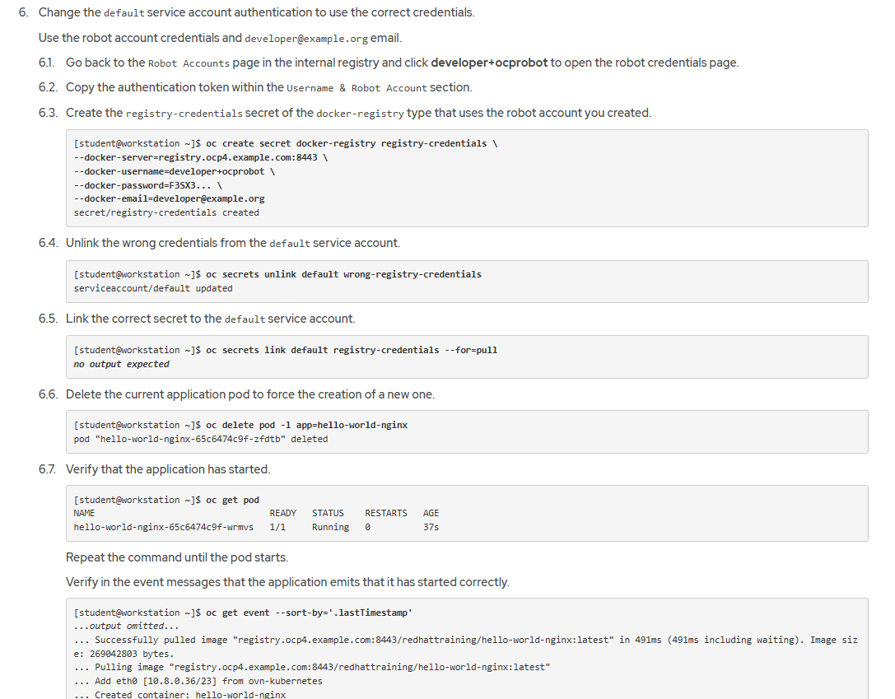
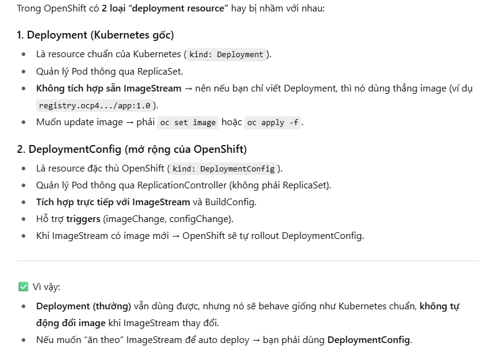
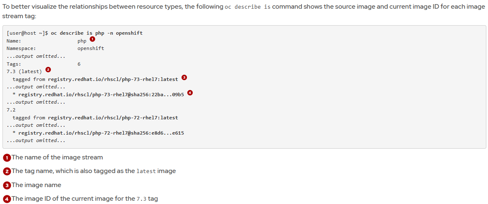
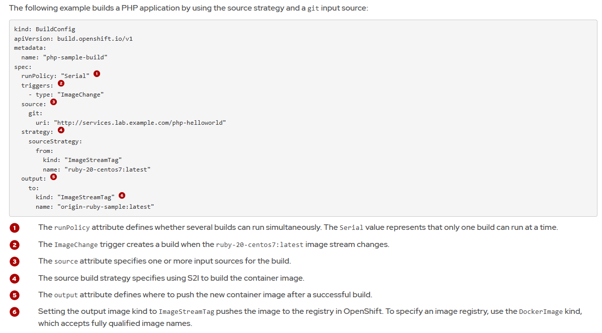
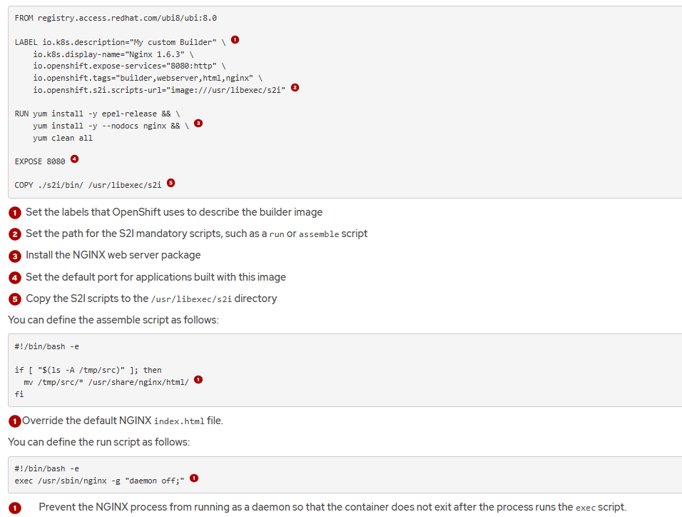
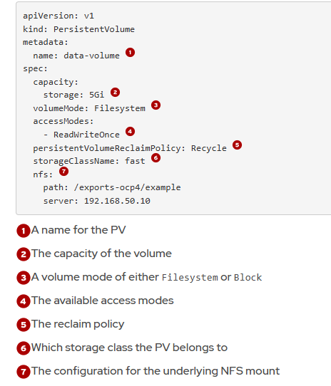
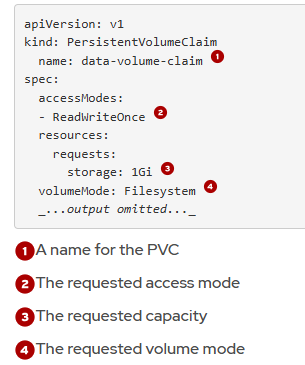

# Chapter 1.  Red Hat OpenShift Container Platform for Developers


Control Plane

Kubernetes services
- etcd: the distributed key-value store, which Kubernetes uses to store configuration and state information about the containers and other resources inside the cluster.
- kube-apiserver: validates and configures cluster objects and provides the access point to the shared state of the cluster.
- kube-controller-manager: monitors etcd for changes and uses the Kubernetes API to apply changes to the cluster.
- kube-scheduler: selects the nodes where a workload must run.

## Red Hat OpenShift Concepts and Terminology

### Kubernetes Concepts

**Pods**  
A Pod is a collection of containers that share the same storage and network. Pods share the context by using Linux namespaces, cgroups, and other isolation technologies.

Each container in a pod usually contains applications that are more or less logically coupled.

**ReplicaSet**  
The ReplicaSet object indicates the number of pods that are available to attend a request. This object also ties all the pods replicas together so you can operate on them at the same time.

**Deployments**  
A Deployment contains the desired state of an application's pods and uses a ReplicaSet to achieve this desired state. Some changes in the application's state can be: creating pods, declaring a new state of pods, changing the number of pods, or rolling back to a previous Deployment revision.

**Service**  
A Kubernetes Service exposes a set of pods over a network. This abstraction allows internal or external clients of the application running on said pods to connect to them regardless of the actual state of the replicas or varying network IPs.

**Ingress**  
An Ingress exposes services inside the cluster to outside clients by using HTTP or HTTPS. A service ingress can also provide external URLs, load balancing, name-based virtual hosting, or SSL/TLS termination.

**Namespace**  
A Namespace can enable you to isolate resources, encapsulate objects under a unique name, and provide resource quotas.

**Custom Resource**  
Custom Resource (CR) allows extending the Kubernetes API. Custom resources represent entities other than the default ones in Kubernetes. Additionally, Custom resources interact with other cluster objects, regardless of whether those other objects are default or custom.

**Operator**  
An Operator is a custom Kubernetes controller that uses custom resources to deploy and manage applications. It takes high-level user configuration and acts to make the cluster match the desired state.

**Service Account**    
A Service Account is a special kind of account that does not correspond to an actual user, but it is used internally by cluster tools. It is useful for pods to connect to objects in the cluster, such as CI/CD pipelines, secrets, or external resources (outside of the namespace or the cluster).

**Storage Class**   
A Storage Class is a name that identifies a particular kind of storage defined by the cluster administrator. A storage class also defines its characteristics, such as backup policies, service level quality, or any other specification the administrator might choose.

**Persistent Volume**  
A Persistent Volume (PV), is a persistence storage unit offered by the cluster, independent of cluster nodes. This object holds information regarding the size, type, or ability to share storage.

**Persistent Volume Claim**  
Users claim the storage that a PV offers by using a Persistent Volume Claim (PVC). A PVC is a request to access a specific kind of storage of the required size. After acquiring the PVC, the storage is attached to the pods claiming it.

---
# Chapter 2.  Deploying Simple Applications


Deploying Applications by Using the Red Hat OpenShift Web Console
- Deploy an application by using a Git repository.
- Deploy an application by using an image from a container registry.


## Deploying Applications by Using the oc and odo CLIs


**Deploying Applications with the OpenShift CLI**   
For complex applications, you can use the oc apply command with the -f option. You provide a manifest file that defines the Kubernetes resources for your application.
```
[user@host ~]$ oc apply -f my-manifest.yaml
```
Deploying Applications with oc new-app


To get a complete list of options and to see a list of examples, run the `oc new-app -h` command.

Example


You can delete resources that the oc new-app command creates by using a single oc delete command with the --selector option and the app label. The following command deletes the resources created by the previous oc new-app command:
```
[user@host ~]$ oc delete all --selector app=hello
```

Use the `-o` option to inspect resource definitions without creating resources.
```
[user@host ~]$ oc new-app \
-o yaml registry.example.com/mycontainerimage
apiVersion: v1
items:
- apiVersion: image.openshift.io/v1
  kind: ImageStream
  ...output omitted...
- apiVersion: build.openshift.io/v1
  kind: BuildConfig
  ...output omitted...
- apiVersion: apps/v1
  kind: Deployment
  ...output omitted...
- apiVersion: v1
  kind: Service
  ...output omitted...
kind: List
metadata: {}
```
**Exposing Applications Outside the Cluster.**  
Service resources are only accessible from within the cluster. To provide external access to your application, you can use the oc expose command.

The `oc expose` command creates a Route resource, a type of OpenShift-specific resource. This resource defines the port and protocol for access outside the cluster.

Syntax
```
oc expose [RESOURCE/NAME] [options]
```
Trong đó:

- RESOURCE/NAME: loại resource và tên (thường là service/<service-name> hoặc deployment/<deploy-name>).
- [options]: các tùy chọn để định nghĩa route hoặc service.


Một số option quan trọng

- `--name=<string>`
→ Đặt tên cho resource mới được tạo (ví dụ: route).

- `--port=<port-name|number>`
→ Chỉ định cổng từ Service mà Route sẽ expose (nếu Service có nhiều port).

- `--target-port=<number>`
→ Chỉ định chính xác cổng đích trên Pod container.

- `--hostname=<string>`
→ Đặt hostname (FQDN) cho Route. Nếu không có, OpenShift sẽ generate.

- `--path=<string>`
→ Gắn path cho Route (ví dụ /api).

- `--type=<string>`
→ Loại service muốn expose (ClusterIP, NodePort, LoadBalancer).

- `--generator=<string>`
→ Kiểu resource generator. Mặc định khi expose Service là route/v1

Cú pháp đầy đủ nhất (hay dùng):
```
oc expose service <service-name> \
  --name=<route-name> \
  --port=<service-port> \
  --hostname=<custom-host> \
  --path=<url-path>
```
🔹 `--hostname=<custom-host>`

- Dùng khi bạn muốn Route có hostname cụ thể thay vì hostname ngẫu nhiên OpenShift generate.
- Trường hợp dùng:
  - Bạn muốn public domain dễ nhớ, ví dụ:
```
oc expose service myservice --hostname=weather.apps.ocp.example.com
```
- Khi bạn đã có DNS record trỏ về OpenShift router (Ingress).
- Trong môi trường production, hostname thường được quy định trước (VD: api.company.com, shop.company.com).

👉 Nếu không set, OpenShift sẽ tự tạo tên dạng:
```
<route-name>-<project>.apps.<cluster-domain>
```
🔹`--path=<url-path>`
- Dùng để thêm context path cho route.
- Trường hợp dùng:
  - Khi bạn muốn nhiều ứng dụng share chung 1 hostname, nhưng phân biệt bằng path.
Ví dụ:
```
oc expose service backend --hostname=api.apps.ocp.example.com --path=/backend
oc expose service frontend --hostname=api.apps.ocp.example.com --path=/frontend
```
- Khi ứng dụng của bạn lắng nghe trên root /, nhưng bạn chỉ muốn expose dưới một nhánh /app1 chẳng hạn.

👉 Nếu không set, mặc định path là `/` (root).

- `--hostname` → dùng khi bạn muốn route có domain cụ thể, nhất là trong production (gắn DNS chuẩn).

- `--path` → dùng khi muốn chạy nhiều service/app dưới cùng 1 domain nhưng phân biệt bằng đường dẫn.


OpenShift chọn port nào để expose khi dung `oc expose` command ? 
- oc expose service ... mặc định lấy port từ Service.
- Nếu Service có 1 port → Route dùng port đó.
- Nếu Service có nhiều port → bạn phải chỉ định --port.

*Cách kiểm tra port service*
```
oc get service openshift-dev-deploy-cli-weather -o yaml
---
ports:
- name: 8080-tcp
  port: 8080
  targetPort: 8080

```
Service có 8080 và 8443 → phải chỉ định:
```
oc expose service myservice --port=8080
```

**Inner loop vs Outer loop**


1. Inner loop vs Outer loop

- Inner loop: vòng lặp ngắn của dev → code → build → test nhanh → debug → lặp lại.
  - Đây là phần mà odo hỗ trợ mạnh nhất (deploy code nhanh lên cluster để test).

- Outer loop: vòng lặp dài hơn → build artifact chính thức → chạy integration test, security test → deploy vào môi trường prod/staging.
  - odo cũng có thể định nghĩa được qua devfile.yaml.

2. Devfile (devfile.yaml)

Là file trung tâm, mô tả:
- Components: container images, manifests, volume…
- Commands: các bước cần chạy (build, run, test, debug, deploy).
- Command groups: gom lệnh theo nhóm (`build, run, test, debug, deploy`).
Nhờ devfile, odo biết phải làm gì khi bạn gõ:
- odo build
- odo run
- odo test
- odo debug
- odo deploy

Note: 
- Nếu muốn odo <kind> chạy mặc định, bạn phải bật isDefault: true.
- Nếu có nhiều command cùng kind thì chỉ 1 được default, còn lại phải gọi bằng --command <id>.

3. `odo init`
- Tạo file devfile.yaml ban đầu.
- odo sẽ cố gắng đoán runtime từ source code (ví dụ thấy package.json → Node.js, thấy requirements.txt → Python).
- Nếu bạn không truyền options, nó sẽ mở interactive mode để bạn chọn.
- Nó cần kết nối tới devfile registry (mặc định: https://registry.devfile.io
) để lấy template phù hợp.

> Sau khi có devfile.yaml, bạn có thể sửa để phù hợp với project.

4. Lệnh `odo create project`
```
odo create project PROJECT_NAME
```
- Tạo một OpenShift Project (namespace) mới trực tiếp từ odo.
- Tương đương với lệnh: `oc new-project PROJECT_NAME`

The following devfile provides a simplified example for outer loop development with odo. The devfile adheres to the following requirements:

- The `Dockerfile` must exist in the same directory as the `devfile.yaml`.

- The `deploy.yaml` contains the Kubernetes resources for the application.

- The parent devfile must exist.

- The odo command must be able to access Podman and an authenticated image registry.


Example deploy.yaml
```bash
apiVersion: apps/v1
kind: Deployment
metadata:
  name: nodejs-app
  labels:
    app: nodejs-app
spec:
...
---
apiVersion: v1
kind: Service
metadata:
  name: nodejs-app
  labels:
    app: nodejs-app
spec:
  selector:

...
---
apiVersion: route.openshift.io/v1
kind: Route
metadata:
  name: nodejs-app
spec:
  to:

```
**Container Image Renaming with odo**  
*Vấn đề*
- Trong devfile.yaml bạn có thể định nghĩa image component để build/push image.
- Nếu bạn viết thẳng image name đầy đủ (ví dụ: quay.io/myuser/nodejs-app:1.0), thì devfile bị gắn chặt với registry đó → khó chia sẻ cho người khác.
- Vì vậy, odo hỗ trợ image renaming để làm devfile portable (dùng lại ở nhiều cluster/registry khác nhau).

*Cách hoạt động*

1. Khai báo `ImageRegistry`
Bạn set registry mặc định để odo push image:
```
odo preference set ImageRegistry quay.io/myuser

# syntax
[user@host ~]$ odo preference set ImageRegistry REGISTRY_URL/NAMESPACE
```
→ Sau đó mọi image sẽ được push về quay.io/myuser/....

2. Dùng imageName tương đối trong devfile  
Trong `devfile.yaml`:
```
components:
  - name: relative-image
    image:
      imageName: "my-relative-image"   # chỉ có tên, không có registry
```

👉 Đây gọi là relative image name.

3. Khi build/push, odo sẽ tự đổi tên image thành:
```
<ImageRegistry>/<DevfileName>-<ImageName>:<UniqueId>
```
- ImageRegistry: giá trị bạn set (quay.io/myuser)
- DevfileName: tên devfile (ví dụ nodejs-app)
- ImageName: phần bạn định nghĩa (my-relative-image)
- UniqueId: giá trị random để tránh trùng

📝 Ví dụ cụ thể

Devfile nodejs-app có:
```
components:
  - name: relative-image
    image:
      imageName: "my-relative-image"
```

Bạn set:
```
odo preference set ImageRegistry quay.io/nghia
```

Khi odo deploy, image thực tế được push sẽ thành:
```
quay.io/nghia/nodejs-app-my-relative-image:abc123
```
✅ Lợi ích

- Devfile không bị hard-code registry → portable, dễ chia sẻ cho team khác.
- odo tự động đổi tên và push image đúng registry bạn chỉ định.
- Bạn có thể kiểm tra:
  - Trong registry (quay.io/nghia/...)
  - Hoặc trong resource YAML mà odo apply lên cluster.

**Syntax hữu ích của oc new-app**
```bash
oc new-app <image>                  # Tạo từ image
oc new-app --image=<image>
oc new-app <image>~<git-repo>       # S2I build từ source code
oc new-app -f template.yaml         # Dùng template file
oc new-app --name=myapp             # Đặt tên app
oc new-app <image> -e VAR=VALUE     # Thêm biến môi trường
oc new-app <image> --as-deployment-config  # Dùng DeploymentConfig thay vì Deployment
```

**Image mà oc new-app dùng từ đâu ra?**


🔹 2. Vậy podman build liên quan gì?
- Nếu bạn tự build một image bằng podman build trên máy local thì image đó chỉ nằm trong local host.
- Để OpenShift dùng được, bạn phải push image đó lên một registry (ví dụ: quay.io, docker.io, hoặc internal OpenShift registry image-registry.openshift-image-registry.svc:5000).

Sau đó bạn mới dùng:
```
oc new-app <registry>/<namespace>/<image>:<tag>
```

Mặc định `oc new-app` chỉ giúp bạn deploy nhanh để test, còn nếu muốn tùy chỉnh chi tiết thì có vài cách:


**Tùy chỉnh**

- Tùy chỉnh ngay từ lệnh `oc new-app`
```bash
# Example
oc scale deployment myapp --replicas=3
oc expose deployment myapp --port=8080 --target-port=8080
```
- Chỉnh sau khi resource được tạo
```bash
# Xuất YAML ra file để chỉnh:
oc get deployment myapp -o yaml > myapp-deploy.yaml

# -> Sửa YAML (replicas, resource limits, volume, env, liveness probe…)

# Apply lại:
oc apply -f myapp-deploy.yaml
```
3. Dùng workflow hiện đại (recommended)  
Thay vì `oc new-app` (quick & simple), bạn có thể:
- Viết sẵn Deployment + Service YAML → `oc apply -f`.
- Hoặc dùng odo với devfile.yaml nếu phát triển app.
- Hoặc dùng BuildConfig + ImageStream nếu muốn workflow CI/CD theo kiểu OpenShift truyền thống.

---
# Chapter 3.  Building and Publishing Container Images

Red Hat Universal Base Images
When defining custom container images, Red Hat recommends the use of Red Hat Universal Base Images (UBI) as the base container images for your applications. UBI images are certified, tested, and regularly maintained images that Red Hat provides at no cost.

UBI images also provide the following major benefits:

**Universal**  
UBI images are designed to be used as the base images for developing container-based applications.

**Robust**  
UBI images are based on Red Hat Enterprise Linux (RHEL). This brings characteristics such as stability and vulnerability management to your base container images.

**Standard**  
UBI images are compliant with the Open Container Initiative (OCI).

**Extensible**  
UBI images provide package managers and other tools for installing additional software.

**OpenShift-optimized**  
UBI images are tailored to work well on Red Hat OpenShift.

**Redistributable**  
The UBI End-User Licensing Agreement (EULA) permits free distribution of the applications that you build on top of UBI images.

Red Hat provides four types of UBI images, designed to cover most use cases.

Image type	|Image name	|Uses
---|---|---
Standard	|ubi|	For most applications and use cases
Init	|ubi-init|	For containers that run multiple systemd services
Minimal	|ubi-minimal	|Smaller image for applications that manage their own dependencies and depend on fewer OS components
Micro	|ubi-micro	|Smallest image for optimized memory-footprint use cases; for applications that use almost no OS components

Runtime UBI Images For Developers
Red Hat provides UBI images for the following runtime languages:
- OpenJDK
- Node.js
- Python
- PHP
- .NET
- Go
- Ruby
 
Optimize Containerfiles for OpenShift  
Format
```
registry.access.redhat.com/NAMESPACE/NAME[:TAG]
```
Example 
```
FROM registry.access.redhat.com/ubi10/nodejs-22-minimal:10.0
```
**Ensure That Your Containers Handle Interruption Signals**

🔹 1. Cơ chế shutdown mặc định

Khi bạn xóa Pod hoặc rollout Deployment mới, OpenShift sẽ:
- Gửi tín hiệu SIGTERM đến process PID 1 trong container.
- Container/app của bạn có trách nhiệm ngắt kết nối, đóng resource, lưu data….
- Nếu trong thời gian terminationGracePeriodSeconds (mặc định 30s) app không tắt → OpenShift gửi SIGKILL (kill ngay lập tức).

👉 Do đó, ứng dụng phải biết cách handle SIGTERM để shutdown “êm đẹp” (graceful shutdown).

🔹 2. Trường hợp ứng dụng không handle SIGTERM

Ví dụ:
- Một app Java chạy bằng java -jar example.jar.
- Nếu bạn không trap SIGTERM, khi Pod bị kill → Java process sẽ tắt ngay → có thể mất data, chưa commit transaction, connection bị cắt đột ngột.

Cách xử lý:
- Viết entrypoint script (như ví dụ trong bài): trap tín hiệu SIGTERM và forward cho app, rồi wait cho app shutdown.
```
trap graceful_shutdown SIGTERM
java -jar example.jar &
java_pid=$!
wait "$java_pid"
```

Ở đây:

- trap graceful_shutdown SIGTERM: khi nhận SIGTERM → gọi hàm graceful_shutdown.

- Hàm này gửi SIGTERM đến process Java (kill -SIGTERM $java_pid) và đợi nó shutdown.

🔹 3. Khi app không sửa code được

Nếu ứng dụng không có cơ chế nhận SIGTERM (hoặc bạn không thể thay đổi entrypoint), bạn có thể dùng Pod lifecycle hook:
```
lifecycle:
  preStop:
    httpGet:
      path: /shutdown
      port: 8080
```

- Khi Pod chuẩn bị bị xóa, kubelet sẽ gọi HTTP GET vào /shutdown.

- Ứng dụng sẽ nhận request này và thực hiện cleanup (đóng kết nối, flush cache, lưu trạng thái, v.v).

- Sau đó mới nhận SIGTERM để tắt hẳn.

🔹 4. Nếu app vẫn không tắt?

- Sau khi hết thời gian terminationGracePeriodSeconds, kubelet/OpenShift gửi SIGKILL → process bị kill ngay lập tức.

- Lúc này không có cơ hội cleanup → nguy cơ mất dữ liệu hoặc lỗi.

✅ Tóm lại

- OpenShift/K8s luôn gửi SIGTERM trước để cho app tự shutdown êm đẹp.

- App nên handle SIGTERM (qua entrypoint script).

- Nếu không thể → dùng preStop hook để app cleanup trước khi bị kill.

- Nếu app vẫn không shutdown kịp → cuối cùng bị SIGKILL (force kill).


**Reduce Image Size**

1. Giảm số lượng RUN
- Kết hợp nhiều lệnh thành 1 RUN để giảm số layer.

2. Giảm build context
- Dùng .dockerignore / .containerignore để loại bỏ file/thư mục không cần thiết.

3. Multistage build
- Stage đầu: build app bằng image đầy đủ (ví dụ: ubi9/nodejs-22).
- Stage cuối: copy artifact sang image minimal/runtime (ubi9/nodejs-22-minimal).
- → Kết quả: image nhỏ gọn, chỉ chứa runtime + app.

4. Dùng minimal image

- Node.js: nodejs-22-minimal.
- OpenJDK: ubi9/openjdk-21-runtime.

5. LABEL
- Dùng LABEL để khai báo metadata.
- Ví dụ: LABEL io.openshift.min-cpu 2 → UI OpenShift cảnh báo cần ít nhất 2 CPU.

6. WORKDIR
- Luôn dùng WORKDIR với absolute path thay vì nhiều lần cd trong RUN.
7. ENV và ARG
- Dùng ENV để cấu hình đường dẫn, version, PATH…
- Dùng ARG cho biến build-time → tạo image tái sử dụng được.
8. VOLUME
- Khai báo rõ VOLUME để người dùng biết mount dữ liệu.
- Nếu không mount, OpenShift sẽ tự gắn EmptyDir (ephemeral).

9. EXPOSE
- Chỉ expose port >1024 (không cần quyền root).
- oc new-app sẽ tự tạo Deployment + Service theo port được EXPOSE.
- Web console cũng nhận diện các port này để cấu hình service.

👉 Tóm gọn lại:
- Multistage + minimal UBI image → giảm size.
- LABEL, ENV, VOLUME, EXPOSE → giúp OpenShift hiểu rõ image, hỗ trợ cấu hình dễ dàng.
- WORKDIR và ít RUN → làm Containerfile gọn, dễ maintain.

**Build and Push Images with Podman**  
You can use a tool such as Podman to build a container image locally and push the image to a container registry.

> Note
You can also use OpenShift to build your container images. The OpenShift build capabilities, such as Source-to-Image (S2I) and Docker builds, are covered later in this course. OpenShift also provides the OpenShift Builds framework, which is based on the Shipwright project.

Use the podman build command to create a container image from a Containerfile, as the following example shows:
```
[user@host ~]$ podman build CONTEXT_DIR -t IMAGE
```
The preceding command creates a local container image by using the Containerfile or Dockerfile at the CONTEXT_DIR directory. The produced image is called IMAGE. After building the container image locally, push the image to a container registry by using the podman push command.
```
[user@host ~]$ podman push IMAGE
```
> Note
You must be logged in to the registry to push images. You can log in with the podman login command.

After the image is published in the container registry, you can deploy the image by using any of the methods that Red Hat OpenShift provides, such as the web console, or the oc and odo CLIs.

## Guided Exercise: Building Container Images for Red Hat OpenShift


```bash
oc new-app \
--name greetings \
--image=registry.ocp4.example.com:8443/developer/images-ubi-greetings:1.0.0
```
File Containerfile


3 error khi `oc new-app`  


**Fix 1**  
Remove the USER instruction from the Containerfile. The file must look as follows:
```
FROM registry.ocp4.example.com:8443/ubi10/nodejs-22-minimal:10.0

ENV PORT=80
EXPOSE ${PORT}

ADD . $HOME

RUN npm ci --omit=dev && rm -rf .npm

CMD npm start
```

**Fix 2**  
Trong Linux (và cũng đúng trong container), có quy tắc:
- Port < 1024 = privileged ports → chỉ process chạy bằng root user mới bind được.
- Port ≥ 1024 = unprivileged ports → bất kỳ non-root user nào cũng bind được.

Vì sao lỗi xảy ra?
- Ứng dụng của bạn cố gắng lắng nghe trên cổng 80:
```
Error: listen EACCES: permission denied 0.0.0.0:80
```
- Nhưng trong OpenShift, container chạy với một UID ngẫu nhiên, không phải root.
- Do đó, process đó không thể mở được cổng 80 → báo lỗi EACCES.

**Fix 3**  
Fix the permissions of the /var/cache directory. In the Containerfile, add a RUN instruction that runs as the root user and ensures that the group assigned to the /var/cache directory is the root group (0). Then, it should grant the root group the same permissions as the user that owns this directory. Finally, it should restore 1001 as the user ID that runs the application.
```bash
...omitted...
RUN npm ci --omit=dev && rm -rf .npm

USER root
RUN chgrp -R 0 /var/cache && \
    chmod -R g=u /var/cache
USER 1001

CMD npm start
```
-> rebuild image, run -rm , podman push -> oc new-app -> expose > get url

## Using External Registries in Red Hat OpenShift
There are many kinds of container registries:

**Public registries**  
Registries that allow anyone to consume container images directly from the internet without any authentication, such as Docker Hub, Quay.io, or the Red Hat Registry.

**Private registries**  
Registries that are available only to selected consumers and usually require authentication. The Red Hat terms-based registry is an example of a private container registry.

**Enterprise registries**  
Registries that your organization manages. Such registries are usually available only to the organization's employees.

**OpenShift internal registries**  
A registry server managed internally by an OpenShift cluster to store container images.

These kinds of registries are not mutually exclusive: a registry can be, at the same time, both public and private.

**Creating Registry Credentials in OpenShift**  
1. You can use the oc create command to create a secret, for example:
```
[user@host ~]$ oc create secret generic example-secret \
--from-literal=user=developer --namespace=example-ns
secret/example-secret created
```
2. You can use the OpenShift console to create secrets. In the Developer perspective, click Secrets. Select a project, click Create, and then select the secret type that you want to create.



3. Kubernetes provides the docker-registry secret type to store credentials for authentication with the container registry.

```bash
[user@host ~]$ oc create secret docker-registry SECRET_NAME \
--docker-server REGISTRY_URL \
--docker-username USER \
--docker-password PASSWORD \
--docker-email=EMAIL
secret/SECRET_NAME created
```
4. Tạo trực tiếp trong Web Console (GUI)
- Vào Workloads → Secrets → Create → Image pull secret.
- Nhập server URL, user, password, email.



You can also create the secret from existing credentials. For example, if you logged in to the private registry with Podman, then you have existing credentials in the `${XDG_RUNTIME_DIR}/containers/auth.json` file. Because the auth.json file uses the same structure as the .dockerconfigjson file, you can create the secret by using the `auth.json` file.
```
[user@host ~]$ oc create secret generic SECRET_NAME \
--from-file .dockerconfigjson=${XDG_RUNTIME_DIR}/containers/auth.json \
--type kubernetes.io/dockerconfigjson
```
You can also upload the auth.json file in the OpenShift console when creating the secret.

**Configuring OpenShift to Use the Registry Credentials**  
You can configure OpenShift to use custom credentials by using the `spec.imagePullSecrets` Pod property, for example:
```
apiVersion: v1
kind: Pod
metadata:
  name: example-pod
spec:
  containers:
  - name: example-container
    image: REGISTRY_URL
  imagePullSecrets:
  - name: SECRET_NAME
```
Consequently, you can use the property for controllers, such as the Deployment objects:
```
apiVersion: apps/v1
kind: Deployment
metadata:
  name: example-deployment
spec:
  replicas: 3
  selector:
    matchLabels:
      app: my-app
  template:
    metadata:
      labels:
        app: my-app
    spec:
      containers:
        - name: example-container
          image: REGISTRY_URL
      imagePullSecrets:
        - name: SECRET_NAME
```

**Linking Registry Credentials to Service Accounts**

Instead of manually assigning the credentials to pods, you can configure OpenShift to assign the credentials to pods automatically by using service accounts. A service account provides an identity for pods. Pods use the default service account unless you configure a different service account.

Use the oc secrets link command to connect a secret with a service account, for example:
```
[user@host ~]$ oc secrets link --for=pull default SECRET_NAME
no output expected
```
Hoặc cho build config:
```
oc secrets link builder my-registry-secret --for=pull
```
The preceding command creates a new entry in the service account imagePullSecrets field:
```
apiVersion: v1
kind: ServiceAccount
metadata:
  name: default
imagePullSecrets:
- name: SECRET_NAME
```
When you create a pod that uses the default service account, it inherits the imagePullSecrets field without you explicitly specifying the field in the pod definition.

This means that every pod that uses the default service account is authorized with the registry credentials in your secret.  
Giai thich:
- Bạn đã tạo secret trước đó (chứa thông tin registry account).
- Câu lệnh này sẽ gắn secret vào ServiceAccount default của project hiện tại.
- Kể từ lúc đó, bất kỳ Pod nào trong project chạy với SA default sẽ tự động dùng secret này khi pull image từ registry private.

-> 2 cách chính để sử dụng secret đó trong OpenShift/Kubernetes:
- Cách 1: Khai báo trực tiếp trong workload (spec.imagePullSecrets)
- Cách 2: Gắn secret vào ServiceAccount (oc secrets link)

Nguyên tắc
- Secret là resource “namespace-scoped” → chỉ tồn tại trong project (namespace) nào nó được tạo.
- Do đó:
  - Secret trong project A không thể dùng trực tiếp ở project B.
  - Nếu project B cũng cần dùng → bạn phải tạo lại secret trong project B (có thể cùng thông tin).

Có thể dung ServiceAccount khác thay vì default
```
oc secrets link custom-sa my-registry-secret --for=pull

# 
apiVersion: apps/v1
kind: Deployment
metadata:
  name: myapp
spec:
  replicas: 1
  selector:
    matchLabels:
      app: myapp
  template:
    metadata:
      labels:
        app: myapp
    spec:
      serviceAccountName: custom-sa   # dùng SA này thay vì default
      containers:
      - name: myapp
        image: quay.io/myuser/private-app:1.0

```

*Search for the failed event messages that the application emits.*
```
[student@workstation ~]$ oc get event --field-selector type=Warning \
-o jsonpath='{range .items[]}{.message}{"\n"}{end}'
Failed to pull image "registry.ocp4.example.com:8443/redhattraining/hello-world-nginx:latest": ... invalid username/password: unauthorized: ...
```



Docs: https://docs.redhat.com/en/documentation/openshift_container_platform/4.8/html/authentication_and_authorization/understanding-and-creating-service-accounts


Fix error  "Robot Accounts"



7. Delete the robot account from the internal registry.

On the Robot Accounts page, click the gear icon of the developer+ocprobot account, and then click Delete Robot developer+ocprobot. Click Ok to complete the process.

## 3.5 Creating Image Streams
Image streams have the following benefits:
- They provide a level of indirection to the container image that OpenShift runs.
- They allow for rolling back to a previous container version without updating the image registry.
- They enable build and deployment automations when an image stream tag gets updated.
- They enable the caching of images from external image registries.
- You can use role-based access control (RBAC) on the image stream object to secure access to container images.

Vấn đề: mỗi lần đổi image → bạn phải can thiệp thủ công.
Trong khi đó, nếu dùng ImageStream + ImageChange trigger thì chỉ cần cập nhật oc tag hoặc build mới   
→ OpenShift tự rollout cho bạn.






**Managing Image Streams and Tags**

For example, the following command imports a my-app-stream container image from an external container registry and periodically checks for updates:
```
[user@host ~]$ oc import-image myimagestream --confirm --scheduled=true \
--from example.com/example-repo/my-app-image
```
To create one image stream tag resource for each container image tag that exists in the source registry server, add the --all option to the oc import-image command. The following command creates or updates all image stream tags for new tags on the source registry server:
```
[user@host ~]$ oc import-image myimagestream --confirm --all \
--from registry/myorg/myimage
```
Running the oc import-image command on an existing image stream updates one of its current image stream tags to the current image IDs on the source registry server, such as in the following command:
```
[user@host ~]$ oc import-image myimagestream[:tag]
```
Exert finer control over an image stream tag by using the oc tag command. This enables you to associate an image stream tag with the following:
- A different registry than the one in its image stream
- A different container image name and tag
- An image ID that might not be the one currently associated with the image tag on the registry server
- An alias for the image stream tag

For example, to update the latest image stream tag to point to a different tag you can run the following command:
```
[user@host ~]$ oc tag myimagestream:tag myimagestream:latest
```
**Creating Image Streams From Private Registries**  
The following example commands use Podman to log in to a private registry, create a secret to store the access token, and create an image stream that points to the private registry:
```
[user@host ~]$ podman login -u myuser registry.example.com
[user@host ~]$ oc create secret generic regtoken \
--from-file .dockerconfigjson=${XDG_RUNTIME_DIR}/containers/auth.json \
--type kubernetes.io/dockerconfigjson
[user@host ~]$ oc import-image myimagestream --confirm \
--from registry.example.com/myorg/myimage
```
After you create an image stream, you can use it to deploy an application by using the oc new-app command and by using the `-i` option to specify the image stream.

By default, an image stream resource is only available to create applications or builds in the same project.

**Using Image Streams with Kubernetes Resources**

**Sharing an Image Stream Between Multiple Projects**

📌 1. Tạo và quản lý ImageStream

Tạo IS rỗng:
```
oc create is myapp
```

Xem danh sách IS trong project:
```
oc get is
```

Xem chi tiết 1 IS:
```
oc describe is myapp
```

Xoá IS:
```
oc delete is myapp
```
📌 2. Import image từ registry vào IS

Import một image cụ thể:
```
oc import-image myapp:1.0 --from=quay.io/example/myapp:1.0 --confirm
```

Import tất cả tag từ một repo:
```
oc import-image myapp --from=quay.io/example/myapp --all --confirm
```

Import có lịch trình (scheduled):
```
oc import-image myapp --from=quay.io/example/myapp --confirm --scheduled=true
```

Cập nhật tag hiện có:
```
oc import-image myapp:latest
```
📌 3. Quản lý tag của IS

Tạo alias giữa các tag:
```
oc tag myapp:1.0 myapp:latest
```

Copy từ IS khác:
```
oc tag otheris:2.0 myapp:dev
```

Gán IS tag với image ngoài registry:
```
oc tag quay.io/example/myapp:3.0 myapp:stable
```
📌 4. Liên quan tới ứng dụng

Dùng IS để tạo app (DeploymentConfig):
```
oc new-app -i myapp:latest --name=myapp
```

Xem Pod nào đang dùng IS:
```
oc describe is myapp
```

(phần “Image Stream Tag History” sẽ show DeploymentConfig, Builds nào đang dùng tag đó).

📌 5. BuildConfig và IS

Build output về IS:
```
oc new-build --binary --name=myapp --to=myapp:1.0
oc start-build myapp --from-dir=. --follow
```

👉 Tóm gọn:

- oc create is / oc delete is → quản lý ImageStream.
- oc import-image → kéo image từ registry vào IS.
- oc tag → quản lý tag trong IS.
- oc new-app -i → deploy app từ IS (DeploymentConfig + trigger).
- oc describe is → theo dõi ai đang dùng IS.

---
# Chapter 4.  Managing Red Hat OpenShift Builds
🔹 OpenShift Build Process (Cách OpenShift build image)
1. Các thành phần chính khi build

- Trigger → cái gì khởi chạy build (git commit, webhook, thay đổi image).
- Strategy → build theo cách nào (Source-to-Image (S2I), Dockerfile/Buildah, Custom).
- Input sources → code, binary, hoặc Dockerfile.
- Output → image được push vào registry.

👉 OpenShift cung cấp 2 cách build chính:

- BuildConfig (cổ điển): tài nguyên gốc của OpenShift, khai báo YAML rồi build.
- Shipwright (mới, Kubernetes-native): dựa trên upstream project, linh hoạt, hỗ trợ nhiều tool (S2I, Buildah, Buildpacks).

2. Shipwright (Builds for OpenShift)
- Kubernetes-native: dùng CRD như các resource khác.
- Linh hoạt: hỗ trợ nhiều chiến lược build.
- Dễ dùng: có CLI shp, tích hợp trong Web Console.

Các CR quan trọng:
- Build: định nghĩa cái gì cần build (nguồn code, chiến lược, output image).
- BuildStrategy / ClusterBuildStrategy: mô tả cách build (ví dụ S2I, Buildah, Buildpacks).
- BuildRun: khi chạy build, sẽ tạo ra một Pod thực hiện build.

3. Ví dụ với Buildah

Build resource (khai báo build):
```bash
apiVersion: shipwright.io/v1beta1
kind: Build
metadata:
  name: buildah-golang-build
spec:
  source:                 # code nguồn
    type: Git
    git:
      url: https://github.com/shipwright-io/sample-go
    contextDir: docker-build
  strategy:               # chiến lược build
    name: buildah
    kind: ClusterBuildStrategy
  paramValues:            # tham số build
  - name: dockerfile
    value: Dockerfile
  output:                 # image output
    image: image-registry.openshift-image-registry.svc:5000/buildah-example/sample-go-app
```

👉 Giải thích:
- source: lấy code từ GitHub.
- strategy: dùng Buildah.
- paramValues: chỉ ra Dockerfile.
- output: image sẽ được push vào internal registry.

BuildRun resource (chạy build):
```bash
apiVersion: shipwright.io/v1beta1
kind: BuildRun
metadata:
  name: buildah-golang-buildrun
spec:
  build:
    name: buildah-golang-build
```

👉 BuildRun chỉ cần tham chiếu đến Build đã định nghĩa → Shipwright tạo Pod để build.

4. CLI shp (thay cho YAML dài dòng)

Tạo Build:
```bash
shp build create buildah-golang-build \
  --source-url="https://github.com/redhat-openshift-builds/samples" \
  --source-context-dir="buildah-build" \
  --strategy-name="buildah" \
  --dockerfile="Dockerfile" \
  --output-image="image-registry.openshift-image-registry.svc:5000/buildah-example/go-app"
```

Chạy build:
```
shp build run buildah-golang-build --follow
```
✅ Tóm tắt 

- BuildConfig: kiểu cũ, thuần OpenShift.
- Shipwright (Builds for OpenShift): kiểu mới, Kubernetes-native, linh hoạt hơn.
- Build = định nghĩa build, BuildStrategy = cách build, BuildRun = chạy build.
- Ví dụ: lấy code từ GitHub → dùng Buildah với Dockerfile → output thành image trong registry.

**Builds using BuildConfig**



**The S2I Build Workflow**



✅ Tóm tắt

- Builder image: image đặc biệt để build app từ source → output image.
- S2I scripts: assemble (cách build), run (cách chạy).
- Có 2 cách dùng:
  - Tạo builder image chứa sẵn script.
  - Override bằng .s2i/bin/ trong repo → nhanh hơn, không cần rebuild builder image.

## 4.3 Managing Application Builds
Create a Build Configuration
There are two ways to create a build configuration using the oc CLI: `oc new-app` and `oc new-build`.


## 4.5 Triggering Builds

## 4.7 Customizing an Existing S2I Base Image

---
# Chapter 5.  Managing Red Hat OpenShift Deployments

1. Khái niệm chung
- Deployment trong OpenShift tự động hóa quá trình cập nhật ứng dụng.
- Mục tiêu: giảm downtime, tăng tính ổn định, hỗ trợ phát hành liên tục.
- Yêu cầu app cần tuân thủ best practices:
  - Xử lý tín hiệu SIGTERM để tắt graceful.
  - Health/Readiness probe để router chỉ gửi request đến pod khỏe.

2. Deployment Resource
- Là Kubernetes-native (dùng ReplicaSet).
- Tính năng: rollout theo config, scale, pause/resume rollout.
- DeploymentConfig (kiểu cũ) đã bị deprecated.

3. Chiến lược Deployment
- Có 2 nhóm:  
a. Dựa trên Deployment Resource
- Rolling (RollingUpdate)
  - Mặc định.
  - Từng bước thay pod cũ bằng pod mới.
  - Không downtime.
  - Dùng khi app chạy song song được nhiều version.
- Recreate
  - Xóa toàn bộ pod cũ → chạy pod mới.
  - Có downtime.
  - Dùng khi app không hỗ trợ chạy song song, hoặc sử dụng PVC với RWO / RWOP.

b. Dựa trên Router

1. Blue-Green
  - 2 môi trường (Blue – mới, Green – cũ) chạy song song.
  - Route trỏ vào version nào thì user dùng version đó.
  - Dễ rollback.

2. A/B
- Route chia traffic theo tỷ lệ (ví dụ 10% Blue, 90% Green).
- Dùng để test dần, tăng traffic từ từ cho version mới.

## 5.3 Managing Application Deployments
`oc rollout`  
The oc rollout command provides the cancel, pause, undo, retry, and more options for your deployments.
1. Xem trạng thái rollout
```
oc rollout status deployment example-deployment
```
- Dùng để theo dõi tiến trình triển khai (xem pod cũ đã xoá chưa, pod mới đã chạy chưa).
- Kết quả ví dụ:
  - Waiting for deployment ... rollout to finish... → đang triển khai.
  - successfully rolled out → triển khai thành công.

2. Rollback (quay lại version trước)
```
oc rollout undo deployment example-deployment
```
- Nếu version mới bị lỗi, quay lại version cũ ngay.
- Giống như Ctrl+Z cho Deployment 😄.

3. Pause (tạm dừng rollout)
```
oc rollout pause deployment example-deployment
```
- Dùng khi bạn muốn tạm dừng triển khai tự động (ví dụ: bạn đang sửa nhiều config).
- Lúc này thay đổi không áp dụng ngay.

4. Resume (tiếp tục rollout)
```
oc rollout resume deployment example-deployment
```
- Sau khi chỉnh sửa xong, dùng lệnh này để cho rollout tiếp tục.

`oc scale`  
The oc scale command scales the number of replicas for a given deployment:
```
[user@host ~]$ oc scale deployment example-deployment --replicas=3
deployment.apps/example-deployment scaled
```

**Create Secrets and Configuration Maps**
Similarly to secrets, you can create configuration maps by using the oc create command:
```
[user@host ~]$ oc create configmap example-cm \
--from-literal key1=value1 \
--from-literal key2=value2
configmap/example-cm created
```
The previous command creates the following YAML object:
```
kind: ConfigMap
metadata:
    name: example-cm
apiVersion: v1
data:
    key1: value1
    key2: value2
```
You can also create configuration maps from a file or a directory:
```
[user@host ~]$ oc create configmap example-cm \
--from-file=redis.conf
configmap/example-cm created
```
The preceding example creates a configuration map with the redis.conf key and the contents of the file as its value. Developers might also rename the key, such as:
```bash
[user@host ~]$ oc create configmap example-cm \
--from-file=primary=/etc/redis/redis.conf \
--from-file=replica=replica-redis.conf
configmap/example-cm created
```
The preceding example creates a configuration map with the following keys:
- The primary key with the contents of the local /etc/redis/redis.conf file.
- The replica key with the contents of the local ./replica-redis.conf file.

Finally, similarly to secrets, you can use the OpenShift web console to create configuration maps. In the developer perspective, click ConfigMaps, select your project, and click Create ConfigMap.

**Manage Secrets and Configuration Maps**  
*View resources*  
To view details of a resource, use the oc get command:
```
[user@host ~]$ oc get secret mysecret -o yaml
...output omitted...
```
The -o yaml parameter displays the resource in the YAML language  
*Edit resources*  
To edit a resource, use the oc edit command:
```
[user@host ~]$ oc edit configmap my-cm
...output omitted...
```
Alternatively, you can edit resources in the OpenShift web console.  

*Patch resources*  
Patching a resource refers to updating the resource by applying a set of changes rather than interactively. This is useful, for example, in scripts. Use the oc patch command to patch a resource, for example:
```
[user@host ~]$ oc patch configmap/my-cm \
--patch '{"data":{"key1":"newvalue1"}}'
configmap/my-cm patched
```
The preceding command changes the .data.key1 key to the newvalue1 value.

The preceding commands work on any OpenShift resource. However, to edit secrets, you must use values in base64 encoding. You can encode any string by using the base64 command, for example:
```bash
[user@host ~]$ echo -n 'hunter3' | base64
aHVudGVyMw==

# decode
[user@host ~]$ echo -n 'aHVudGVyMw==' | base64 --decode
hunter3
```
*Inject Data to Pods*  
You can mount configuration maps and secrets as data volumes or expose the data as environment variables, inside an application container.

Có 2 cách để đưa dữ liệu từ ConfigMap hoặc Secret vào trong Pod:
- Inject thành biến môi trường (env).
- Mount thành file trong container.

1. Inject ConfigMap/Secret thành Environment Variables

Ví dụ lệnh:
```
oc set env deployment my-deployment --from configmap/my-cm
```
- Ý nghĩa: Lấy tất cả key/value trong ConfigMap my-cm → inject vào Deployment my-deployment → thành biến môi trường trong container.
- Kết quả trong pod:
```
env:
  - name: KEY1
    valueFrom:
      configMapKeyRef:
        key: key1
        name: my-cm
```
- Dùng khi app đọc config từ ENV.

2. Mount ConfigMap/Secret thành Volume (file trong container)

Ví dụ lệnh:
```
oc set volume deployment my-deployment --add \
-t secret -m /mnt/secret \
--name myvol --secret-name my-secret
```

Ý nghĩa: Mount Secret my-secret vào Deployment my-deployment, gắn tại /mnt/secret.

Kết quả trong pod:
```
volumeMounts:
- mountPath: /mnt/secret
  name: myvol
volumes:
- name: myvol
  secret:
    secretName: my-secret
```

Dùng khi app cần file (ví dụ: username.txt, password.txt, TLS cert…).

3. Lưu ý quan trọng
- ConfigMap/Secret chỉ dùng trong cùng namespace (không share giữa project).
- Nếu bạn cập nhật ConfigMap/Secret, pod đang chạy không tự động nhận giá trị mới.
  - Bạn phải xóa pod hoặc rollout lại deployment để pod mới nhận giá trị update. Update config thì cần tái tạo pod để áp dụng giá trị mới.

1. Service Account (SA) là gì?
- Là identity (danh tính) cho ứng dụng trong OpenShift.
- Có thể gắn quyền RBAC, secrets, SCC (Security Context Constraints)… vào SA.
- Mặc định, mọi pod dùng default service account trong namespace.
- Mỗi SA có một JWT token được mount vào pod tại:
```
/var/run/secrets/kubernetes.io/serviceaccount
```

→ Pod có thể dùng token này để gọi OpenShift API.

2. Tạo và gán Service Account
- Tạo SA:
```
oc create serviceaccount my-sa
```
- Gán SA cho deployment:
```
oc set serviceaccount deployment nginx-deployment my-sa
```
Kết quả: deployment nginx-deployment sẽ chạy pod với SA my-sa.

👉 Dùng khi app cần quyền đặc biệt (ví dụ: CI/CD pipeline hoặc operator gọi API OpenShift).

3. Security Context & SCC
a. Security Context
- Xác định quyền, UID, GID, capabilities mà container được phép.
- Ví dụ: chạy non-root, cấm privilege escalation.

b. SCC (Security Context Constraints)
- Là policy bảo mật riêng của OpenShift.
- Tự động áp dụng security context cho pod.
- Mặc định, pod thường dùng SCC restricted-v2.

👉 Admin có thể gắn SCC vào SA → Pod nào chạy với SA đó sẽ được áp dụng SCC tương ứng.

4. Ví dụ Deployment với Security Context
```
securityContext:
  runAsNonRoot: true
  allowPrivilegeEscalation: false
  seccompProfile:
    type: RuntimeDefault
  capabilities:
    drop:
    - ALL
```
- runAsNonRoot: true → cấm chạy user root.
- allowPrivilegeEscalation: false → không cho container tăng quyền.
- capabilities.drop: ALL → bỏ hết Linux capabilities.
- seccompProfile: RuntimeDefault → dùng cấu hình bảo mật mặc định của runtime.

5. Lưu ý quan trọng
- SA + SCC quyết định pod được phép làm gì.
- Nếu không chỉ định → OpenShift sẽ áp dụng mặc định (restricted-v2).
- Để chạy pod đặc biệt (ví dụ cần quyền hostPath, privileged) → cần gán SCC phù hợp cho SA.

## 5.5 Deploying Stateful Applications

**Persistent Volumes and Persistent Volume Claims**  
*Persistent Volumes*  


*Persistent Volume Claims*  
Persistent volume claims (PVCs) represent a request for a persistent volume. These requests can include requirements for the PV, such as the following attributes:
- Amount of storage
- Label selector
- Volume mode
- Access mode
- Storage class



**Static and Dynamic Provisioning**

1. Static Provisioning
- Admin tạo PV thủ công trước → Developer chỉ tạo PVC để claim vào PV đã có.
- Nhược điểm:
  - Tốn công quản lý (Admin phải đoán trước dung lượng).
  - Dễ lãng phí nếu PV không được dùng.
- Dùng khi storage backend không hỗ trợ dynamic hoặc môi trường lab/test.

2. Dynamic Provisioning

- Developer chỉ cần tạo PVC.
- Cluster sẽ tự động tạo PV mới phù hợp nhờ StorageClass (SC).
- Điều kiện:
  - Admin phải cấu hình StorageClass với một Provisioner plugin (ví dụ: nfs-subdir-external-provisioner, Ceph, EBS, v.v.).
  - Nếu default SC chưa định nghĩa, PVC phải chỉ rõ storageClassName.

3. StorageClass (SC)
- Là “profile” của storage: định nghĩa loại storage, tốc độ, reclaim policy,…
- Ví dụ SC:
```
apiVersion: storage.k8s.io/v1
kind: StorageClass
metadata:
  name: nfs-storage
  annotations:
    storageclass.kubernetes.io/is-default-class: "true"
provisioner: k8s-sigs.io/nfs-subdir-external-provisioner
reclaimPolicy: Delete
volumeBindingMode: Immediate
```
- provisioner: plugin lo việc cấp phát storage.
- reclaimPolicy: Delete (xoá PV khi xoá PVC) hoặc Retain (giữ lại PV).
- is-default-class: "true" → PVC nào không ghi storageClassName thì mặc định dùng SC này.

4. PVC với Dynamic Provisioning

Ví dụ:
```
apiVersion: v1
kind: PersistentVolumeClaim
metadata:
  name: dynamic-volume-claim
spec:
  accessModes:
  - ReadWriteOnce
  resources:
    requests:
      storage: 1Gi
  storageClassName: nfs-storage
```
- Khi tạo PVC này → SC nfs-storage sẽ tạo ra một PV mới tự động → PVC được bind.
- Admin không cần tạo PV thủ công.

So sánh
| Đặc điểm    | Static Provisioning   | Dynamic Provisioning            |
| ----------- | --------------------- | ------------------------------- |
| Ai tạo PV   | Admin                 | Tự động (qua StorageClass)      |
| Ai tạo PVC  | Developer             | Developer                       |
| Linh hoạt   | Kém                   | Cao                             |
| Thường dùng | Test, storage cố định | Production, CI/CD, Cloud-native |


